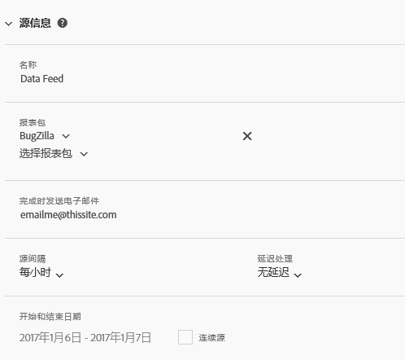

# 馈送信息

使用馈送信息部分命名馈送、指定运行馈送所针对的报表包、确定馈送重复周期以及指定馈送开始和结束的时间。

<table id="table_C98C7C3CE4194BEF819E792793EBC517">
 <thead>
  <tr>
   <th colname="col1" class="entry"> 字段 </th>
   <th colname="col2" class="entry"> 描述 </th>
  </tr>
 </thead>
 <tbody> 
  <tr> 
   <td colname="col1"> 
名称（必填项） 
 </td>
   <td colname="col2"> 
输入馈送名称。 
 
在选定的报表包中，名称必须是唯一的，且长度最多为 225 个字符。 
 </td>
  </tr>
  <tr>
   <td colname="col1"> 
报表包（必填项） 
 </td>
   <td colname="col2"> 
指定用于馈送查询的报表包。 
 
至少需要选择一个报表包。不能两次列出同一个报表包。 
 
登录用户可用的所有非虚拟报告套件均可用。 
</td>
  </tr>
  <tr>
   <td colname="col1"> 
完成时发送电子邮件（必填项） 
 </td>
   <td colname="col2"> 
指定接收馈送提交更新的电子邮件收件人。 
 
此字段不能为空。必须包含格式正确的电子邮件地址。 
 </td>
  </tr>
  <tr>
   <td colname="col1"> 
馈送间隔（必填项） 
 </td>
   <td colname="col2"> 
指定计划重复周期。 
 
注意：考虑到数据馈送压缩文件的潜在大小，请确保您的 ETL 流程使用 64 位压缩工具。 
 </td>
  </tr>
  <tr>
   <td colname="col1"> 
延迟处理（可选项） 
 </td>
   <td colname="col2"> 
指定将应用到每个计划实例的延迟。 
 </td>
  </tr>
  <tr>
   <td colname="col1"> 
开始日期和结束日期（必填项） 
 
连续馈送（必填项） 
 </td>
   <td colname="col2"> 
计划馈送开始和结束的日期。 
 

     <ul id="ul_509977336CD34032924B48E043E8CBC7">
      <li id="li_BFB5B6ADCB184D839C9BA42DB3DCAF32">开始日期：默认为当天日期 </li>
      <li id="li_34F8DB45D9B54076840D1A0B782812D3">结束日期：默认为明天日期 </li>
     </ul>
     
 </td>
  </tr>
 </tbody>
</table>