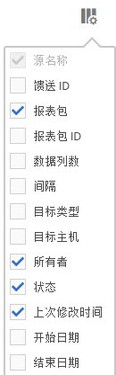

# 对列排序

您可以确定哪些列可用，并根据需要对其进行排序。

1. To determine which columns are visible, click the **[!UICONTROL Columns Configuration]** button.

   

1. 要对列进行排序，请单击列标题。

   按字母顺序对字母列进行排序。单击标题可按字母顺序进行逆向排序。

   数字列按数字顺序排序。单击标题可在“从低到高”和“从高到低”顺序之间切换。
