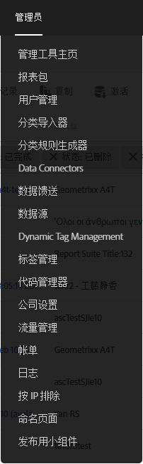
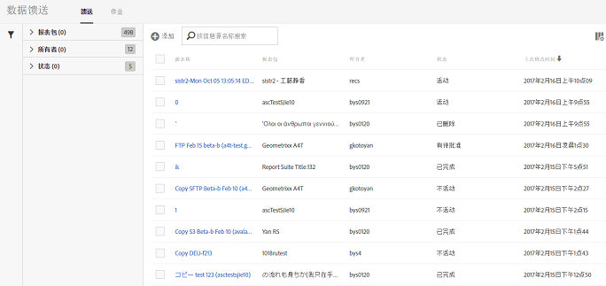

# 打开数据馈送界面

数据馈送用户界面可通过“”管理员选项卡访问。

1. 打开“管理员”选项卡。
1. Select **[!UICONTROL Data Feeds]**.

   

数据馈送登录页面列出了当前为您的公司定义的所有馈送，而管理员用户可访问所有报表包。

如果尚未设置馈送，则该页面会显示&#x200B;**[!UICONTROL 创建新数据馈送]按钮。**

要查看您的作 [业](../../../export/analytics-data-feed/c-data-feed-actions/t-feed-job-history.md#task_0D05F2D1B41B4E4A95B570DC78014480)，请单击 **[!UICONTROL 作业]**。 To return to the feeds view, click **[!UICONTROL Feeds]**.