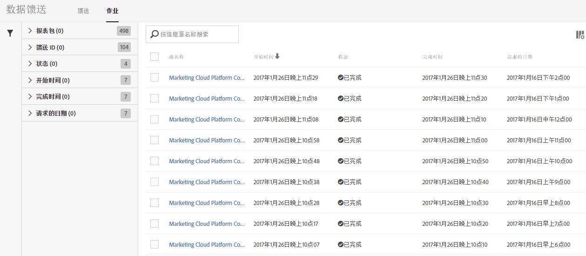
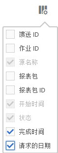

# 数据馈送作业 - 概述

使用“作业”选项卡可查看作业历史记录和执行作业管理任务。

“作业”列表提供各类信息，例如作业状态、作业开始时间、作业完成时间、作业运行时长等等。

单击列标题可切换作业显示的顺序。

要设置希望显示在“作业”列表中的信息，请单击“设置”图标，然后选择所需的列名称。

“馈送名称”、“开始时间”和“状态”为必需列，无法从“作业”列表中移除。

| 列 | 描述 |
|---|---|
| 馈送 ID | 馈送的唯一标识符。 |
| 作业 ID | 作业的唯一标识符。 |
| 馈送名称 | 馈送名称。 |
| 开始时间 | 作业的开始时间，以您所在的时区显示。 |
| 运行时间 | 作业运行所需的时间。显示为 dd hh:mm:ss。 |
| 状态 | 作业的当前[状态](/help/export/analytics-data-feed/c-df-jobs/r-job-status.md)。 |
| 完成时间 | 作业结束运行的时间。以您所在的时区显示。 |
| 请求的数据 | 作业所含数据的数据戳。 |

