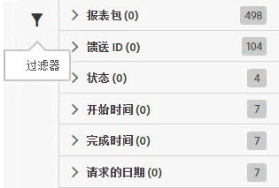

# 过滤器作业列表

搜索和过滤功能可帮助您在列表中查找作业。

1. 单击或将鼠标悬停在“过滤器”图标上方可查看过滤选项：

   

   有以下几种过滤选项可用：

   * 报表包
   * 馈送 ID
   * 状态
   * 开始时间
   * 完成时间
   * 请求的数据

1. 输入搜素词以搜索“作业”列表。

   

您可以结合使用过滤和搜索功能以帮助您查找作业。使用“AND”运算符可结合多个过滤器和搜索词。
