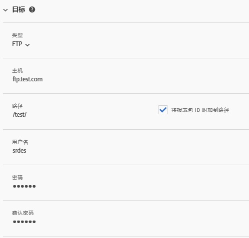
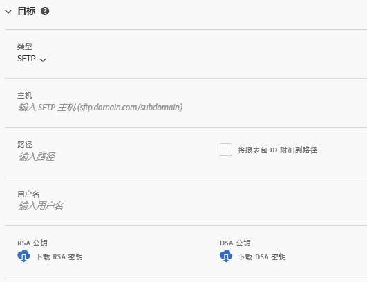
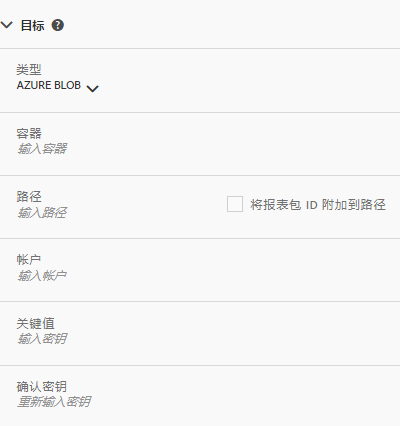

# 创建或编辑数据馈送

通过创建数据馈送，Adobe 可以了解发送原始数据文件的位置以及要包含在每个文件中的内容。本页列出了在创建数据馈送时可以自定义的各个设置。

在阅读本页之前，建议您先了解数据馈送的基本知识。请参阅[数据馈送概述](data-feed-overview.md)，确保您满足创建数据馈送的要求。

## 馈送信息字段

* **名称**：数据馈送的名称。在选定的报表包中，名称必须是唯一的，且长度最多为 255 个字符。
* **报表包**：数据馈送所基于的报表包。如果为同一报表包创建了多个数据馈送，则它们必须具有不同的列定义。只有源报表包支持数据馈送；虚拟报表包则不支持。
* **完成时发送电子邮件**：在馈送完成处理时要通知的电子邮件地址。电子邮件地址的格式必须正确。
* **馈送间隔**：每小时馈送包含一个小时的数据。每日馈送包含一整天的数据。
* **延迟处理**：在处理数据馈送文件之前等待给定的时长。延迟可用于为移动设备实施提供使离线设备变为在线并发送数据的机会。它还可用于在管理以前处理的文件时容纳组织的服务器端进程。在大多数情况下，无需延迟。馈送最多可延迟 120 分钟。
* **开始和结束日期**：开始日期表示您需要数据馈送的第一个日期。将此日期设置为过去的日期，可立即开始处理历史数据的数据馈送。馈送将连续处理，直到它们到达结束日期。
* **连续馈送**：此复选框将删除结束日期，允许馈送无限期运行。当馈送完成历史数据处理时，馈送会等待完成给定小时或天的数据收集。当前小时或天结束后，处理将在指定的延迟后开始。

## 目标字段

目标字段下的可用字段取决于目标类型。

### FTP

数据馈送数据可以提交到由 Adobe 或客户托管的 FTP 位置。需要 FTP 主机、用户名和密码。可使用路径字段将馈送文件放置在文件夹中。文件夹必须已存在；如果指定的路径不存在，则馈送将引发错误。

### SFTP

提供了对数据馈送的 SFTP 支持。需要 SFTP 主机、用户名，以及包含有效 RSA 或 DSA 公钥的目标站点。您可以在创建馈送时下载相应的公钥。

### S3

您可以直接将馈送发送到 Amazon S3 存储段。需要存储段名称、访问密钥 ID 和密钥。有关详细信息，请参阅 Amazon S3 文档中的 [Amazon S3 存储段命名要求](https://docs.aws.amazon.com/awscloudtrail/latest/userguide/cloudtrail-s3-bucket-naming-requirements.html)。

以下 11 个标准 AWS 区域（在必要时使用适当的签名算法）受支持：

* us-east-1
* us-west-1
* us-west-2
* ap-south-1
* ap-northeast-2
* ap-southeast-1
* ap-southeast-2
* ap-northeast-1
* eu-central-1
* eu-west-1
* sa-east-1

> [!NOTE] 不支持 cn-north-1 区域。

### Azure Blob

数据馈送支持 Azure Blob 目标。需要容器、帐户和密钥。Amazon 会自动加密静态数据。当您下载数据时，数据会自动解密。有关详细信息，请参阅 Microsoft Azure 文档中的[创建存储帐户](https://docs.microsoft.com/zh-cn/azure/storage/common/storage-quickstart-create-account?tabs=azure-portal#view-and-copy-storage-access-keys)。

> [!NOTE] 您必须实施自己的流程来管理馈送目标上的磁盘空间。Adobe 不会从服务器中删除任何数据。

## 数据列定义

所有列（无论它们是否包含数据）均可使用。数据馈送必须至少包含一列。

* **删除转义字符**：在收集数据时，某些字符（如换行符）可能会导致问题。如果您希望从馈送文件中删除这些字符，请选中此框。
* **压缩格式**：使用的压缩类型。Gzip 以 `.tar.gz` 格式输出文件。Zip 以 `.zip` 格式输出文件。
* **包装类型**：如果选择单个文件，则可能会以单个大型文件的形式输出 `hit_data.tsv` 文件。如果选择多个文件，则会将您的数据分为多个 2 GB 的区块（未压缩）。如果选择了多个文件，而报告时间范围的未压缩数据小于 2 GB，则会发送一个文件。Adobe 建议对大多数的数据馈送使用多个文件。
* **列模板**：创建多个数据馈送时，Adobe 建议创建列模板。选择列模板会自动包含模板中指定的列。默认情况下，Adobe 也提供了多个模板。
* **可用列**：Adobe Analytics 中的所有可用数据列。单击“[!UICONTROL 全部添加]”可在数据馈送中包含所有列。
* **包含的列**：要包含在数据馈送中的列。单击“[!UICONTROL 全部移除]”可从数据馈送中移除所有列。
* **下载 CSV**：下载含有所有包含的列的 CSV 文件。
