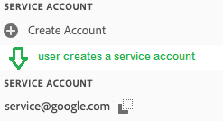

# 创建或编辑数据馈送

通过创建数据馈送，Adobe 可以了解发送原始数据文件的位置以及要包含在每个文件中的内容。本页列出了在创建数据馈送时可以自定义的各个设置。

在阅读本页之前，建议您先了解数据馈送的基本知识。请参阅[数据馈送概述](data-feed-overview.md)，确保您满足创建数据馈送的要求。

## 馈送信息字段

* **名称**：数据馈送的名称。在选定的报表包中，名称必须是唯一的，且长度最多为 255 个字符。
* **报表包**：数据馈送所基于的报表包。如果为同一报表包创建了多个数据馈送，则它们必须具有不同的列定义。只有源报表包支持数据馈送；虚拟报表包则不支持。
* **完成时发送电子邮件**：在馈送完成处理时要通知的电子邮件地址。电子邮件地址的格式必须正确。
* **馈送间隔**：每小时馈送包含一个小时的数据。每日馈送包含一天的数据，这包括来自报表包所在时区从午夜到午夜的数据。
* **延迟处理**：在处理数据馈送文件之前等待给定的时长。延迟可用于为移动设备实施提供使离线设备变为在线并发送数据的机会。它还可用于在管理以前处理的文件时容纳组织的服务器端进程。在大多数情况下，无需延迟。馈送最多可延迟 120 分钟。
* **开始和结束日期**：开始日期表示您需要数据馈送的第一个日期。将此日期设置为过去的日期，可立即开始处理历史数据的数据馈送。馈送将连续处理，直到它们到达结束日期。开始日期和结束日期基于报表包所在的时区。
* **连续馈送**：此复选框将删除结束日期，允许馈送无限期运行。当馈送完成历史数据处理时，馈送会等待完成给定小时或天的数据收集。当前小时或天结束后，处理将在指定的延迟后开始。

## 目标字段

目标字段下的可用字段取决于目标类型。

### Google Cloud平台

作为安全目标访问GCP存储段

**字段**
* *类型：* Google云平台的目标类型
* *项目ID:* 存储段所在的GCP项目ID
* *存储段名称：* 不带点的存储段名称最多可包含3到63个字符。 包含点的名称最多可包含222个字符，但每个以点分隔的组件不能超过63个字符。
* *路径（可选）：* &amp; *将报表包ID附加到路径：* 要检索或存储的资源的位置


**服务帐户创建过程**

需要用户为已选择Google云平台目标创建服务帐户。

每个Analytics组织只允许一个GCP服务帐户。 为数据馈送创建服务帐户后，组织内的所有其他数据馈送都将预填充服务帐户。




### Amazon S3

Amazon S3存储段存储，通过受信任实体中的IAM角色访问。

**字段**

* *类型：* Amazon S3的目标类型
* *存储段：* S3存储段名称
* *可信实体ARN:* AWS IAM Entity ARN `arn:aws:iam::<12 digit account number>:user/<username>`
* *角色ARN:* AWS IAM角色ARN `arn:aws:iam::<12 digit account number>:role/<role name>`
* *路径（可选）：* &amp; *将报表包ID附加到路径：* 要检索或存储的资源的位置
* *指定区域（可选）：* 所有可用AWS区域（包括CN区域）的下拉列表


**创建和选择受信任实体**

用户可以从下拉列表中列出的任何选项中选择受信任的实体，也可以通过单击 `Create Entity` 按钮。

单击 `Create Entity` 按钮，用户将被重定向到身份验证过程。 用户进行身份验证后，将创建受信任实体并将其添加到下拉菜单中的选项。

此下拉列表列出了此用户在组织中创建的所有受信任实体。


您可以通过旧版方法将信息源直接发送到Amazon S3存储段。 有关详细信息，请参阅 Amazon S3 文档中的 [Amazon S3 存储段命名要求](https://docs.aws.amazon.com/awscloudtrail/latest/userguide/cloudtrail-s3-bucket-naming-requirements.html)。

**字段 — 已弃用**

* *类型：* 已弃用S3方法的目标类型
* *存储段：* Amazon S3存储段名称
* *路径（可选）：* &amp; *将报表包ID附加到路径：* 要检索或存储的资源的位置
* *访问密钥：* AWS用户的访问密钥ID
* *密钥：* AWS用户的密钥
* *确认密钥：* 重新输入AWS用户的密钥


您为上传数据馈送提供的用户必须具有以下[权限](https://docs.aws.amazon.com/AmazonS3/latest/API/API_Operations_Amazon_Simple_Storage_Service.html)：

* s3:GetObject
* s3:PutObject
* s3:PutObjectAcl

每次上传到 Amazon S3 存储桶时，无论存储桶是否有需要它的策略，[!DNL Analytics] 都会将存储桶所有者添加到 BucketOwnerFullControl ACL。有关详细信息，请参阅“[什么是 Amazon S3 数据馈送的 BucketOwnerFullControl 设置？](df-faq.md#BucketOwnerFullControl)”

**受支持的AWS地区**:
* us-east-2
* us-east-1
* us-west-1
* us-west-2
* ap-south-1
* ap-northeast-2
* ap-southeast-1
* ap-southeast-2
* ap-northeast-1
* ca-central-1
* eu-central-1
* eu-west-1
* eu-west-2
* eu-west-3
* eu-north-1
* sa-east-1
* cn-north-1
* cn-northwest-1


### Azure Blob

使用基于角色的访问控制(RBAC)或共享访问签名(SAS)的Azure Blob安全目标。 选择访问控制后，面板的内容将进行更新以反映相应的字段。

**字段 — RBAC**
* *类型：* Azure Blob的目标类型
* *访问控制：* 使用RBAC或SAS的选项
* *Active Directory租户ID:* Azure帐户的组织ID
* *应用程序ID:* 来自Active Directory适配器的应用程序ID
* *客户端密钥：* Azure客户端密钥
* *存储帐户名称：* 包含数据对象的帐户名称
* *容器名称：* 属于给定存储帐户的容器。
* *路径（可选）：* &amp; *将报表包ID附加到路径：* 要检索或存储的资源的位置


**字段 — SAS**
* *类型：* Azure Blob的目标类型
* *访问控制：* 使用RBAC或SAS的选项
* *Active Directory租户ID:* Azure Active Directory实例的ID
* *应用程序ID:* 来自Active Directory适配器的应用程序ID
* *客户端密钥：* Azure客户端密钥
* *密钥保管库URI:* Azure密钥保管库的位置
* *密钥保管库密钥名称：* 用于访问安全密钥保管库的密钥名称
* *路径（可选）：* &amp; *将报表包ID附加到路径：* 要检索或存储的资源的位置


**字段 — 已弃用**
* *类型：* Azure Blob的目标类型
* *容器：* Azure容器的名称
* *路径（可选）：* &amp; *将报表包ID附加到路径：* 要检索或存储的资源的位置
* *帐户：* Azure帐户密钥
* *密钥保管库URI:* Azure密钥保管库的位置
* *密钥保管库密钥名称：* 用于访问安全密钥保管库的密钥名称

您必须实施自己的流程来管理馈送目标上的磁盘空间。Adobe 不会从服务器中删除任何数据。有关详细信息，请参阅 Microsoft Azure 文档中的[创建存储帐户](https://docs.microsoft.com/zh-cn/azure/storage/common/storage-quickstart-create-account?tabs=azure-portal#view-and-copy-storage-access-keys)。


>[!NOTE]
>
>您必须实施自己的流程来管理馈送目标上的磁盘空间。Adobe 不会从服务器中删除任何数据。

### FTP — 已弃用

**字段**
* *类型：* FTP的目标类型
* *主机：* 访问主机的端点
* *路径（可选）：* &amp; *将报表包ID附加到路径：* 要检索或存储的资源的位置
* *用户名：* 主机用户名
* *密码：* 主机密码
* *确认密码：* 重新输入并验证主机的密码


### SFTP - 已弃用

提供了对数据馈送的 SFTP 支持。需要 SFTP 主机、用户名，以及包含有效 RSA 或 DSA 公钥的目标站点。您可以在创建馈送时下载相应的公钥。

**字段**
* *类型：* SFTP的目标类型
* *主机：* 访问主机的端点
* *路径（可选）：* &amp; *将报表包ID附加到路径：* 要检索或存储的资源的位置
* *RSA公钥：* 或 *DSA公钥：* 访问主机的公共密钥


## 数据列定义

所有列（无论它们是否包含数据）均可使用。数据馈送必须至少包含一列。

* **删除转义字符**：在收集数据时，某些字符（如换行符）可能会导致问题。如果您希望从馈送文件中删除这些字符，请选中此框。
* **压缩格式**：使用的压缩类型。Gzip 以 `.tar.gz` 格式输出文件。Zip 以 `.zip` 格式输出文件。
* **包装类型**：如果选择单个文件，则可能会以单个大型文件的形式输出 `hit_data.tsv` 文件。如果选择多个文件，则会将您的数据分为多个 2 GB 的区块（未压缩）。如果选择了多个文件，而报告时间范围的未压缩数据小于 2 GB，则会发送一个文件。Adobe 建议对大多数的数据馈送使用多个文件。
* **清单**：在一个馈送间隔内未收集到数据时，Adobe 是否应将[清单文件](c-df-contents/datafeeds-contents.md#feed-manifest)提交到目标位置。如果选择“清单文件”，则在未收集到数据时，您将收到类似于以下内容的清单文件：

```text
   Datafeed-Manifest-Version: 1.0
    Lookup-Files: 0
    Data-Files: 0
    Total-Records: 0
```

* **列模板**：创建多个数据馈送时，Adobe 建议创建列模板。选择列模板会自动包含模板中指定的列。默认情况下，Adobe 也提供了多个模板。
* **可用列**：Adobe Analytics 中的所有可用数据列。单击“[!UICONTROL 全部添加]”可在数据馈送中包含所有列。
* **包含的列**：要包含在数据馈送中的列。单击“[!UICONTROL 全部移除]”可从数据馈送中移除所有列。
* **下载 CSV**：下载含有所有包含的列的 CSV 文件。
