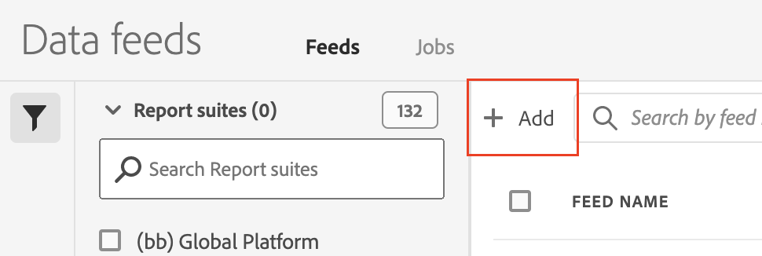
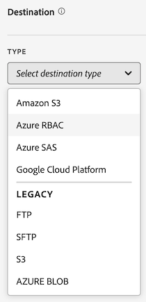

# 创建数据馈送

创建数据馈送时，您为 Adobe 提供：

* 您想将原始数据文件发送到那里的目标的信息
* 您想在每一个文件中包含的数据

在创建数据馈送之前，重要的是要对数据馈送有基本的了解，并确保满足所有前提条件。更多信息请参阅[数据馈送概述](data-feed-overview.md)。

## 创建和配置数据馈送 {#create-and-configure-data-feed}

<!-- markdownlint-disable MD034 -->

>[!CONTEXTUALHELP]
>id="aa_datafeed_os_strings"
>title="替换操作系统字符串"
>abstract="此选项用于清理数据输出，即检测客户数据中嵌入的以下字符串序列并将其替换为空格： Windows：CRLF、CR 或 TAB Mac 和 Linux：\n、\r 或 \t"

<!-- markdownlint-enable MD034 -->

<!-- markdownlint-disable MD034 -->

>[!CONTEXTUALHELP]
>id="aa_datafeed_export_file"
>title="清单"
>abstract="选择是否在每次数据馈送传递时附带一个清单文件。清单文件中包含了用于数据馈送中所含每个文件的信息。如果用一个包发送数据馈送数据，您还可以选择包含一个完成文件，但建议包含清单文件。 "

<!-- markdownlint-enable MD034 -->

1. 使用您的 Adobe ID 凭据登录 [experiencecloud.adobe.com](https://experiencecloud.adobe.com)。
1. 选择右上方的九宫格图标，然后选择 [!UICONTROL **Analytics**]。
1. 在顶部导航栏中前往&#x200B;[!UICONTROL **管理员**] > [!UICONTROL **数据馈送**]。
1. 选择&#x200B;[!UICONTROL **添加**]。

   

   现在显示一个页面，其中有 3 个主要类别：[!UICONTROL **馈送信息**]、[!UICONTROL **目标**]&#x200B;和&#x200B;[!UICONTROL **数据列定义**]。
1. 在&#x200B;[!UICONTROL **馈送信息**]&#x200B;部分中，填写以下字段：

   | 字段 | 功能 |
   |---------|----------|
   | [!UICONTROL **名称**] | 数据馈送的名称。必须在所选报告包中是唯一的，长度最多 255 个字符。[了解详情](/help/export/analytics-data-feed/df-faq.md#must-feed-names-be-unique) |
   | [!UICONTROL **报告包**] | 数据馈送所基于的报告包。如果为同一报表包创建了多个数据馈送，则它们必须具有不同的列定义。只有源报表包支持数据馈送；虚拟报表包则不支持。 |
   | [!UICONTROL **完成后发送电子邮件**] | 馈送完成处理后所通知的电子邮件地址。电子邮件地址的格式必须正确。 |
   | [!UICONTROL **馈送间隔**] | 选择&#x200B;**每日**&#x200B;用于回填或历史数据。每日馈送包含报告包所在时区从午夜到午夜的一整天数据。选择&#x200B;**每小时**&#x200B;用于连续数据（如果您希望，也可以为连续馈送使用“每日”）。每小时馈送包含一个小时的数据。 |
   | [!UICONTROL **延迟处理**] | 在处理数据馈送文件之前等待一段指定的时间。延迟可用于为移动设备实施提供使离线设备变为在线并发送数据的机会。它还可用于在管理以前处理的文件时容纳组织的服务器端进程。在大多数情况下，无需延迟。馈送最多可延迟 120 分钟。 |
   | [!UICONTROL **开始日期和结束日期**] | 开始日期表示您希望数据馈送开始的日期。要立即开始处理历史数据的数据馈送，可将此日期设置为过去收集数据时的任何日期。开始日期和结束日期基于报告包所在的时区。 |
   | [!UICONTROL **持续馈送**] | 勾选此复选框可以移除结束日期，允许馈送无限期运行。当馈送完成历史数据处理时，馈送会等待完成给定小时或天的数据收集。当前小时或天结束后，处理将在指定的延迟后开始。 |

1. 在&#x200B;[!UICONTROL **目标**]&#x200B;部分中，在&#x200B;[!UICONTROL **类型**]&#x200B;下拉菜单中选择您希望数据发送到那里的目标。

   >[!NOTE]
   >
   >在配置报表目标时，请考虑以下事项：
   >
   >* 我们建议您使用云帐户作为报告目标。虽然[旧版 FTP 和 SFTP 帐户](#legacy-destinations)可用，但建议不要使用这些帐户。
   >* 您之前配置的任何云帐户都可用于数据馈送。您可以通过以下任一方式配置云帐户：
   >
   >   * 为 [Data Warehouse](/help/export/data-warehouse/create-request/dw-request-report-destinations.md) 配置云帐户时
   >   
   >   * [导入 Adobe Analytics 分类数据](/help/components/locations/locations-manager.md)时（任何为导入分类数据而配置的位置都不能使用。）
   >   
   >   * 从位置管理器中，在[组件 > 位置](/help/components/locations/configure-import-accounts.md)内
   >
   >* 云帐户与您的 Adobe Analytics 用户帐户关联。其他用户无法使用或查看您配置的云帐户。
   >
   >* 您可以在[组件 > 位置](/help/components/locations/configure-import-accounts.md)中的位置管理器中编辑您创建的任何位置

   

   创建数据馈送时可以使用以下任何目标类型。请展开目标类型，获得配置说明。（其他[旧目标](#legacy-destinations)也可用，但建议不要使用。）

   +++Amazon S3

   您可以直接将馈送发送到 Amazon S3 存储桶。此目标类型只需要您的 Amazon S3 帐户和位置（存储桶）。

   Adobe Analytics 使用跨帐户身份验证将文件从 Adobe Analytics 上传到您 Amazon S3 实例中的指定位置。

   如果使用 Amazon S3 和数据馈送，就只支持 SSE-S3 加密。

   要将 Amazon S3 存储桶配置为数据馈送的目标：

   1. 按照[创建和配置数据馈送](#create-and-configure-a-data-feed)中所述，开始创建数据馈送。

   1. 在&#x200B;[!UICONTROL **目标**]&#x200B;部分中，在&#x200B;[!UICONTROL **类型**]&#x200B;下拉菜单中选择 [!UICONTROL **Amazon S3**]。

      

   1. 选择&#x200B;[!UICONTROL **选择位置**]。

      现在显示 Amazon S3 导出位置页面。

   1. （视情况而定）如果 Adobe Analytics 已配置了 Amazon S3 帐户（以及该帐户上的一个位置），您可以将其用作数据馈送目标：

      >[!NOTE]
      >
      >仅当您配置了帐户或与您所属的组织共享帐户时，您才可以使用帐户。

      1. 从&#x200B;[!UICONTROL **选择帐户**]&#x200B;下拉菜单中选择帐户。

         在 Adobe Analytics 的以下任何区域中配置的任何云帐户均可使用：

         * 导入 Adobe Analytics 分类数据时，如[架构](/help/components/classifications/sets/manage/schema.md)中所述。

           不过，不能使用配置用于导入分类数据的任何位置。相反，请按如下所述添加新目标。

         * 在“位置”区域配置帐户和位置时，如[配置云导入和导出帐户](/help/components/locations/configure-import-accounts.md)和[配置云导入和导出位置](/help/components/locations/configure-import-locations.md)中所述。

      1. 在&#x200B;[!UICONTROL **选择位置**]&#x200B;下拉菜单中选择位置。

      1. 选择&#x200B;[!UICONTROL **保存**] > [!UICONTROL **保存**]。

      现在目标已配置为将数据发送到您指定的 Amazon S3 位置。

   1. （视情况而定）如果您之前还未添加 Amazon S3 帐户：

      1. 选择&#x200B;[!UICONTROL **添加帐户**]，然后指定以下信息：

         | 字段 | 功能 |
         |---------|----------|
         | [!UICONTROL **帐户名称**] | 帐户的名称。您可以选择任何名称。 |
         | [!UICONTROL **帐户描述**] | 帐户的描述。 |
         | [!UICONTROL **角色 ARN**] | 您必须提供角色 ARN（Amazon 资源名称），Adobe 可以使用它来获取对 Amazon S3 帐户的访问权限。为此，您需要为源帐户创建 IAM 权限策略，将该策略附加到用户，然后为目标帐户创建角色。有关特定信息，请参阅[此 AWS 文档](https://aws.amazon.com/premiumsupport/knowledge-center/cross-account-access-iam/)。 |
         | [!UICONTROL **用户 ARN**] | 用户 ARN（Amazon 资源名称）由 Adobe 提供。您必须将此用户附加到创建的策略。 |

         {style="table-layout:auto"}

      1. 选择&#x200B;[!UICONTROL **添加位置**]，然后指定以下信息：

         | 字段 | 功能 |
         |---------|----------|
         | [!UICONTROL **名称**] | 帐户的名称。 |
         | [!UICONTROL **描述**] | 帐户的描述。 |
         | [!UICONTROL **存储桶**] | 您要将 Adobe Analytics 数据发送到的 Amazon S3 帐户中的存储桶。 
确保 Adobe 提供的用户 ARN 具有 `S3:PutObject` 权限，以便将文件上传到此存储段。此权限允许用户 ARN 上传初始文件并覆盖后续上传的文件。

桶名称必须符合特定的命名规则。例如，它们的长度必须在 3 到 63 个字符之间，只能由小写字母、数字、点 (.) 和连字符 (-) 组成，并且必须以字母或数字开头和结尾。[若要了解完整的命名规则列表，请参阅 AWS 文档](https://docs.aws.amazon.com/AmazonS3/latest/userguide/bucketnamingrules.html)。 
 |
         | [!UICONTROL **前缀**] | 存储段中要用于放置数据的文件夹。指定文件夹名称，然后在名称后添加反斜杠以创建文件夹。例如，`folder_name/` |

         {style="table-layout:auto"}

      1. 选择&#x200B;[!UICONTROL **创建**] > [!UICONTROL **保存**]。

         现在目标已配置为将数据发送到您指定的 Amazon S3 位置。

      1. （视情况而定）如果您需要管理刚刚创建的目标（帐户和位置），可以在[位置管理器](/help/components/locations/locations-manager.md)中找到它。

   +++

   +++Azure RBAC

   您可以使用 RBAC 身份验证将馈送直接发送到 Azure 容器。此目标类型需要一个应用程序 ID、租户 ID 和密码。

   要将 Azure RBAC 帐户配置为数据馈送的目标：

   1. 如果您还没有这样做，请创建一个 Azure 应用程序，供 Adobe Analytics 用于身份验证，然后在访问控制 (IAM) 中授予访问权限。

      相关信息请参阅[关于如何创建 Azure 活动目录应用程序的 Microsoft Azure 文档](https://learn.microsoft.com/en-us/azure/active-directory/develop/howto-create-service-principal-portal)。

   1. 在 Adobe Analytics Admin Console 中，在&#x200B;[!UICONTROL **目标**]&#x200B;部分的&#x200B;[!UICONTROL **类型**]&#x200B;下拉菜单中选择 [!UICONTROL **Azure RBAC**]。

      

   1. 选择&#x200B;[!UICONTROL **选择位置**]。

      现在显示 Azure RBAC 导出位置页面。

   1. （视情况而定）如果 Adobe Analytics 已配置了 Azure RBAC 帐户（以及该帐户上的一个位置），您可以将其用作数据馈送目标：

      >[!NOTE]
      >
      >仅当您配置了帐户或与您所属的组织共享帐户时，您才可以使用帐户。

      1. 从&#x200B;[!UICONTROL **选择帐户**]&#x200B;下拉菜单中选择帐户。

      您在 Adobe Analytics 的以下任何区域中配置的任何云帐户均可供使用：

      * 导入 Adobe Analytics 分类数据时，如[架构](/help/components/classifications/sets/manage/schema.md)中所述。

        不过，不能使用配置用于导入分类数据的任何位置。相反，请按如下所述添加新目标。

      * 在“位置”区域配置帐户和位置时，如[配置云导入和导出帐户](/help/components/locations/configure-import-accounts.md)和[配置云导入和导出位置](/help/components/locations/configure-import-locations.md)中所述。

      1. 在&#x200B;[!UICONTROL **选择位置**]&#x200B;下拉菜单中选择位置。

      1. 选择&#x200B;[!UICONTROL **保存**] > [!UICONTROL **保存**]。

         现在目标已配置为将数据发送到您指定的 Azure RBAC 位置。

   1. （视情况而定）如果您之前还未添加 Azure RBAC 帐户：

      1. 选择&#x200B;[!UICONTROL **添加帐户**]，然后指定以下信息：

         | 字段 | 功能 |
         |---------|----------|
         | [!UICONTROL **帐户名称**] | Azure RBAC 帐户的名称。这个名称会显示在&#x200B;[!UICONTROL **选择帐户**]&#x200B;下拉字段中，您可以选择任何名称。 |
         | [!UICONTROL **帐户描述**] | Azure RBAC 帐户的描述。这个描述会显示在&#x200B;[!UICONTROL **选择帐户**]&#x200B;下拉字段中，您可以选择任何名称。 |
         | [!UICONTROL **应用程序 ID**] | 从您创建的 Azure 应用程序复制此 ID。在 Microsoft Azure 中，此信息位于应用程序内的&#x200B;**概述**&#x200B;选项卡上。有关更多信息，请参阅[有关如何向 Microsoft 身份标识平台注册应用程序的 Microsoft Azure 文档](https://learn.microsoft.com/en-us/azure/active-directory/develop/quickstart-register-app)。 |
         | [!UICONTROL **租户 ID**] | 从您创建的 Azure 应用程序复制此 ID。在 Microsoft Azure 中，此信息位于应用程序内的&#x200B;**概述**&#x200B;选项卡上。有关更多信息，请参阅[有关如何向 Microsoft 身份标识平台注册应用程序的 Microsoft Azure 文档](https://learn.microsoft.com/en-us/azure/active-directory/develop/quickstart-register-app)。 |
         | [!UICONTROL **密码**] | 从您创建的 Azure 应用程序复制密码。在 Microsoft Azure 中，此信息位于应用程序中的&#x200B;**证书和密码**&#x200B;选项卡上。有关更多信息，请参阅[有关如何向 Microsoft 身份标识平台注册应用程序的 Microsoft Azure 文档](https://learn.microsoft.com/en-us/azure/active-directory/develop/quickstart-register-app)。 |

         {style="table-layout:auto"}

      1. 选择&#x200B;[!UICONTROL **添加位置**]，然后指定以下信息：

         | 字段 | 功能 |
         |---------|----------|
         | [!UICONTROL **名称**] | 位置的名称。这个名称会显示在&#x200B;[!UICONTROL **选择位置**]&#x200B;下拉字段中，您可以选择任何名称。 |
         | [!UICONTROL **描述**] | 位置的描述。这个描述会显示在&#x200B;[!UICONTROL **选择位置**]&#x200B;下拉字段中，您可以选择任何名称。 |
         | [!UICONTROL **帐户**] | Azure 存储帐户。 |
         | [!UICONTROL **容器**] | 要将 Adobe Analytics 数据发送到的指定帐户中的容器。确保授予将文件上传到您之前创建的 Azure 应用程序的权限。 |
         | [!UICONTROL **前缀**] | 容器中要用于放置数据的文件夹。指定文件夹名称，然后在名称后添加反斜杠以创建文件夹。例如，`folder_name/`
确保您在配置 Azure RBAC 帐户时指定的应用程序 ID 已被授予 `Storage Blob Data Contributor` 角色，以便访问容器（文件夹）。
 
有关更多信息，请参阅 [Azure 内置角色](https://learn.microsoft.com/en-us/azure/role-based-access-control/built-in-roles)。
 |

         {style="table-layout:auto"}

      1. 选择&#x200B;[!UICONTROL **创建**] > [!UICONTROL **保存**]。

         现在目标已配置为将数据发送到您指定的 Azure RBAC 位置。

      1. （视情况而定）如果您需要管理刚刚创建的目标（帐户和位置），可以在[位置管理器](/help/components/locations/locations-manager.md)中找到它。

   +++

   +++Azure SAS

   您可以使用 SAS 身份验证将馈送直接发送到 Azure 容器。此目标类型需要一个应用程序 ID、租户 ID、密钥存储库 URI、密钥存储库密码名称和密码。

   要将 Azure SAS 配置为数据馈送的目标：

   1. 如果您还没有这样做，请创建一个 Azure 应用程序，供 Adobe Analytics 用于身份验证。

      相关信息请参阅[关于如何创建 Azure 活动目录应用程序的 Microsoft Azure 文档](https://learn.microsoft.com/en-us/azure/active-directory/develop/howto-create-service-principal-portal)。

   1. 在 Adobe Analytics Admin Console 中，在&#x200B;[!UICONTROL **目标**]&#x200B;部分选择 [!UICONTROL **Azure SAS**]。

      

   1. 选择&#x200B;[!UICONTROL **选择位置**]。

      现在显示 Azure SAS 导出位置页面。

   1. （视情况而定）如果 Adobe Analytics 已配置了 Azure SAS 帐户（以及该帐户上的一个位置），您可以将其用作数据馈送目标：

      >[!NOTE]
      >
      >仅当您配置了帐户或与您所属的组织共享帐户时，您才可以使用帐户。

      1. 从&#x200B;[!UICONTROL **选择帐户**]&#x200B;下拉菜单中选择帐户。

         您在 Adobe Analytics 的以下任何区域中配置的任何云帐户均可供使用：

         * 导入 Adobe Analytics 分类数据时，如[架构](/help/components/classifications/sets/manage/schema.md)中所述。

           不过，不能使用配置用于导入分类数据的任何位置。相反，请按如下所述添加新目标。

         * 在“位置”区域配置帐户和位置时，如[配置云导入和导出帐户](/help/components/locations/configure-import-accounts.md)和[配置云导入和导出位置](/help/components/locations/configure-import-locations.md)中所述。

      1. 在&#x200B;[!UICONTROL **选择位置**]&#x200B;下拉菜单中选择位置。

      1. 选择&#x200B;[!UICONTROL **保存**] > [!UICONTROL **保存**]。

         现在目标已配置为将数据发送到您指定的 Azure SAS 位置。

   1. （视情况而定）如果您之前还未添加 Azure SAS 帐户：

      1. 选择&#x200B;[!UICONTROL **添加帐户**]，然后指定以下信息：

         | 字段 | 功能 |
         |---------|----------|
         | [!UICONTROL **帐户名称**] | Azure SAS 帐户的名称。这个名称会显示在&#x200B;[!UICONTROL **选择帐户**]&#x200B;下拉字段中，您可以选择任何名称。 |
         | [!UICONTROL **帐户描述**] | Azure SAS 帐户的描述。这个描述会显示在&#x200B;[!UICONTROL **选择帐户**]&#x200B;下拉字段中，您可以选择任何名称。 |
         | [!UICONTROL **应用程序 ID**] | 从您创建的 Azure 应用程序复制此 ID。在 Microsoft Azure 中，此信息位于应用程序内的&#x200B;**概述**&#x200B;选项卡上。有关更多信息，请参阅[有关如何向 Microsoft 身份标识平台注册应用程序的 Microsoft Azure 文档](https://learn.microsoft.com/en-us/azure/active-directory/develop/quickstart-register-app)。 |
         | [!UICONTROL **租户 ID**] | 从您创建的 Azure 应用程序复制此 ID。在 Microsoft Azure 中，此信息位于应用程序内的&#x200B;**概述**&#x200B;选项卡上。有关更多信息，请参阅[有关如何向 Microsoft 身份标识平台注册应用程序的 Microsoft Azure 文档](https://learn.microsoft.com/en-us/azure/active-directory/develop/quickstart-register-app)。 |
         | [!UICONTROL **密钥保管库 URI**] | 
Azure 密钥存储库中 SAS URI 的路径。要配置 Azure SAS，需要使用 Azure Key Vault 将 SAS URI 存储为密码。有关信息，请参阅[有关如何从 Azure 密钥保管库设置和检索密码的 Microsoft Azure 文档](https://learn.microsoft.com/en-us/azure/key-vault/secrets/quick-create-portal?source=recommendations)。

创建密钥保管库 URI 后：<ul><li>在密钥保管库上添加访问策略，以便向您创建的 Azure 应用程序授予权限。
有关信息，请参阅[有关如何分配密钥存储库访问策略的 Microsoft Azure 文档](https://learn.microsoft.com/en-us/azure/key-vault/general/assign-access-policy?tabs=azure-portal)。

或

如果要在不创建访问策略的情况下直接授予访问角色，请参阅 [Microsoft Azure 文档，了解如何使用 Azure 门户分配 Azure 角色](https://learn.microsoft.com/en-us/azure/role-based-access-control/role-assignments-portal)。这将为应用程序 ID 添加访问密钥存储库 URI 的角色分配。 
</li><li>确保已将应用程序 ID 授予 `Key Vault Certificate User` 内置角色，以便访问密钥保管库 URI。 
有关更多信息，请参阅 [Azure 内置角色](https://learn.microsoft.com/en-us/azure/role-based-access-control/built-in-roles)。
</li></ul> |
         | [!UICONTROL **密钥保管库密码名称**] | 将密码添加到 Azure 密钥保管库时创建的密码名称。在 Microsoft Azure 中，此信息位于您在&#x200B;**密钥保管库**&#x200B;设置页面上创建的密钥保管库中。有关信息，请参阅[有关如何从 Azure 密钥保管库设置和检索密码的 Microsoft Azure 文档](https://learn.microsoft.com/en-us/azure/key-vault/secrets/quick-create-portal?source=recommendations)。 |
         | [!UICONTROL **密码**] | 从您创建的 Azure 应用程序复制密码。在 Microsoft Azure 中，此信息位于应用程序中的&#x200B;**证书和密码**&#x200B;选项卡上。有关更多信息，请参阅[有关如何向 Microsoft 身份标识平台注册应用程序的 Microsoft Azure 文档](https://learn.microsoft.com/en-us/azure/active-directory/develop/quickstart-register-app)。 |

         {style="table-layout:auto"}

      1. 选择&#x200B;[!UICONTROL **添加位置**]，然后指定以下信息：

         | 字段 | 功能 |
         |---------|----------|
         | [!UICONTROL **名称**] | 位置的名称。这个名称会显示在&#x200B;[!UICONTROL **选择位置**]&#x200B;下拉字段中，您可以选择任何名称。 |
         | [!UICONTROL **描述**] | 位置的描述。这个描述会显示在&#x200B;[!UICONTROL **选择位置**]&#x200B;下拉字段中，您可以选择任何名称。 |
         | [!UICONTROL **容器**] | 要将 Adobe Analytics 数据发送到的指定帐户中的容器。 |
         | [!UICONTROL **前缀**] | 容器中要用于放置数据的文件夹。指定文件夹名称，然后在名称后添加反斜杠以创建文件夹。例如，`folder_name/`
确保在配置 Azure SAS 帐户时，在 Key Vault 密码名称字段中指定的 SAS URI 存储具有 `Write` 权限。这将允许 SAS URI 在 Azure 容器中创建文件。 
如果您希望 SAS URI 也覆盖文件，请确保 SAS URI 存储具有 `Delete` 权限。

有关更多信息，请参阅 Azure Blob 存储文档中的 [Blob 存储资源](https://learn.microsoft.com/en-us/azure/storage/blobs/storage-blobs-introduction#blob-storage-resources)。
 |

         {style="table-layout:auto"}

      1. 选择&#x200B;[!UICONTROL **创建**] > [!UICONTROL **保存**]。

         现在目标已配置为将数据发送到您指定的 Azure SAS 位置。

      1. （视情况而定）如果您需要管理刚刚创建的目标（帐户和位置），可以在[位置管理器](/help/components/locations/locations-manager.md)中找到它。

   +++

   +++Google Cloud Platform

   您可以将馈送直接发送到 Google Cloud Platform (GCP) 存储桶。此目标类型只需要您的 GCP 帐户名称和位置（存储桶）名称。

   Adobe Analytics 使用跨帐户身份验证将文件从 Adobe Analytics 上传到您的 GCP 实例中的指定位置。

   要将 GCP 存储桶配置为数据馈送的目标：

   1. 在 Adobe Analytics Admin Console 中，在&#x200B;[!UICONTROL **目标**]&#x200B;部分选择 [!UICONTROL **Google Cloud Platform**]。

      

   1. 选择&#x200B;[!UICONTROL **选择位置**]。

      现在显示 GCP 导出位置页面。

   1. （视情况而定）如果 Adobe Analytics 已配置了 Google Cloud Platform 帐户（以及该帐户上的一个位置），您可以将其用作数据馈送目标：

      >[!NOTE]
      >
      >仅当您配置了帐户或与您所属的组织共享帐户时，您才可以使用帐户。

      1. 从&#x200B;[!UICONTROL **选择帐户**]&#x200B;下拉菜单中选择帐户。

         您在 Adobe Analytics 的以下任何区域中配置的任何云帐户均可供使用：

         * 导入 Adobe Analytics 分类数据时，如[架构](/help/components/classifications/sets/manage/schema.md)中所述。

           不过，不能使用配置用于导入分类数据的任何位置。相反，请按如下所述添加新目标。

         * 在“位置”区域配置帐户和位置时，如[配置云导入和导出帐户](/help/components/locations/configure-import-accounts.md)和[配置云导入和导出位置](/help/components/locations/configure-import-locations.md)中所述。

      1. 在&#x200B;[!UICONTROL **选择位置**]&#x200B;下拉菜单中选择位置。

      1. 选择&#x200B;[!UICONTROL **保存**] > [!UICONTROL **保存**]。

         现在目标已配置为将数据发送到您指定的 Google Cloud Platform 位置。

   1. （视情况而定）如果您之前还未添加 GCP 帐户：

      1. 选择&#x200B;[!UICONTROL **添加帐户**]，然后指定以下信息：

         | 字段 | 功能 |
         |---------|----------|
         | [!UICONTROL **帐户名称**] | 帐户的名称。您可以选择任何名称。 |
         | [!UICONTROL **帐户描述**] | 帐户的描述。 |
         | [!UICONTROL **项目 ID**] | 您的 Google Cloud 项目 ID。请参阅[有关获取项目 ID 的 Google Cloud 文档](https://cloud.google.com/resource-manager/docs/creating-managing-projects#identifying_projects)。 |

         {style="table-layout:auto"}

      1. 选择&#x200B;[!UICONTROL **添加位置**]，然后指定以下信息：

         | 字段 | 功能 |
         |---------|----------|
         | [!UICONTROL **主体**] | 这是 Adobe 提供的主体。您必须授予此主体接收馈送的权限。 |
         | [!UICONTROL **名称**] | 帐户的名称。 |
         | [!UICONTROL **描述**] | 帐户的描述。 |
         | [!UICONTROL **存储桶**] | 您要将 Adobe Analytics 数据发送到的 GCP 账户中的存储段。 
确保您已向 Adobe 提供的主体授予以下任一权限：（有关授予权限的信息，请参阅 Google Cloud 文档中的[将主体添加到存储段级策略](https://cloud.google.com/storage/docs/access-control/using-iam-permissions#bucket-add) 。）<ul><li>`roles/storage.objectCreator`：如果您要仅允许主体在您的 GCP 帐户中创建文件，请使用此权限。 **重要提示：**&#x200B;如果您将此权限用于计划报告，则必须为每个新的计划导出使用唯一文件名。否则，将无法生成报表，因为主体无权覆盖现有文件。</li><li>（推荐）`roles/storage.objectUser`：如果您希望主体有权查看、列出、更新和删除您 GCP 帐户中的文件，请使用此权限。 此权限允许主体覆盖现有文件以进行后续上传，而无需为每个新的计划导出自动生成唯一文件名。</li></ul>
如果您的组织使用[组织策略约束](https://cloud.google.com/storage/docs/org-policy-constraints)，仅允许在允许列表中使用 Google Cloud Platform 帐户，则需要以下 Adobe 拥有的 Google Cloud Platform 组织 ID： <ul><li>`DISPLAY_NAME`：`adobe.com`</li><li>`ID`：`178012854243`</li><li>`DIRECTORY_CUSTOMER_ID`：`C02jo8puj`</li></ul> 
 |
         | [!UICONTROL **前缀**] | 存储段中要用于放置数据的文件夹。指定文件夹名称，然后在名称后添加反斜杠以创建文件夹。例如，`folder_name/` |

         {style="table-layout:auto"}

      1. 选择&#x200B;[!UICONTROL **创建**] > [!UICONTROL **保存**]。

         现在目标已配置为将数据发送到您指定的 GCP 位置。

      1. （视情况而定）如果您需要管理刚刚创建的目标（帐户和位置），可以在[位置管理器](/help/components/locations/locations-manager.md)中找到它。

   +++

1. 在&#x200B;[!UICONTROL **数据列定义**]&#x200B;部分，在下拉菜单中选择最近的&#x200B;[!UICONTROL **所有 Adobe 列**]&#x200B;模板，然后填写以下字段：

   | 字段 | 功能 |
   |---------|----------|
   | [!UICONTROL **移除转义字符**] | 收集数据时，某些字符（例如换行符）可能会导致问题。如果您希望从馈送文件中移除这些字符，请选中此框。 |
   | [!UICONTROL **压缩格式**] | 所用的压缩类型。**Gzip** 输出文件为 `.tar.gz` 格式。**Zip** 输出文件为 `.zip` 格式。 |
   | [!UICONTROL **打包类型**] | 为大多数数据馈送选择&#x200B;[!UICONTROL **多文件**]。此选项会将您的数据分页成未经压缩的 2GB 数据块。（如果选择了&#x200B;[!UICONTROL **多文件**]&#x200B;选项，并且报告窗口的未压缩数据小于 2GB，就会发送一个文件。）选择&#x200B;**单个文件**&#x200B;会将 `hit_data.tsv` 文件输出为一个单独的可能很大的文件。 |
   | [!UICONTROL **清单**] | 确定在某个馈送间隔未收集数据的情况下，Adobe 是否要将一个[清单文件](c-df-contents/datafeeds-contents.md#feed-manifest)传输到目标。如果选择了&#x200B;**清单文件**，您就会在未收集数据的情况下收到一个清单文件，类似这样：
`text`

`Datafeed-Manifest-Version: 1.0`

`Lookup-Files: 0`

`Data-Files: 0`

 `Total-Records: 0`
 |
   | [!UICONTROL **列模板**] | 如果要创建许多数据馈送，Adobe 建议创建一个列模板。选择列模板会自动包含模板中指定的列。默认情况下，Adobe 也提供了多个模板。 |
   | [!UICONTROL **可用列**] | Adobe Analytics 中所有可用的数据列。单击“[!UICONTROL 全部添加]”可在数据馈送中包含所有列。 |
   | [!UICONTROL **包含的列**] | 要包含在数据馈送中的列。单击“[!UICONTROL 全部移除]”可从数据馈送中移除所有列。 |
   | [!UICONTROL **下载 CSV**] | 下载一个包括所有“包含的列”的 CSV 文件。 |

1. 选择右上方的&#x200B;[!UICONTROL **保存**]。

   历史数据处理立即开始。一天的数据处理完成后，文件就会发送到您配置的目标。

   关于如何访问数据馈送以及更好地理解其内容，请参阅[数据馈送内容 - 概述](/help/export/analytics-data-feed/c-df-contents/datafeeds-contents.md)。

## 旧目标

>[!IMPORTANT]
>
>此部分中描述的目标是旧目标，建议不要使用这些目标。请改用以下的一个目标来创建数据馈送：Amazon S3、Google Cloud Platform、Azure RBAC 或 Azure SAS。请参阅[创建和配置数据馈送](#create-and-configure-a-data-feed)，了解关于每一个所建议的这些目标的详细信息。

以下信息提供了每个旧目标的配置信息：

### FTP

数据馈送数据可以传输到由 Adobe 或客户托管的 FTP 位置。需要 FTP 主机、用户名和密码。可使用路径字段将馈送文件放置在文件夹中。文件夹必须已存在；如果指定的路径不存在，则馈送将引发错误。

填写可用字段时，请使用以下信息：

* [!UICONTROL **主机**]：输入所需的 FTP 目标 URL。例如，`ftp://ftp.omniture.com`。
* [!UICONTROL **路径**]：可留空
* [!UICONTROL **用户名**]：输入用于登录 FTP 网站的用户名。
* [!UICONTROL **密码和确认密码**]：输入用于登录 FTP 网站的密码。

### SFTP

提供了对数据馈送的 SFTP 支持。需要 SFTP 主机、用户名，以及包含有效 RSA 或 DSA 公钥的目标站点。您可以在创建馈送时下载相应的公钥。

### S3

您可以直接将馈送发送到 Amazon S3 存储桶。此目标类型需要存储段名称、访问密钥 ID 和密钥。有关详细信息，请参阅 Amazon S3 文档中的 [Amazon S3 存储段命名要求](https://docs.aws.amazon.com/awscloudtrail/latest/userguide/cloudtrail-s3-bucket-naming-requirements.html)。

您为上传数据馈送提供的用户必须具有以下[权限](https://docs.aws.amazon.com/AmazonS3/latest/API/API_Operations_Amazon_Simple_Storage_Service.html)：

* s3:GetObject
* s3:PutObject
* s3:PutObjectAcl

  >[!NOTE]
  >
  >每次上传到 Amazon S3 存储桶时，无论存储桶是否有需要它的策略，[!DNL Analytics] 都会将存储桶所有者添加到 BucketOwnerFullControl ACL。更多信息请参阅“[什么是 Amazon S3 数据馈送的 BucketOwnerFullControl 设置？](df-faq.md#BucketOwnerFullControl)”

以下 16 个标准 AWS 区域（在必要时使用适当的签名算法）受支持：

* us-east-2
* us-east-1
* us-west-1
* us-west-2
* ap-south-1
* ap-northeast-2
* ap-southeast-1
* ap-southeast-2
* ap-northeast-1
* ca-central-1
* eu-central-1
* eu-west-1
* eu-west-2
* eu-west-3
* eu-north-1
* sa-east-1

>[!NOTE]
>
>不支持 cn-north-1 区域。

### Azure Blob

数据馈送支持 Azure Blob 目标。需要容器、帐户和密钥。Amazon 会自动加密静态数据。当您下载数据时，数据会自动解密。有关详细信息，请参阅 Microsoft Azure 文档中的[创建存储帐户](https://docs.microsoft.com/zh-cn/azure/storage/common/storage-quickstart-create-account?tabs=azure-portal#view-and-copy-storage-access-keys)。

>[!NOTE]
>
>您必须实施自己的流程来管理馈送目标上的磁盘空间。Adobe 不会从服务器中删除任何数据。
