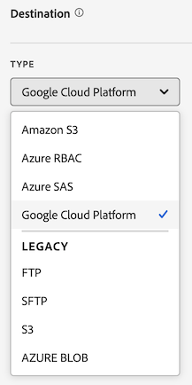

# 创建数据馈送

创建数据馈送时，您为 Adobe 提供：

* 您想将原始数据文件发送到那里的目标的信息
* 您想在每一个文件中包含的数据

在创建数据馈送之前，重要的是要对数据馈送有基本的了解，并确保满足所有前提条件。更多信息请参阅[数据馈送概述](data-feed-overview.md)。

## 创建和配置数据馈送 {#create-and-configure-data-feed}

<!-- markdownlint-disable MD034 -->

>[!CONTEXTUALHELP]
>id="aa_datafeed_os_strings"
>title="替换操作系统字符串"
>abstract="此选项用于清理数据输出，即检测客户数据中嵌入的以下字符串序列并将其替换为空格： Windows：CRLF、CR 或 TAB Mac 和 Linux：\n、\r 或 \t"

<!-- markdownlint-enable MD034 -->

<!-- markdownlint-disable MD034 -->

>[!CONTEXTUALHELP]
>id="aa_datafeed_export_file"
>title="清单"
>abstract="选择是否在每次数据馈送传递时附带一个清单文件。清单文件包含数据馈送中包含的每个文件的信息。 如果用一个包发送数据馈送数据，您还可以选择包含一个完成文件，但建议包含清单文件。 "

<!-- markdownlint-enable MD034 -->

<!-- markdownlint-disable MD034 -->

>[!CONTEXTUALHELP]
>id="aa_datafeed_notify"
>title="完成时通知"
>abstract="指定一个或多个电子邮件地址，在发送数据馈送后应将通知发送到这些地址。 多个电子邮件地址必须以逗号分隔。"

<!-- markdownlint-enable MD034 -->

<!-- added help for Dynamic lookups to this page: help/export/analytics-data-feed/c-df-contents/dynamic-lookups.md -->

1. 使用您的 Adobe ID 凭据登录 [experiencecloud.adobe.com](https://experiencecloud.adobe.com)。

1. 选择右上方的九宫格图标，然后选择 [!UICONTROL **Analytics**]。

1. 在顶部导航栏中前往&#x200B;[!UICONTROL **管理员**] > [!UICONTROL **数据馈送**]。

1. 选择&#x200B;[!UICONTROL **创建数据馈送**]。

   显示的页面具有以下类别： [!UICONTROL **详细信息**]、[!UICONTROL **数据格式**]、[!UICONTROL **数据结构**]、[!UICONTROL **计划**]&#x200B;和&#x200B;[!UICONTROL **目标**]。

   

1. 在&#x200B;[!UICONTROL **详细信息**]&#x200B;部分中，完成以下字段：

   | 字段 | 功能 |
   |---------|----------|
   | [!UICONTROL **名称**] | 数据馈送的名称。名称在选定的报表包中必须是唯一的，长度最多为255个字符。 [了解详情](/help/export/analytics-data-feed/df-faq.md#must-feed-names-be-unique) |
   | [!UICONTROL **标记**] | 将任何标记应用到数据馈送以方便分类。 您可以按照[筛选和搜索](/help/export/analytics-data-feed/df-manage-feeds.md#filter-and-search-the-list-of-data-feeds)管理数据馈送[中的数据馈送](/help/export/analytics-data-feed/df-manage-feeds.md)中的说明对标记进行筛选。 |
   | [!UICONTROL **描述**] | 指定数据馈送的描述。 编辑数据馈送时，您添加的描述可见。 |

1. 在&#x200B;[!UICONTROL **数据格式**]&#x200B;部分中，指定以下信息：

   | 字段 | 功能 |
   |---------|----------|
   | [!UICONTROL **压缩格式**] | 所用的压缩类型。**Gzip** 输出文件为 `.tar.gz` 格式。**Zip** 输出文件为 `.zip` 格式。 |
   | [!UICONTROL **打包类型**] | 为大多数数据馈送选择&#x200B;[!UICONTROL **多文件**]。此选项会将您的数据分页成未经压缩的 2GB 数据块。（如果选择了&#x200B;[!UICONTROL **多文件**]&#x200B;选项，并且报告窗口的未压缩数据小于 2GB，就会发送一个文件。）选择&#x200B;**单个文件**&#x200B;会将 `hit_data.tsv` 文件输出为一个单独的可能很大的文件。 |
   | [!UICONTROL **清单**] | 选择是否在每次数据馈送提交时都包含清单文件。 
您可以从以下选项中进行选择：
<ul><li>**[!UICONTROL 清单文件]**：包含数据馈送中包含的每个文件的信息。</li><li>**[!UICONTROL 完成文件（旧版）]**：表示数据馈送已成功完成。 不包含其他信息。 此选项适用于最初使用此选项但需要重新处理的现有馈送。 仅当在单个包中发送数据馈送数据时，它才可用。 </li><li>**[!UICONTROL 无]**：不包含任何文件</li></ul> |
   | [!UICONTROL **即使没有数据也发送清单**] | 确定在某个馈送间隔未收集数据的情况下，Adobe 是否要将一个[清单文件](/help/export/analytics-data-feed/c-df-contents/datafeeds-contents.md#feed-manifest)传输到目标。如果选择&#x200B;**清单文件**，则在未收集到数据时，您将收到类似于以下内容的清单文件：
`text`

`Datafeed-Manifest-Version: 1.0`

`Lookup-Files: 0`

`Data-Files: 0`

 `Total-Records: 0`
 |
   | [!UICONTROL **替换操作系统字符串**] | 在收集数据时，某些字符（如新行）可能会导致问题。 选择此选项可从馈送文件中删除这些字符。
此选项会检测嵌入到客户数据中的以下字符串序列，并将其替换为空格：
 <ul><li>**Windows：** CRLF、CR或TAB</li><li>**Mac和Linux：** \n、\r或\t</li></ul> |
   | [!UICONTROL **启用动态查找**] | 动态查找允许您在数据馈送中接收其他不可用的查找文件。 此设置允许随每个数据馈送文件发送以下查找表：<ul><li> **运营商名称**</li><li>**移动设备属性**</li><li>**操作系统类型**</li></ul>
有关详细信息，请参阅[动态查找](/help/export/analytics-data-feed/c-df-contents/dynamic-lookups.md)。
 |
   | **允许迟到的点击** | 历史数据可能会在数据馈送作业完成给定小时或一天的处理后到达（例如，通过带有时间戳的点击或数据源）。
选择此选项可以包括数据馈送作业在设置的报告频率内（通常是每日或每小时）完成数据处理后到达的数据。 启用此选项后，每次数据馈送处理数据时，它都会查看任何已到达的迟到点击，并将它们与发送的下一个数据馈送文件分批加入。

有关详细信息，请参阅[迟到的点击](/help/export/analytics-data-feed/c-df-contents/late-arriving-hits.md)。
 |
   | **回顾窗口**（对于迟到的点击） | 启用选项&#x200B;**[!UICONTROL 允许迟到的点击]**&#x200B;时，将显示此选项。 选择回顾窗口以限制包含的最新点击的时间范围。 如果要允许所有迟到的点击，而不考虑迟到的时间，请选择&#x200B;**[!UICONTROL 无限制]**。 您可以选择预设间隔，如&#x200B;**[!UICONTROL 1小时]**、**[!UICONTROL 2小时]**、**[!UICONTROL 1周]**、**[!UICONTROL 2周]**&#x200B;等。 或者，选择&#x200B;**[!UICONTROL 自定义回看窗口期]**，然后在&#x200B;**[!UICONTROL 自定义回看窗口期]**&#x200B;字段中指定最多26,280小时的回看窗口期。 |

1. 在&#x200B;[!UICONTROL **数据结构**]&#x200B;部分的&#x200B;**[!UICONTROL 报表包]**&#x200B;字段中，选择包含要导出的数据的源报表包。 
选择报表包时，请考虑以下事项：
 <ul><li>如果为同一报表包创建了多个数据馈送，则每个数据馈送必须具有不同的列定义。</li><li>只有源报表包支持数据馈送；虚拟报表包则不支持。</li><li>可用列的列表取决于所选报表包所属的登录公司。 如果更改报表包，则可用列的列表可能会发生更改。 </li></ul>

1. 使用以下任一方法或同时使用以下两种方法确定要包含在馈送中的数据列：

   * **单独添加列：**&#x200B;在左侧的&#x200B;**[!UICONTROL 可用]**&#x200B;部分中，选择要包含的任何列，然后选择&#x200B;**[!UICONTROL 包含]**。 Adobe Analytics中的所有数据列均可用。 您可以通过按住&#x200B;**[!UICONTROL Shift]**&#x200B;或按住&#x200B;**[!UICONTROL Command]**(在macOS上)或&#x200B;**[!UICONTROL Ctrl]**（在Windows上）来选择多个列。 单击“**[!UICONTROL 全部添加]**”可在数据馈送中包含所有列。

     添加的列显示在右侧的&#x200B;**[!UICONTROL 已包括]**&#x200B;部分中。

   * **添加列模板：**&#x200B;在&#x200B;**[!UICONTROL 列模板]**&#x200B;字段中，选择要添加的列模板。 列模板是一组预定义的列，默认情况下，Adobe提供了多个列。

     模板中包含的所有列都显示在右侧的&#x200B;**[!UICONTROL Included]**&#x200B;部分中。

1. （可选）要基于当前创建的数据馈送创建列模板，请选择&#x200B;**[!UICONTROL 另存为模板]**，指定模板的名称，然后选择&#x200B;**[!UICONTROL 保存]**。 如果您计划创建包含相同列的其他数据馈送，则此选项非常有用。

   创建数据馈送时

1. （可选）要下载.csv格式包含的列的列表，请选择&#x200B;**[!UICONTROL 下载列]**。 此选项对于具有大量列的数据馈送很有用。

1. 在&#x200B;[!UICONTROL **计划**]&#x200B;部分中，指定以下信息：

   | 字段 | 功能 |
   |---------|----------|
   | [!UICONTROL **频率**] | 选择应发送数据馈送的频率。 可用选项会根据您的报表包配置动态填充。 
通常提供以下选项：
<ul><li>**每日**：馈送包含一天的数据，从报表包时区的午夜到午夜。 此选项可用于回填或历史数据，或者用于连续馈送。</li><li>**小时**：馈送包含一小时的数据。 使用此选项可继续馈送。</li></ul>
导出频率可以为15分钟，但默认情况下不可用。 要使此选项在您的环境中可用，您必须首先联系Adobe客户关怀团队，并请求将您的报表包配置为支持15分钟导出。
 |
   | [!UICONTROL **处理延迟**] | 选择在处理数据馈送文件之前是否等待给定的时长。 延迟可用于为移动设备实施提供使离线设备变为在线并发送数据的机会。它还可用于在管理以前处理的文件时容纳组织的服务器端进程。在大多数情况下，无需延迟。馈送的延迟时间最多可达8小时（480分钟），如果您选择自定义的时间量（延迟9,999分钟或大约1周），则延迟时间会更长。 |
   | [!UICONTROL **持续馈送**] | 选中此选项后，将删除结束日期，允许馈送无限期运行。 当馈送完成历史数据处理时，馈送会等待完成给定小时或天的数据收集。当当前的小时或天结束时，处理将在指定的延迟后开始。 |
   | [!UICONTROL **开始日期**] | 指定希望数据馈送开始的日期。 要立即开始处理历史数据的数据馈送，可将此日期设置为过去收集数据时的任何日期。开始日期基于报表包所在时区。 |
   | [!UICONTROL **结束日期**] | 指定您希望数据馈送结束的日期。 结束日期基于报表包所在时区。 |

1. 在&#x200B;[!UICONTROL **目标**]&#x200B;部分中，配置要将数据发送到的目标。

   >[!NOTE]
   >
   >在配置报表目标时，请考虑以下事项：
   >
   >* Adobe建议为报表目标使用云帐户。 虽然[旧版 FTP 和 SFTP 帐户](#legacy-destinations)可用，但建议不要使用这些帐户。
   >* 您之前配置的任何云帐户均可用于数据馈送。 您可以通过以下任一方式配置云帐户：
   >
   >   * 为 [Data Warehouse](/help/export/data-warehouse/create-request/dw-request-report-destinations.md) 配置云帐户时
   >   
   >   * [导入 Adobe Analytics 分类数据](/help/components/locations/locations-manager.md)时（任何为导入分类数据而配置的位置都不能使用。）
   >   
   >   * 从位置管理器中，在[组件 > 位置](/help/components/locations/configure-import-accounts.md)内
   >
   >* 云帐户与您的 Adobe Analytics 用户帐户关联。其他用户无法使用或查看您配置的云帐户，除非您将其提供给组织中的所有用户。
   >
   >* 您可以在[组件 > 位置](/help/components/locations/configure-import-accounts.md)中的位置管理器中编辑您创建的任何位置

   请完成以下字段：

   | 字段 | 功能 |
   |---------|----------|
   | [!UICONTROL **帐户**] | 执行以下其中一项操作：<ul><li>**使用现有帐户：**&#x200B;选择&#x200B;**[!UICONTROL 帐户]**&#x200B;字段旁边的下拉菜单。 或者，开始键入帐户名称，然后从下拉菜单中选择该名称。 
只有在配置帐户或与您所属的某个组织共享帐户后，您才可以使用帐户。
</li><li>**创建新帐户：**&#x200B;在&#x200B;**[!UICONTROL 帐户]**&#x200B;字段下选择&#x200B;**[!UICONTROL 添加新]**。 有关如何配置帐户的信息，请参阅[配置云导入和导出帐户](/help/components/locations/configure-import-accounts.md#configure-a-location-account)中的[配置位置帐户](/help/components/locations/configure-import-accounts.md)。</li></ul> |
   | [!UICONTROL **位置**] | 执行以下其中一项操作：<ul><li>**使用现有位置：**&#x200B;选择&#x200B;**[!UICONTROL 位置]**&#x200B;字段旁边的下拉菜单。 或者，开始键入位置名称，然后从下拉菜单中选择该位置。</li><li>**创建新位置：**&#x200B;在&#x200B;**[!UICONTROL 位置]**&#x200B;字段下选择&#x200B;**[!UICONTROL 添加新]**。 有关如何配置位置的信息，请参阅[配置云导入和导出位置](/help/components/locations/configure-import-locations.md#configure-a-location)中的[配置位置](/help/components/locations/configure-import-locations.md)。 |
   | [!UICONTROL **完成时通知**] | 指定一个或多个电子邮件地址，在成功发送数据馈送或无法发送数据馈送后，应将通知发送到这些地址。 多个电子邮件地址必须以逗号分隔。 |

1. 选择&#x200B;**[!UICONTROL 保存]**。

## 管理列模板

利用模板，您可以对创建的未来数据馈送重复使用相同的列。

在管理模板时，您可以创建新模板、使用已创建的模板、复制模板、编辑模板和删除模板。

[!UICONTROL **管理员**] > [!UICONTROL **数据馈送**] > **[!UICONTROL 管理模板]**

### 创建列模板

在创建多个使用相同列的数据馈送时，Adobe建议您创建列模板。 您创建的任何列模板均可供贵组织中的任何人使用。

要创建列模板，请执行以下操作：

1. 在Adobe Analytics中，转到&#x200B;[!UICONTROL **管理员**] > [!UICONTROL **数据馈送**] > **[!UICONTROL 管理模板]**。

1. 选择&#x200B;**[!UICONTROL 创建新模板]**&#x200B;以创建新列模板。

   

1. 在&#x200B;**[!UICONTROL 模板名称]**&#x200B;字段中，指定模板的名称。

1. 在左侧的&#x200B;**[!UICONTROL 可用]**&#x200B;部分中，选择要包含的任何列，然后选择&#x200B;**[!UICONTROL 包含]**。 Adobe Analytics中的所有可用数据列均可用。 您可以通过按住&#x200B;**[!UICONTROL Shift]**&#x200B;或按住&#x200B;**[!UICONTROL Command]**(在macOS上)或&#x200B;**[!UICONTROL Ctrl]**（在Windows上）来选择多个列。 单击“**[!UICONTROL 全部添加]**”可在数据馈送中包含所有列。

   添加的列显示在右侧的&#x200B;**[!UICONTROL 已包括]**&#x200B;部分中。

1. 选择&#x200B;**[!UICONTROL 保存]**。

### 编辑列模板

1. 在Adobe Analytics中，转到&#x200B;[!UICONTROL **管理员**] > [!UICONTROL **数据馈送**] > **[!UICONTROL 管理模板]**。

1. 选择要编辑的模板，然后选择&#x200B;**[!UICONTROL 编辑]**。

1. 进行任何编辑，然后选择&#x200B;**[!UICONTROL 保存]**。

### 复制列模板

1. 在Adobe Analytics中，转到&#x200B;[!UICONTROL **管理员**] > [!UICONTROL **数据馈送**] > **[!UICONTROL 管理模板]**。

1. 选择要复制的模板，然后选择&#x200B;**[!UICONTROL 复制]**。

1. 在&#x200B;**[!UICONTROL 模板名称]**&#x200B;字段中，指定模板的名称。

1. 进行任何其他更改，然后选择&#x200B;**[!UICONTROL 保存]**。

### 删除列模板

1. 在Adobe Analytics中，转到&#x200B;[!UICONTROL **管理员**] > [!UICONTROL **数据馈送**] > **[!UICONTROL 管理模板]**。

1. 选择一个或多个要删除的模板，然后选择&#x200B;**[!UICONTROL 删除]**。

<!-- why would you want to do this? -->

<!-- I don't think we need anything after this, but saving here just in case:

1. In the [!UICONTROL **Feed Information**] section, complete the following fields:
   
   | Field | Function |
   |---------|----------|
   | [!UICONTROL **Name**] | The name of the data feed. Must be unique within the selected report suite, and can be up to 255 characters in length. [Learn more](/help/export/analytics-data-feed/df-faq.md#must-feed-names-be-unique) |
   | [!UICONTROL **Report suite**] | The report suite that the data feed is based on. If multiple data feeds are created for the same report suite, they must have different column definitions. Only source report suites support data feeds; virtual report suites are not supported. |
   | [!UICONTROL **Email when complete**] | The email address to be notified when a feed finishes processing. The email address must be properly formatted. |
   | [!UICONTROL **Feed interval**] | Select **Daily** for backfill or historical data. Daily feeds contain a full day's worth of data, from midnight to midnight in the report suite's time zone. Select **Hourly** for continuing data (Daily is also available for continuing feeds if you prefer). Hourly feeds contain a single hour's worth of data. |
   | [!UICONTROL **Delay processing**] | Wait a given amount of time before processing a data feed file. A delay can be useful to give mobile implementations an opportunity for offline devices to come online and send data. It can also be used to accommodate your organization's server-side processes in managing previously processed files. In most cases, no delay is needed. A feed can be delayed by up to 120 minutes. |
   | [!UICONTROL **Start & end dates**] | The start date indicates the date when you want the data feed to begin. To immediately begin processing data feeds for historical data, set this date to any date in the past when data is being collected. The start and end dates are based on the report suite's time zone. |
   | [!UICONTROL **Continuous feed**] | This checkbox removes the end date, allowing a feed to run indefinitely. When a feed finishes processing historical data, a feed waits for data to finish collecting for a given hour or day. Once the current hour or day concludes, processing begins after the specified delay. |
   
1. In the [!UICONTROL **Destination**] section, in the [!UICONTROL **Type**] drop-down menu, select the destination where you want the data to be sent. 

   >[!NOTE]
   >
   >Consider the following when configuring a report destination:
   >
   >* We recommend using a cloud account for your report destination. [Legacy FTP and SFTP accounts](#legacy-destinations) are available, but are not recommended.
   >* Any cloud accounts that you previously configured are available to use for Data Feeds. You can configure cloud accounts in any of the following ways:
   >
   >   * When configuring cloud accounts for [Data Warehouse](/help/export/data-warehouse/create-request/dw-request-report-destinations.md) 
   >   
   >   * When [importing Adobe Analytics classification data](/help/components/locations/locations-manager.md) (Any locations that are configured for importing classification data cannot be used.)
   >   
   >   * From the Locations manager, in [Components > Locations](/help/components/locations/configure-import-accounts.md) 
   >
   >* Cloud accounts are associated with your Adobe Analytics user account. Other users cannot use or view cloud accounts that you configure.
   >
   >* You can edit any locations that you create from the Locations manager in [Components > Locations](/help/components/locations/configure-import-accounts.md)

   

   Use any of the following destination types when creating a data feed. For configuration instructions, expand the destination type. (Additional [legacy destinations](#legacy-destinations) are also available, but are not recommended.)

   +++Amazon S3

   You can send feeds directly to Amazon S3 buckets. This destination type requires only your Amazon S3 account and the location (bucket). 

   Adobe Analytics uses cross-account authentication to upload files from Adobe Analytics to the specified location in your Amazon S3 instance.

   When using Amazon S3 with Data Feeds, only SSE-S3 encryption is supported.

   To configure an Amazon S3 bucket as the destination for a data feed:

   1. Begin creating a data feed as described in [Create and configure a data feed](#create-and-configure-a-data-feed).
   
   1. In the [!UICONTROL **Destination**] section, in the [!UICONTROL **Type**] drop-down menu, select [!UICONTROL **Amazon S3**].

      

   1. Select [!UICONTROL **Select location**].

      The Amazon S3 Export Locations page is displayed.

   1. (Conditional) If an Amazon S3 account (and a location on that account) has already been configured in Adobe Analytics, you can use it as your data feed destination: 

      >[!NOTE]
      >
      >Accounts are available to you only if you configured them or if they were shared with an organization you are a part of.
   
      1. Select the account from the [!UICONTROL **Select account**] drop-down menu.

         Any cloud accounts that were configured in any of the following areas of Adobe Analytics are available to use:
      
         * When importing Adobe Analytics classification data, as described in [Schema](/help/components/classifications/sets/manage/schema.md).
      
           However, any locations that are configured for importing classification data cannot be used. Instead, add a new destination as described below.

         * When configuring accounts and locations in the Locations area, as described in [Configure cloud import and export accounts](/help/components/locations/configure-import-accounts.md) and [Configure cloud import and export locations](/help/components/locations/configure-import-locations.md).
   
      1. Select the location from the [!UICONTROL **Select location**] drop-down menu.

      1. Select [!UICONTROL **Save**] > [!UICONTROL **Save**].

      The destination is now configured to send data to the Amazon S3 location that you specified.
   
   1. (Conditional) If you have not previously added an Amazon S3 account:

      1. Select [!UICONTROL **Add account**], then specify the following information:
   
         |Field | Function |
         |---------|----------|
         | [!UICONTROL **Account name**] | A name for the account. This can be any name you choose. |
         | [!UICONTROL **Account description**] | A description for the account. |
         | [!UICONTROL **Role ARN**] | You must provide a Role ARN (Amazon Resource Name) that Adobe can use to gain access to the Amazon S3 account. To do this, you create an IAM permission policy for the source account, attach the policy to a user, and then create a role for the destination account. For specific information, see [this AWS documentation](https://aws.amazon.com/premiumsupport/knowledge-center/cross-account-access-iam/). |
         | [!UICONTROL **User ARN**] | The User ARN (Amazon Resource Name) is provided by Adobe. You must attach this user to the policy you created. |

         {style="table-layout:auto"}

      1. Select [!UICONTROL **Add location**], then specify the following information:
   
         |Field | Function |
         |---------|----------|
         | [!UICONTROL **Name**] | A name for the account.  |
         | [!UICONTROL **Description**] | A description for the account. |
         | [!UICONTROL **Bucket**] | The bucket within your Amazon S3 account where you want Adobe Analytics data to be sent. 
Ensure that the User ARN that was provided by Adobe has the `S3:PutObject` permission in order to upload files to this bucket. This permission allows the User ARN to upload initial files and overwrite files for subsequent uploads.

Bucket names must meet specific naming rules. For example, they must be between 3 to 63 characters long, can consist only of lowercase letters, numbers, dots (.), and hyphens (-), and must begin and end with a letter or number. [A complete list of naming rules are available in the AWS documentation](https://docs.aws.amazon.com/AmazonS3/latest/userguide/bucketnamingrules.html). 
 |
         | [!UICONTROL **Prefix**] | The folder within the bucket where you want to put the data. Specify a folder name, then add a backslash after the name to create the folder. For example, `folder_name/` |

         {style="table-layout:auto"}

      1. Select [!UICONTROL **Create**] > [!UICONTROL **Save**].

         The destination is now configured to send data to the Amazon S3 location that you specified.

      1. (Conditional) If you need to manage the destination (account and location) that you just created, it is available in the [Locations manager](/help/components/locations/locations-manager.md).
   
   +++

   +++Azure RBAC

   You can send feeds directly to an Azure container by using RBAC authentication. This destination type requires an Application ID, Tenant ID, and Secret. 

   To configure an Azure RBAC account as the destination for a data feed:

   1. If you haven't already, create an Azure application that Adobe Analytics can use for authentication, then grant access permissions in access control (IAM). 
   
      For information, refer to the [Microsoft Azure documentation about how to create an Azure Active Directory application](https://learn.microsoft.com/en-us/azure/active-directory/develop/howto-create-service-principal-portal). 
   
   1. In the Adobe Analytics admin console, in the [!UICONTROL **Destination**] section, in the [!UICONTROL **Type**] drop-down menu, select [!UICONTROL **Azure RBAC**].

      

   1. Select [!UICONTROL **Select location**].

      The Azure RBAC Export Locations page is displayed.

   1. (Conditional) If an Azure RBAC account (and a location on that account) has already been configured in Adobe Analytics, you can use it as your data feed destination: 

      >[!NOTE]
      >
      >Accounts are available to you only if you configured them or if they were shared with an organization you are a part of.
   
      1. Select the account from the [!UICONTROL **Select account**] drop-down menu.

      Any cloud accounts that you configured in any of the following areas of Adobe Analytics are available to use:
      
         * When importing Adobe Analytics classification data, as described in [Schema](/help/components/classifications/sets/manage/schema.md).
      
           However, any locations that are configured for importing classification data cannot be used. Instead, add a new destination as described below.

         * When configuring accounts and locations in the Locations area, as described in [Configure cloud import and export accounts](/help/components/locations/configure-import-accounts.md) and [Configure cloud import and export locations](/help/components/locations/configure-import-locations.md).

      1. Select the location from the [!UICONTROL **Select location**] drop-down menu.

      1. Select [!UICONTROL **Save**] > [!UICONTROL **Save**].

         The destination is now configured to send data to the Azure RBAC location that you specified.

   1. (Conditional) If you have not previously added an Azure RBAC account:

      1. Select [!UICONTROL **Add account**], then specify the following information:
   
         |Field | Function |
         |---------|----------|
         | [!UICONTROL **Account name**] | A name for the Azure RBAC account. This name displays in the [!UICONTROL **Select account**] drop-down field and can be any name you choose. |
         | [!UICONTROL **Account description**] | A description for the Azure RBAC account. This description displays in the [!UICONTROL **Select account**] drop-down field and can be any name you choose.  |
         | [!UICONTROL **Application ID**] | Copy this ID from the Azure application that you created. In Microsoft Azure, this information is located on the **Overview** tab within your application. For more information, see the [Microsoft Azure documentation about how to register an application with the Microsoft identity platform](https://learn.microsoft.com/en-us/azure/active-directory/develop/quickstart-register-app). |
         | [!UICONTROL **Tenant ID**] | Copy this ID from the Azure application that you created. In Microsoft Azure, this information is located on the **Overview** tab within your application. For more information, see the [Microsoft Azure documentation about how to register an application with the Microsoft identity platform](https://learn.microsoft.com/en-us/azure/active-directory/develop/quickstart-register-app). |
         | [!UICONTROL **Secret**] | Copy the secret from the Azure application that you created. In Microsoft Azure, this information is located on the **Certificates & secrets** tab within your application. For more information, see the [Microsoft Azure documentation about how to register an application with the Microsoft identity platform](https://learn.microsoft.com/en-us/azure/active-directory/develop/quickstart-register-app). |

         {style="table-layout:auto"}

      1. Select [!UICONTROL **Add location**], then specify the following information: 
   
         |Field | Function |
         |---------|----------|
         | [!UICONTROL **Name**] | A name for the location. This name displays in the [!UICONTROL **Select location**] drop-down field and can be any name you choose. |
         | [!UICONTROL **Description**] | A description for the location. This description displays in the [!UICONTROL **Select location**] drop-down field and can be any name you choose. |
         | [!UICONTROL **Account**] | The Azure storage account. |
         | [!UICONTROL **Container**] | The container within the account you specified where you want Adobe Analytics data to be sent. Ensure that you grant permissions to upload files to the Azure application that you created earlier. |
         | [!UICONTROL **Prefix**] | The folder within the container where you want to put the data. Specify a folder name, then add a backslash after the name to create the folder. For example, `folder_name/`
Make sure the Application ID that you specified when configuring the Azure RBAC account has been granted the `Storage Blob Data Contributor` role in order to access the container (folder).
 
For more information, see [Azure built-in roles](https://learn.microsoft.com/en-us/azure/role-based-access-control/built-in-roles).
 |

         {style="table-layout:auto"}

      1. Select [!UICONTROL **Create**] > [!UICONTROL **Save**].

         The destination is now configured to send data to the Azure RBAC location that you specified.

      1. (Conditional) If you need to manage the destination (account and location) that you just created, it is available in the [Locations manager](/help/components/locations/locations-manager.md).
   
   +++

   +++Azure SAS

   You can send feeds directly to an Azure container by using SAS authentication. This destination type requires an Application ID, Tenant ID, Key vault URI, Key vault secret name, and secret. 

   To configure Azure SAS as the destination for a data feed:

   1. If you haven't already, create an Azure application that Adobe Analytics can use for authentication. 
   
      For information, refer to the [Microsoft Azure documentation about how to create an Azure Active Directory application](https://learn.microsoft.com/en-us/azure/active-directory/develop/howto-create-service-principal-portal). 
   
   1. In the Adobe Analytics admin console, in the [!UICONTROL **Destination**] section, select [!UICONTROL **Azure SAS**].

      

   1. Select [!UICONTROL **Select location**].

      The Azure SAS Export Locations page is displayed.

   1. (Conditional) If an Azure SAS account (and a location on that account) has already been configured in Adobe Analytics, you can use it as your data feed destination: 

      >[!NOTE]
      >
      >Accounts are available to you only if you configured them or if they were shared with an organization you are a part of.
   
      1. Select the account from the [!UICONTROL **Select account**] drop-down menu.

         Any cloud accounts that you configured in any of the following areas of Adobe Analytics are available to use:
      
         * When importing Adobe Analytics classification data, as described in [Schema](/help/components/classifications/sets/manage/schema.md).
      
           However, any locations that are configured for importing classification data cannot be used. Instead, add a new destination as described below.

         * When configuring accounts and locations in the Locations area, as described in [Configure cloud import and export accounts](/help/components/locations/configure-import-accounts.md) and [Configure cloud import and export locations](/help/components/locations/configure-import-locations.md).

      1. Select the location from the [!UICONTROL **Select location**] drop-down menu.

      1. Select [!UICONTROL **Save**] > [!UICONTROL **Save**].

         The destination is now configured to send data to the Azure SAS location that you specified.
   
   1. (Conditional) If you have not previously added an Azure SAS account:

      1. Select [!UICONTROL **Add account**], then specify the following information:
   
         |Field | Function |
         |---------|----------|
         | [!UICONTROL **Account name**] | A name for the Azure SAS account. This name displays in the [!UICONTROL **Select account**] drop-down field and can be any name you choose. |
         | [!UICONTROL **Account description**] | A description for the Azure SAS account. This description displays in the [!UICONTROL **Select account**] drop-down field and can be any name you choose. |
         | [!UICONTROL **Application ID**] | Copy this ID from the Azure application that you created. In Microsoft Azure, this information is located on the **Overview** tab within your application. For more information, see the [Microsoft Azure documentation about how to register an application with the Microsoft identity platform](https://learn.microsoft.com/en-us/azure/active-directory/develop/quickstart-register-app). |
         | [!UICONTROL **Tenant ID**] | Copy this ID from the Azure application that you created. In Microsoft Azure, this information is located on the **Overview** tab within your application. For more information, see the [Microsoft Azure documentation about how to register an application with the Microsoft identity platform](https://learn.microsoft.com/en-us/azure/active-directory/develop/quickstart-register-app). |
         | [!UICONTROL **Key vault URI**] | 
The path to the SAS URI in Azure Key Vault. To configure Azure SAS, you need to store an SAS URI as a secret using Azure Key Vault. For information, see the [Microsoft Azure documentation about how to set and retrieve a secret from Azure Key Vault](https://learn.microsoft.com/en-us/azure/key-vault/secrets/quick-create-portal?source=recommendations).

After the key vault URI is created:<ul><li>Add an access policy on the Key Vault in order to grant permission to the Azure application that you created.
For information, see the [Microsoft Azure documentation about how to assign a Key Vault access policy](https://learn.microsoft.com/en-us/azure/key-vault/general/assign-access-policy?tabs=azure-portal).

Or

If you want to grant an access role directly without creating an access policy, see the [Microsoft Azure documentation about how to assign Azure roles using Azure portal](https://learn.microsoft.com/en-us/azure/role-based-access-control/role-assignments-portal). This adds the role assignment for the application ID to access the key vault URI. 
</li><li>Make sure the Application ID has been granted the `Key Vault Certificate User` built-in role in order to access the key vault URI. 
For more information, see [Azure built-in roles](https://learn.microsoft.com/en-us/azure/role-based-access-control/built-in-roles).
</li></ul> |
         | [!UICONTROL **Key vault secret name**] | The secret name you created when adding the secret to Azure Key Vault. In Microsoft Azure, this information is located in the Key Vault you created, on the **Key Vault** settings pages. For information, see the [Microsoft Azure documentation about how to set and retrieve a secret from Azure Key Vault](https://learn.microsoft.com/en-us/azure/key-vault/secrets/quick-create-portal?source=recommendations). |
         | [!UICONTROL **Secret**] | Copy the secret from the Azure application that you created. In Microsoft Azure, this information is located on the **Certificates & secrets** tab within your application. For more information, see the [Microsoft Azure documentation about how to register an application with the Microsoft identity platform](https://learn.microsoft.com/en-us/azure/active-directory/develop/quickstart-register-app). |

         {style="table-layout:auto"}

      1. Select [!UICONTROL **Add location**], then specify the following information: 
   
         |Field | Function |
         |---------|----------|
         | [!UICONTROL **Name**] | A name for the location. This name displays in the [!UICONTROL **Select location**] drop-down field and can be any name you choose. |
         | [!UICONTROL **Description**] | A description for the location. This description displays in the [!UICONTROL **Select location**] drop-down field and can be any name you choose. |
         | [!UICONTROL **Container**] | The container within the account you specified where you want Adobe Analytics data to be sent. |
         | [!UICONTROL **Prefix**] | The folder within the container where you want to put the data. Specify a folder name, then add a backslash after the name to create the folder. For example, `folder_name/`
Make sure that the SAS URI store that you specified in the Key Vault secret name field when configuring the Azure SAS account has the `Write` permission. This allows the SAS URI to create files in your Azure container. 
If you want the SAS URI to also overwrite files, make sure that the SAS URI store has the `Delete` permission.

For more information, see [Blob storage resources](https://learn.microsoft.com/en-us/azure/storage/blobs/storage-blobs-introduction#blob-storage-resources) in the Azure Blob Storage documentation.
 |

         {style="table-layout:auto"}

      1. Select [!UICONTROL **Create**] > [!UICONTROL **Save**].

         The destination is now configured to send data to the Azure SAS location that you specified.

      1. (Conditional) If you need to manage the destination (account and location) that you just created, it is available in the [Locations manager](/help/components/locations/locations-manager.md).
   
   +++

   +++Google Cloud Platform

   You can send feeds directly to Google Cloud Platform (GCP) buckets. This destination type requires only your GCP account name and the location (bucket) name. 
   
   Adobe Analytics uses cross-account authentication to upload files from Adobe Analytics to the specified location in your GCP instance.

   To configure a GCP bucket as the destination for a data feed:

   1. In the Adobe Analytics admin console, in the [!UICONTROL **Destination**] section, select [!UICONTROL **Google Cloud Platform**].

      

   1. Select [!UICONTROL **Select location**].

      The GCP Export Locations page is displayed.

   1. (Conditional) If a Google Cloud Platform account (and a location on that account) has already been configured in Adobe Analytics, you can use it as your data feed destination: 

      >[!NOTE]
      >
      >Accounts are available to you only if you configured them or if they were shared with an organization you are a part of.
   
      1. Select the account from the [!UICONTROL **Select account**] drop-down menu.

         Any cloud accounts that you configured in any of the following areas of Adobe Analytics are available to use:
      
         * When importing Adobe Analytics classification data, as described in [Schema](/help/components/classifications/sets/manage/schema.md).
      
           However, any locations that are configured for importing classification data cannot be used. Instead, add a new destination as described below.

         * When configuring accounts and locations in the Locations area, as described in [Configure cloud import and export accounts](/help/components/locations/configure-import-accounts.md) and [Configure cloud import and export locations](/help/components/locations/configure-import-locations.md).

      1. Select the location from the [!UICONTROL **Select location**] drop-down menu.

      1. Select [!UICONTROL **Save**] > [!UICONTROL **Save**].

         The destination is now configured to send data to the Google Cloud Platform location that you specified.
   
   1. (Conditional) If you have not previously added a GCP account:

      1. Select [!UICONTROL **Add account**], then specify the following information:
   
         |Field | Function |
         |---------|----------|
         | [!UICONTROL **Account name**] | A name for the account. This can be any name you choose. |
         | [!UICONTROL **Account description**] | A description for the account. |
         | [!UICONTROL **Project ID**] | Your Google Cloud project ID. See the [Google Cloud documentation about getting a project ID](https://cloud.google.com/resource-manager/docs/creating-managing-projects#identifying_projects). |

         {style="table-layout:auto"}

      1. Select [!UICONTROL **Add location**], then specify the following information:
   
         |Field | Function |
         |---------|----------|
         | [!UICONTROL **Principal**] | The Principal is provided by Adobe. You must grant permission to receive feeds to this principal. |
         | [!UICONTROL **Name**] | A name for the account.  |
         | [!UICONTROL **Description**] | A description for the account. |
         | [!UICONTROL **Bucket**] | The bucket within your GCP account where you want Adobe Analytics data to be sent. 
Ensure that you have granted either of the following permissions to the Principal provided by Adobe: (For information about granting permissions, see [Add a principal to a bucket-level policy](https://cloud.google.com/storage/docs/access-control/using-iam-permissions#bucket-add) in the Google Cloud documentation.)<ul><li>`roles/storage.objectCreator`: Use this permission if you  want to limit the Principal to only create files in your GCP account.  **Important:** If you use this permission with scheduled reporting, you must use a unique file name for each new scheduled export. Otherwise, the report generation will fail because the Principal does not have access to overwrite existing files.</li><li>(Recommended) `roles/storage.objectUser`: Use this permission if you want the Principal to have access to view, list, update, and delete files in your GCP account. This permission allows the Principal to overwrite existing files for subsequent uploads, without the need to auto-generate unique file names for each new scheduled export.</li></ul>
If your organization is using [Organization policy constraints](https://cloud.google.com/storage/docs/org-policy-constraints) to allow only the Google Cloud Platform account in your allow list, you need the following Adobe-owned Google Cloud Platform organization ID: <ul><li>`DISPLAY_NAME`: `adobe.com`</li><li>`ID`: `178012854243`</li><li>`DIRECTORY_CUSTOMER_ID`: `C02jo8puj`</li></ul> 
 |
         | [!UICONTROL **Prefix**] | The folder within the bucket where you want to put the data. Specify a folder name, then add a backslash after the name to create the folder. For example, `folder_name/` |

         {style="table-layout:auto"}

      1. Select [!UICONTROL **Create**] > [!UICONTROL **Save**].

         The destination is now configured to send data to the GCP location that you specified.

      1. (Conditional) If you need to manage the destination (account and location) that you just created, it is available in the [Locations manager](/help/components/locations/locations-manager.md).
   
   +++

1. In the  [!UICONTROL **Data Column Definitions**] section, select the latest [!UICONTROL **All Adobe Columns**] template in the drop-down menu, then complete the following fields:
   
   |Field | Function |
   |---------|----------|
   | [!UICONTROL **Remove escaped characters**] | When collecting data, some characters (such as newlines) can cause issues. Check this box if you would like these characters removed from feed files. |
   | [!UICONTROL **Compression format**] | The type of compression used. **Gzip** outputs files in `.tar.gz` format. **Zip** outputs files in `.zip` format. |
   | [!UICONTROL **Packaging type**] | Select [!UICONTROL **Multiple files**] for most data feeds. This option paginates your data into uncompressed 2GB chunks. (If the [!UICONTROL **Multiple files**] option is selected and uncompressed data for the reporting window is less than 2GB, one file is sent.) Selecting **Single file** outputs the `hit_data.tsv` file in a single, potentially massive file. |
   | [!UICONTROL **Manifest**] | Determines whether Adobe should deliver a [manifest file](c-df-contents/datafeeds-contents.md#feed-manifest) to the destination when no data is collected for a feed interval. If you select **Manifest File**, you receive a manifest file similar to the following when no data is collected:
`text`

`Datafeed-Manifest-Version: 1.0`

`Lookup-Files: 0`

`Data-Files: 0`

 `Total-Records: 0`
 |
   | [!UICONTROL **Column templates**] | When creating many data feeds, Adobe recommends creating a column template. Selecting a column template automatically includes the specified columns in the template. Adobe also provides several templates by default. |
   | [!UICONTROL **Available columns**] | All available data columns in Adobe Analytics. Click [!UICONTROL Add all] to include all columns in a data feed. |
   | [!UICONTROL **Included columns**] | The columns to include in a data feed. Click [!UICONTROL Remove all] to remove all columns from a data feed. |
   | [!UICONTROL **Download CSV**] | Downloads a CSV file containing all included columns. |

1. Select [!UICONTROL **Save**] in the top-right.

    Historical data processing begins immediately. When data finishes processing for a day, the file is sent to the destination that you configured.

    For information about how to access the data feed and to get a better understanding of its contents, see [Data feed contents - overview](/help/export/analytics-data-feed/c-df-contents/datafeeds-contents.md).

## Legacy destinations

>[!IMPORTANT]
>
>The destinations described in this section are legacy, and are not recommended. Instead, use one of the following destinations when creating a data feed: Amazon S3, Google Cloud Platform, Azure RBAC, or Azure SAS. See [Create and configure a data feed](#create-and-configure-a-data-feed) for detailed information about each of these recommended destinations. 

The following information provides configuration information for each of the legacy destinations:

### FTP

Data feed data can be delivered to an Adobe or customer-hosted FTP location. Requires an FTP host, username, and password. Use the path field to place feed files in a folder. Folders must already exist; feeds throw an error if the specified path does not exist.

Use the following information when completing the available fields:

* [!UICONTROL **Host**]: Enter the desired FTP destination URL. For example, `ftp://ftp.omniture.com`.
* [!UICONTROL **Path**]: Can be left blank
* [!UICONTROL **Username**]: Enter the username to log in to the FTP site.
* [!UICONTROL **Password and confirm password**]: Enter the password to log in to the FTP site.

### SFTP

SFTP support for data feeds is available. Requires an SFTP host, username, and the destination site to contain a valid RSA or DSA public key. You can download the appropriate public key when creating the feed.

### S3

You can send feeds directly to Amazon S3 buckets. This destination type requires a Bucket name, an Access Key ID, and a Secret Key. See [Amazon S3 bucket naming requirements](https://docs.aws.amazon.com/awscloudtrail/latest/userguide/cloudtrail-s3-bucket-naming-requirements.html) within the Amazon S3 docs for more information.

The user you provide for uploading data feeds must have the following [permissions](https://docs.aws.amazon.com/AmazonS3/latest/API/API_Operations_Amazon_Simple_Storage_Service.html):

* s3:GetObject
* s3:PutObject
* s3:PutObjectAcl

  >[!NOTE]
  >
  >For each upload to an Amazon S3 bucket, [!DNL Analytics] adds the bucket owner to the BucketOwnerFullControl ACL, regardless of whether the bucket has a policy that requires it. For more information, see "[What is the BucketOwnerFullControl setting for Amazon S3 data feeds?](df-faq.md#BucketOwnerFullControl)"

The following 16 standard AWS regions are supported (using the appropriate signature algorithm where necessary):

* us-east-2
* us-east-1
* us-west-1
* us-west-2
* ap-south-1
* ap-northeast-2
* ap-southeast-1
* ap-southeast-2
* ap-northeast-1
* ca-central-1
* eu-central-1
* eu-west-1
* eu-west-2
* eu-west-3
* eu-north-1
* sa-east-1

>[!NOTE]
>
>The cn-north-1 region is not supported.

### Azure Blob

Data feeds support Azure Blob destinations. Requires a container, account, and a key. Amazon automatically encrypts the data at rest. When you download the data, it gets decrypted automatically. See [Create a storage account](https://docs.microsoft.com/en-us/azure/storage/common/storage-quickstart-create-account?tabs=azure-portal#view-and-copy-storage-access-keys) within the Microsoft Azure docs for more information.

>[!NOTE]
>
>You must implement your own process to manage disk space on the feed destination. Adobe does not delete any data from the server.

-->
