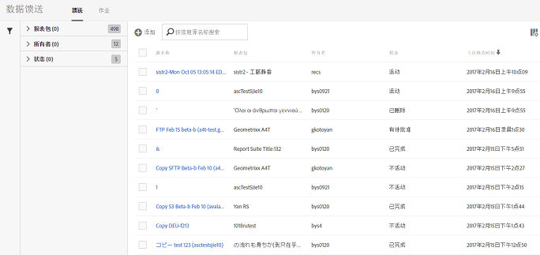

# 管理数据馈送

通过数据馈送管理器，您可以为贵组织创建、编辑和删除数据馈送。如果您有权访问数据馈送管理器，则可以管理对您可见的所有报表包的数据馈送。

+++观看有关数据馈送管理的视频。

>[!VIDEO](https://video.tv.adobe.com/v/25452/?quality=12)

+++

## 查看数据馈送

1. 使用您的 Adobe ID 凭据登录 [experiencecloud.adobe.com](https://experiencecloud.adobe.com)。
1. 选择右上角的9个正方形图标，然后选择&#x200B;[!UICONTROL **Analytics**]。
1. 在顶部导航栏中，转到&#x200B;[!UICONTROL **管理员**] > [!UICONTROL **数据馈送**]。

   此时将显示您有权访问的所有报表包的数据馈送。 或者，如果尚未配置馈送，则页面会显示[!UICONTROL 新建数据馈送]按钮。

   

## 创建数据馈送

使用[!UICONTROL 添加]按钮可创建新馈送。 有关详细信息，请参阅[创建数据馈送](create-feed.md)。

## 编辑数据馈送

1. 在Adobe Analytics中，选择&#x200B;[!UICONTROL **管理员**] > [!UICONTROL **数据馈送**]。

1. 找到要编辑的数据馈送。 若要查找数据馈送，您可以[筛选和搜索数据馈送列表](#filter-and-search-the-list-of-data-feeds)。

1. 在&#x200B;[!UICONTROL **馈送名称**]&#x200B;列中选择数据馈送。

1. 对数据馈送进行任何所需的更改。

   为正在编辑的数据馈送更新&#x200B;[!UICONTROL **目标**]&#x200B;分区时，您可以在&#x200B;[!UICONTROL **帐户**]&#x200B;和&#x200B;[!UICONTROL **位置**]&#x200B;下拉字段中选择用于新数据馈送的其他帐户和位置。

   如果要编辑正在使用它们的所有数据馈送的帐户和位置，可以直接编辑帐户和位置，如[配置云导入和导出帐户](/help/components/locations/configure-import-accounts.md)和[配置云导入和导出位置](/help/components/locations/configure-import-locations.md)中所述。 无法编辑非云帐户和位置。

1. 选择&#x200B;[!UICONTROL **保存**]。

## 筛选和搜索数据馈送列表

1. 在Adobe Analytics中，选择&#x200B;[!UICONTROL **管理员**] > [!UICONTROL **数据馈送**]。

1. 使用搜索或筛选器来查找特定馈送。

   * 在搜索字段中，开始键入馈送的名称。 只有匹配的馈送才会显示在可用馈送列表中。

   * 在最左侧，单击过滤器图标可显示或隐藏过滤选项。过滤器按类别进行组织。您可以折叠或展开过滤类别。 选中要应用的任何过滤器旁边的复选框。

## 查看数据馈送作业

1. 在Adobe Analytics中，选择&#x200B;[!UICONTROL **管理员**] > [!UICONTROL **数据馈送**]。

1. 选择&#x200B;[!UICONTROL **作业**]&#x200B;选项卡可查看每个馈送创建的各个作业。

   或

   要查看特定数据馈送的作业，请选中一个或多个数据馈送旁边的复选框，然后选择&#x200B;[!UICONTROL **作业历史记录**]。

   有关详细信息，请参阅[管理数据馈送作业](df-manage-jobs.md)。

## 复制数据馈送

1. 在Adobe Analytics中，选择&#x200B;[!UICONTROL **管理员**] > [!UICONTROL **数据馈送**]。

1. 选中要复制的数据馈送旁边的复选框，然后选择&#x200B;[!UICONTROL **复制**]。

   将您转到[使用当前馈送的所有设置创建新馈送](create-feed.md)。 如果选择多个数据馈送，则此选项不可见。

   为要复制的数据馈送更新&#x200B;[!UICONTROL **目标**]&#x200B;分区时，您可以在&#x200B;[!UICONTROL **帐户**]&#x200B;和&#x200B;[!UICONTROL **位置**]&#x200B;下拉字段中选择用于新数据馈送的其他帐户和位置。

   如果要编辑正在使用它们的所有数据馈送的帐户和位置，可以直接编辑帐户和位置，如[配置云导入和导出帐户](/help/components/locations/configure-import-accounts.md)和[配置云导入和导出位置](/help/components/locations/configure-import-locations.md)中所述。 无法编辑非云帐户和位置。

## 暂停数据馈送

您可以停止处理馈送，将其状态设置为[!UICONTROL 不活动]。

1. 在Adobe Analytics中，选择&#x200B;[!UICONTROL **管理员**] > [!UICONTROL **数据馈送**]。

1. 选中要暂停的数据馈送旁边的复选框，然后选择&#x200B;[!UICONTROL **暂停**]。

## 激活数据馈送

您可以激活不活动的馈送。

回填馈送（仅处理历史数据的馈送）会从停止的位置恢复处理数据，如有必要，会回填任何日期。 实时馈送还会从停止的位置恢复处理数据。

>[!AVAILABILITY]
>
>对实时馈送恢复处理数据的方式所做的以下更改处于版本的有限测试阶段：
> 
>**实时馈送从当前时间继续处理数据。**
>
>此更改可能还无法在您的环境中使用。
>
>此注释将在此更改正式可用时删除。 有关 Analytics 发布流程的信息，请参阅 [Adobe Analytics 功能发布](/help/release-notes/releases.md)。

激活数据馈送：

1. 在Adobe Analytics中，选择&#x200B;[!UICONTROL **管理员**] > [!UICONTROL **数据馈送**]。

1. 选中要激活的非活动数据馈送旁边的复选框，然后选择&#x200B;[!UICONTROL **激活**]。

## 删除数据馈送

删除数据馈送时，其状态将设置为[!UICONTROL 已删除]。

1. 在Adobe Analytics中，选择&#x200B;[!UICONTROL **管理员**] > [!UICONTROL **数据馈送**]。

1. 选中要删除的数据馈送旁边的复选框，然后选择&#x200B;[!UICONTROL **删除**]。

## 在数据馈送管理器中配置列

创建的每个馈送都会显示若干列，列中提供了有关该馈送的信息。选择列标题以按升序排序。 再次选择列标题可按降序排序。 如果看不到特定列，请单击右上方的列图标。

以下列可供使用：

* **馈送名称**：必需列。 显示馈送名称。
* **馈送 ID**：显示馈送 ID（唯一标识符）。
* **报表包**：馈送从中引用数据的报表包。
* **报表包ID**：报表包的唯一标识符。
* **数据列**：用于馈送的活动数据列。在大多数情况下，列会因为太多而无法全部以此格式显示。
* **间隔**：指示馈送的频率是每小时还是每天。
* **目标类型**：馈送的目标类型。例如，Amazon S3、GCP或Azure。
* **目标主机**：文件的放置位置。
* **所有者**：创建馈送时所用的用户帐户。
* **状态**：馈送的状态。
   * 活动：馈送正在运行。
   * 有待批准：在某些情况下，馈送需要先获得 Adobe 的批准，然后才能开始生成作业。
   * 已删除：馈送已删除。
   * 已完成：馈送已完成处理。可以编辑、搁置或取消已完成的馈送。
   * 待定：馈送已创建但尚未激活。馈送会在短暂的过渡时间内保持此状态。
   * 不活动：等同于“已暂停”或“已搁置”状态。有关在重新激活不活动的馈送时回填馈送和实时馈送会发生什么情况的信息，请参阅[激活数据馈送](#activate-a-data-feed)。
* **上次修改时间**：上次修改馈送的日期。日期和时间将以报表包的时区显示，且含 GMT 时差。
* **开始日期**：此馈送交付第一个作业的日期。日期和时间将以报表包的时区显示，且含 GMT 时差。
* **结束日期**：此馈送交付最后一个作业的日期。持续进行的数据馈送没有结束日期。

