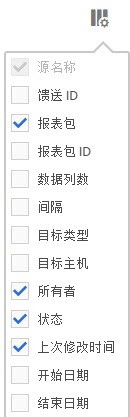

# 管理数据馈送

通过数据馈送管理器，您可以为贵组织创建、编辑和删除数据馈送。如果您有权访问数据馈送管理器，则可以管理对您可见的所有报表包的数据馈送。

>[!BEGINSHADEBOX]

观看演示视频，请参阅 [数据馈送管理](https://video.tv.adobe.com/v/3428569?captions=chi_hans&quality=12&learn=on){target="_blank"}。

>[!ENDSHADEBOX]

## 查看数据馈送

1. 使用您的 Adobe ID 凭据登录 [experiencecloud.adobe.com](https://experiencecloud.adobe.com)。
1. 选择右上方的九宫格图标，然后选择 [!UICONTROL **Analytics**]。
1. 在顶部导航栏中前往&#x200B;[!UICONTROL **管理员**] > [!UICONTROL **数据馈送**]。

   此时将显示您有权访问的所有报表包的数据馈送。 或者，如果尚未配置馈送，则页面会显示[!UICONTROL 新建数据馈送]按钮。

   

## 创建数据馈送

使用&#x200B;**[!UICONTROL 创建数据馈送]**&#x200B;按钮可创建新馈送。 有关详细信息，请参阅[创建数据馈送](create-feed.md)。

## 编辑数据馈送

1. 在Adobe Analytics中，选择&#x200B;[!UICONTROL **管理员**] > [!UICONTROL **数据馈送**]。

1. 找到要编辑的数据馈送。 若要查找数据馈送，您可以[筛选和搜索数据馈送列表](#filter-and-search-the-list-of-data-feeds)。

1. 在&#x200B;[!UICONTROL **馈送名称**]&#x200B;列中选择数据馈送。

1. 对数据馈送进行任何所需的更改。

   有关数据馈送选项的信息，请参阅[创建数据馈送](/help/export/analytics-data-feed/create-feed.md#create-and-configure-a-data-feed)中的[创建并配置数据馈送](/help/export/analytics-data-feed/create-feed.md)。

   为正在编辑的数据馈送更新&#x200B;[!UICONTROL **目标**]&#x200B;分区时，您可以在&#x200B;[!UICONTROL **帐户**]&#x200B;和&#x200B;[!UICONTROL **位置**]&#x200B;下拉字段中选择用于新数据馈送的其他帐户和位置。

   可以按照[配置云导入和导出帐户](/help/components/locations/configure-import-accounts.md)和[配置云导入和导出位置](/help/components/locations/configure-import-locations.md)中的说明编辑帐户和位置。 编辑帐户或位置会影响与该帐户或位置关联的所有项目。

   早期版本的数据馈送管理器允许您创建FTP、SFTP、S3和Azure blob目标。 无法编辑或复制在这些早期版本的数据馈送管理器中创建的目标。

1. 选择&#x200B;[!UICONTROL **保存**]。

## 筛选和搜索数据馈送列表

1. 在Adobe Analytics中，选择&#x200B;[!UICONTROL **管理员**] > [!UICONTROL **数据馈送**]。

1. 使用搜索或筛选器来查找特定馈送。

   * 在搜索字段中，开始键入馈送的名称。 只有匹配的馈送才会显示在可用馈送列表中。

   * 在最左侧，选择过滤器图标以显示或隐藏过滤选项。 筛选器按类别组织，包括&#x200B;**[!UICONTROL 报表包]**、**[!UICONTROL 所有者]**、**[!UICONTROL 状态]**&#x200B;和&#x200B;**[!UICONTROL 标记]**。 您可以折叠或展开过滤类别。 选中要应用的任何过滤器旁边的复选框。

     

## 查看数据馈送作业

1. 在Adobe Analytics中，选择&#x200B;[!UICONTROL **管理员**] > [!UICONTROL **数据馈送**]。

1. 选择&#x200B;[!UICONTROL **作业**]&#x200B;选项卡可查看每个馈送创建的各个作业。

   或

   要查看特定数据馈送的作业，请选中一个或多个数据馈送旁边的复选框，然后选择&#x200B;[!UICONTROL **作业历史记录**]。

   有关详细信息，请参阅[管理数据馈送作业](df-manage-jobs.md)。

## 复制数据馈送

1. 在Adobe Analytics中，选择&#x200B;[!UICONTROL **管理员**] > [!UICONTROL **数据馈送**]。

1. 选中要复制的数据馈送旁边的复选框，然后选择&#x200B;[!UICONTROL **复制**]。

   这会将您引导至[使用当前馈送的所有设置创建新馈送](create-feed.md)。 如果选择多个数据馈送，则此选项不可见。

   为要复制的数据馈送更新&#x200B;[!UICONTROL **目标**]&#x200B;分区时，您可以在&#x200B;[!UICONTROL **帐户**]&#x200B;和&#x200B;[!UICONTROL **位置**]&#x200B;下拉字段中选择用于新数据馈送的其他帐户和位置。

   可以按照[配置云导入和导出帐户](/help/components/locations/configure-import-accounts.md)和[配置云导入和导出位置](/help/components/locations/configure-import-locations.md)中的说明编辑帐户和位置。 编辑帐户或位置会影响与该帐户或位置关联的所有项目。

   早期版本的数据馈送管理器允许您创建FTP、SFTP、S3和Azure blob目标。 无法编辑或复制在这些早期版本的数据馈送管理器中创建的目标。

## 暂停数据馈送

当您暂停数据馈送时，它将停止处理该馈送，并将其状态设置为[!UICONTROL 不活动]。

在暂停馈送后重新激活它时，将会为回填馈送处理馈送暂停期间的数据，但不会为实时馈送处理数据。 有关详细信息，请参阅[激活数据馈送](#activate-a-data-feed)。

暂停数据馈送：

1. 在Adobe Analytics中，选择&#x200B;[!UICONTROL **管理员**] > [!UICONTROL **数据馈送**]。

1. 选中要暂停的数据馈送旁边的复选框，然后选择&#x200B;[!UICONTROL **暂停**]。

## 激活数据馈送

您可以激活不活动的馈送。

重新激活馈送后，在馈送处于不活动状态的时间内，可能无法自动处理数据。 是否处理数据取决于它是回填馈送还是实时馈送：

* **回填馈送**（仅处理历史数据的馈送）从停止的位置恢复处理数据，如有必要，可回填任何日期。

* **实时馈送**&#x200B;从激活数据之时起继续处理数据。 这意味着在馈送暂停到激活馈送期间，不会处理数据。 如果在此时间段内需要数据，则必须设置回填。

激活数据馈送：

1. 在Adobe Analytics中，选择&#x200B;[!UICONTROL **管理员**] > [!UICONTROL **数据馈送**]。

1. 选中要激活的非活动数据馈送旁边的复选框，然后选择&#x200B;[!UICONTROL **激活**]。

## 删除数据馈送

删除数据馈送时，其状态将设置为[!UICONTROL 已删除]。 数据馈送的状态必须为“活动”才能被删除。

要删除数据馈送，请执行以下操作：

1. 在Adobe Analytics中，选择&#x200B;[!UICONTROL **管理员**] > [!UICONTROL **数据馈送**]。

1. 选中要删除的数据馈送旁边的复选框，然后选择&#x200B;[!UICONTROL **删除**]。

## 在数据馈送管理器中配置列

创建的每个馈送都会显示若干列，列中提供了有关该馈送的信息。选择列标题以按升序排序。 再次选择列标题可按降序排序。 如果看不到特定列，请单击右上方的列图标。

以下列可供使用：

* **馈送名称**：必需列。 显示馈送名称。
* **馈送 ID**：显示馈送 ID（唯一标识符）。
* **报表包**：馈送从中引用数据的报表包。
* **报表包ID**：报表包的唯一标识符。
* **数据列**：用于馈送的活动数据列。在大多数情况下，列会因为太多而无法全部以此格式显示。
* **间隔**：指示馈送的频率是每小时还是每天。
* **目标类型**：馈送的目标类型。例如，Amazon S3、GCP或Azure。
* **目标主机**：文件的放置位置。
* **所有者**：创建馈送时所用的用户帐户。
* **状态**：馈送的状态。
   * 活动：馈送正在运行。
   * 有待批准：在某些情况下，馈送需要先获得 Adobe 的批准，然后才能开始生成作业。
   * 已删除：馈送已删除。
   * 已完成：馈送已完成处理。可以编辑、搁置或取消已完成的馈送。
   * 待定：馈送已创建但尚未激活。馈送会在短暂的过渡时间内保持此状态。
   * 不活动：等同于“已暂停”或“已搁置”状态。有关在重新激活不活动的馈送时回填馈送和实时馈送会发生什么情况的信息，请参阅[激活数据馈送](#activate-a-data-feed)。
* **上次修改时间**：上次修改馈送的日期。日期和时间将以报表包的时区显示，且含GMT时差。
* **开始日期**：此馈送交付第一个作业的日期。日期和时间将以报表包的时区显示，且含GMT时差。
* **结束日期**：此馈送交付最后一个作业的日期。持续进行的数据馈送没有结束日期。

