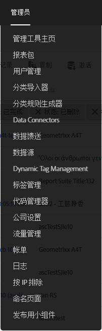
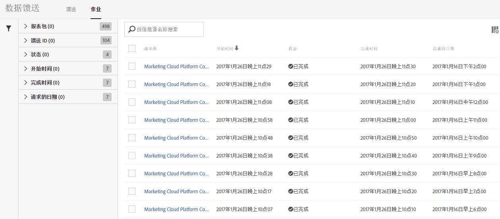
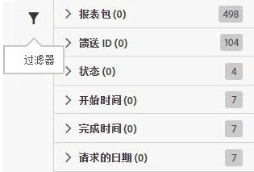
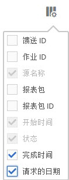

# 管理数据馈送作业

作业是指可输出压缩文件的单个任务。作业由馈送创建和管理。

可按照以下步骤访问数据馈送作业管理器：

1. 登录到 [experiencecloud.adobe.com](https://experiencecloud.adobe.com)。
2. 单击右上方的 9 宫格菜单，然后单击“[!UICONTROL Analytics]”。
3. 在顶部菜单中，单击“[!UICONTROL 管理员]”>“[!UICONTROL 数据馈送]”。
4. 单击顶部附近的“作业”选项卡。

## 导览界面

数据馈送作业是指 Adobe 处理某个给定报告时间范围的数据并输出压缩文件的单个实例。作业管理器提供了一个细化视图，用于查看各个作业的状态。

### 过滤器和搜索

使用过滤器和搜索功能可准确找到您要查找的作业。

在最左侧，单击过滤器图标可显示或隐藏过滤选项。过滤器按类别进行组织。单击 V 形标记可折叠或展开过滤类别。单击相应的复选框可应用该过滤器。

使用搜索功能可按名称查找作业。

### 馈送和作业

单击“馈送”选项卡，可查看创建这些作业的主要馈送。请参阅[管理数据馈送](df-manage-feeds.md)。

### 列

每个作业都会显示若干列，列中提供了有关该作业的信息。单击列标题可将列按升序排序。再次单击列标题可将列按降序排序。如果看不到某个特定列，请单击右上方的列图标。

* **馈送 ID**：显示馈送 ID（唯一标识符）。由同一馈送创建的作业将具有相同的馈送 ID。
* **作业 ID**：作业的唯一标识符。所有作业的作业 ID 都各不相同。
* **馈送名称**：必需列。显示馈送名称。由同一馈送创建的作业将具有相同的馈送名称。
* **报表包**：作业从中引用数据的报表包。
* **报表包 ID**：报表包的唯一标识符。
* **开始时间**：作业开始的时间。日期和时间将以报表包的时区显示，且含 GMT 时差。每日馈送的开始时间通常临近报表包时区的午夜。
* **状态**：馈送的状态。
   * 正在等待数据：作业正在运行，且正在收集相应报告时间范围的数据。
   * 正在处理：作业正在创建数据文件并准备发送它们。
   * 已完成：作业已完成，且未出现任何问题。
   * 失败：作业未完成。请参阅[数据馈送疑难解答](troubleshooting.md)，帮助确定失败的原因。
   * 等待导出：尚未完全处理相应报告时间范围的数据。
   * 无数据：报表包中没有请求的报告时间范围的数据。
* **完成时间**：作业完成的时间。日期和时间将以报表包的时区显示，且含 GMT 时差。
* **请求的日期**：文件的报告时间范围。每日馈送通常会显示 00:00 - 23:59（含 GMT 时差），以表示基于报表包时区的一整天。每小时馈送则会显示作业所对应的单个小时。
