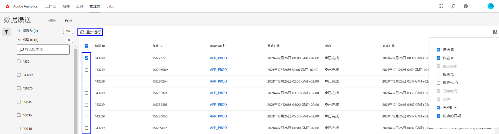

# 数据馈送疑难解答

确定作业可能无法处理或交付的潜在原因。

## 现有数据馈送疑难解答

如果您有一个每小时或每天成功运行但最近失败的数据馈送，请检查以下各项：

* 使用 [Adobe 状态工具](https://status.adobe.com/en/experience_cloud)确定是否有任何计划的维护时段或可用性问题。 如果当时存在已知问题，Adobe 会在服务恢复后自动处理计划的数据馈送。
* 确保 FTP 站点上有足够的可用空间。 如果 FTP 站点的磁盘空间不足，请从服务器中删除一些文件，以便为新文件腾出空间。
* 如果没有已知问题并且 FTP 站点有足够的磁盘空间，您可以重新发送数据馈送。

   1. 登录 Adobe Analytics 并导航至&#x200B;**[!UICONTROL 管理员]** > **[!UICONTROL 数据馈送]**。
   2. 找到所需的数据馈送，然后单击要重新运行的每个馈送旁边的复选框。
   3. 单击&#x200B;**[!UICONTROL 重新运行]**。

  

如果您在重新运行后仍未收到数据馈送文件，请联系客户关怀部门。

## 新数据馈送疑难解答

如果新的数据馈送引发错误，请通过手动将测试文件上传到 FTP 站点来解决问题。 在大多数情况下，您可以使用这些步骤来确定故障点。

1. 使用“文件资源管理器”(Windows) 或“访达”(Mac) 登录 FTP 站点。确保您使用 FTP 协议 (`ftp://`) 并允许 [Adobe 的 IP 地址](/help/technotes/ip-addresses.md)通过您组织的防火墙。 如果您无法访问 FTP 站点，请与 FTP 站点的所有者一起确定正确的目标。

   

2. 会出现一个弹出窗口，要求输入用户名和密码。输入您的身份验证凭据。如果凭据被接受，则窗口会显示 FTP 站点上的当前内容。如果凭据不被接受，请与 FTP 所有者一起确保用户名和密码正确。 如果使用 SFTP，请确保按照 [SFTP 指南](../ftp-and-sftp/c-sftp/ftp-sftp.md)中的每个步骤进行操作。 请注意，Adobe 并不支持所有 SFTP 用例。
3. 通过将文件拖入已验证的窗口，将其上传到 FTP 站点。任何图像或文本文档就足够了。如果在尝试将文件放置到 FTP 站点上时出错，请与 FTP 站点的所有者合作，一起确认是否具有足够的磁盘空间，以及用户名是否拥有 FTP 站点的写入权限。
4. 确认文件已在 FTP 站点上之后，可删除上一步中上传的文件。

如果以上所有步骤都有效，但仍然出现 FTP 错误，请联系客户关怀部门。
