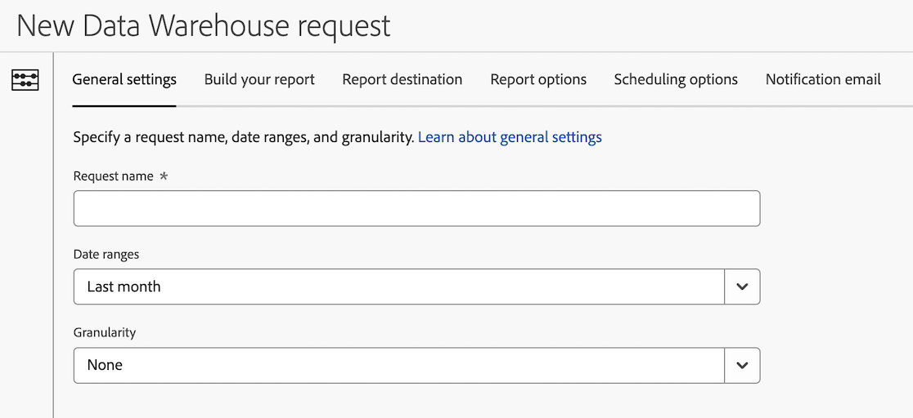

# Data Warehouse请求常规设置

提供了在创建 Data Warehouse 请求时可使用的多种配置选项。以下信息介绍了如何配置请求的常规设置。

有关如何开始创建请求的信息以及其他重要配置选项的链接，请参阅[创建 Data Warehouse 请求](/help/export/data-warehouse/create-request/t-dw-create-request.md)。

要配置Data Warehouse请求的常规设置，请执行以下操作：

1. 通过选择&#x200B;**[!UICONTROL 工具]** > **[!UICONTROL Data Warehouse]** > [!UICONTROL **添加**]，开始在Adobe Analytics中创建Data Warehouse请求。

   有关更多详细信息，请参阅[创建 Data Warehouse 请求](/help/export/data-warehouse/create-request/t-dw-create-request.md)。

1. 在“新建Data Warehouse请求”页面上，选择&#x200B;[!UICONTROL **常规设置**]&#x200B;选项卡。

   

1. 请完成以下字段：

   | 选项 | 功能 |
   |---------|----------|
   | 请求名称 | 管理请求时，此名称显示在Data Warehouse主页面上。 |
   | 日期范围 | 选择要包含在报告中的日期范围。 
您可以选择自定义日期或预设日期范围。 预设范围是相对于发送报表日期的。

以下预设选项可用：
<ul><li>今天</li><li>昨天</li><li>最近 7 天</li><li>最近 30 天</li><li>本周</li><li>上周</li><li>最近2周</li><li>最近3周</li><li>最近4周</li><li>本月</li><li>上个月</li><li>上一小时</li></ul> |
   | 粒度 | 时间粒度。 有效值为无、小时、天、周、月、季和年。
报表粒度需要额外的处理时间。 如果您报告的粒度为整年的每月粒度，则在提交每月报表请求时，报表处理速度会更快。

**注意：**&#x200B;在Data Warehouse请求中应用粒度时，“日期”列将添加到报告中。 根据所选粒度，日期格式会发生变化，如下所示：
<ul><li>**小时粒度**：<ul> <li>**格式**：`mmmm d, yyyy`小时`H`</li><li>**示例**： 20XX年1月1日，小时0 </li></ul><li>**每日粒度**：<ul> <li>**格式**： `mmmm d, yyyy`</li><li>**示例**： 20XX年1月1日</li></ul><li>**每周粒度**：<ul> <li>**格式**：周`w, yyyy`</li><li>**示例**：第1周，20XX </li></ul><li>**每月粒度**：<ul> <li>**格式**： `mmmm yyyy`</li><li>**示例**： January 20XX </li></ul><li>**每季度粒度**：<ul> <li>**格式**：`q`季度`yyyy`</li><li>**示例**： 20XX年第1季度 </li></ul><li>**每年粒度**：<ul> <li>**格式**： `yyyy`</li><li>**示例**： 20XX</li></ul> |
   | 向组织中的用户提供 | 所有Data Warehouse请求仅对您和所有系统管理员可见。 如果要使请求对贵组织中的每个人都可见，请启用此选项。 
如果您希望组织中的其他用户帮助创建或更新请求，则启用此选项很有用。
 |

   {style="table-layout:auto"}

1. 继续在&#x200B;[!UICONTROL **构建报表**]&#x200B;选项卡上配置Data Warehouse请求。 有关详细信息，请参阅[为Data Warehouse请求生成报告](/help/export/data-warehouse/create-request/dw-request-build-report.md)。
