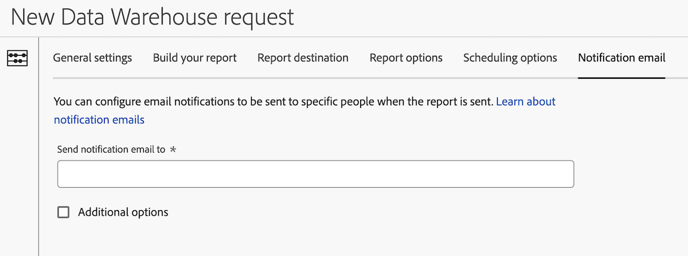

# 为Data Warehouse请求配置通知电子邮件

提供了在创建 Data Warehouse 请求时可使用的多种配置选项。 以下信息介绍了如何为请求配置通知电子邮件。

有关如何开始创建请求的信息以及其他重要配置选项的链接，请参阅[创建 Data Warehouse 请求](/help/export/data-warehouse/create-request/t-dw-create-request.md)。

要为Data Warehouse请求配置通知电子邮件，请执行以下操作：

1. 如果还没有，请选择“**[!UICONTROL 工具]**”>“**[!UICONTROL Data Warehouse]**”>“[!UICONTROL **添加**]”，开始在 Adobe Analytics 中创建请求。

   有关更多详细信息，请参阅[创建 Data Warehouse 请求](/help/export/data-warehouse/create-request/t-dw-create-request.md)。

1. 在“新建Data Warehouse请求”页面上，选择&#x200B;[!UICONTROL **通知电子邮件**]&#x200B;选项卡。

   

1. 请完成以下字段：

   | 选项 | 功能 |
   |---------|----------|
   | [!UICONTROL **将通知电子邮件发送至**] | 指定发送报告时应接收电子邮件通知的人员的电子邮件地址。 
您可以指定单个电子邮件地址或以逗号分隔的电子邮件地址列表。
 |
   | [!UICONTROL **高级选项**] | 选择此选项可在发送通知时包含电子邮件的主题和注释。 |

   {style="table-layout:auto"}

1. 选择&#x200B;[!UICONTROL **保存请求**]&#x200B;以保存Data Warehouse报表请求。

   您现在可以将数据导出到您配置的帐户和位置。
