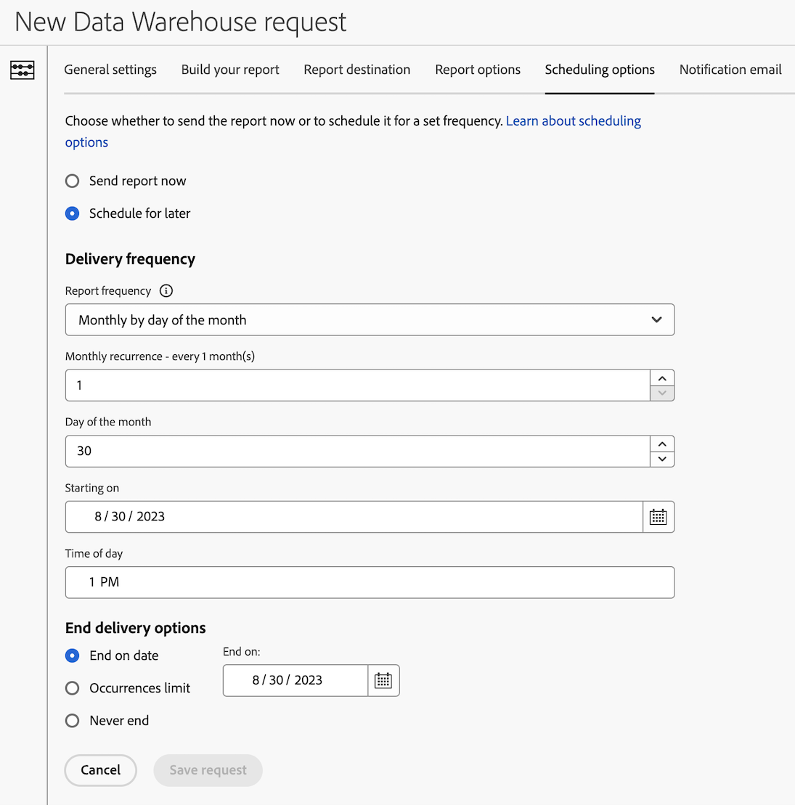

# 为Data Warehouse请求配置计划选项

提供了在创建 Data Warehouse 请求时可使用的多种配置选项。 以下信息介绍了如何为请求配置计划选项。

有关如何开始创建请求的信息以及其他重要配置选项的链接，请参阅[创建 Data Warehouse 请求](/help/export/data-warehouse/create-request/t-dw-create-request.md)。

要为Data Warehouse请求配置计划选项，请执行以下操作：

1. 如果还没有，请选择“**[!UICONTROL 工具]**”>“**[!UICONTROL Data Warehouse]**”>“[!UICONTROL **添加**]”，开始在 Adobe Analytics 中创建请求。

   有关更多详细信息，请参阅[创建 Data Warehouse 请求](/help/export/data-warehouse/create-request/t-dw-create-request.md)。

1. 在“新建Data Warehouse请求”页面上，选择&#x200B;[!UICONTROL **计划选项**]&#x200B;选项卡。

    <!-- update screenshot -->

1. 请完成以下字段：

   | 选项 | 功能 |
   |---------|----------|
   | [!UICONTROL **立即发送报告**] | 将报表作为一次性报表发送。 选择此选项时，将隐藏所有计划选项。 |
   | [!UICONTROL **计划稍后执行**] | 提供用于计划报表提交的选项。 所有选项如下所述。 |
   | [!UICONTROL **报告频率**] | 提交报表的频率。 
可以使用以下选项：
<ul><li>每小时</li>
仅当&#x200B;[!UICONTROL **常规设置**]&#x200B;选项卡上的&#x200B;[!UICONTROL **日期范围**]&#x200B;选项设置为&#x200B;[!UICONTROL **上一小时**]&#x200B;时，[!UICONTROL **小时**]&#x200B;才可用。
<li>每日</li><li>每周</li><li>按月</li><li>每年</li></ul>
根据您选择的频率，将显示其他选项。
 |
   | [!UICONTROL **开始于**] | 新计划应该开始的日期。 |
   | [!UICONTROL **时间**] | 一天中应发送报告的时间。 |
   | [!UICONTROL **结束传递选项**] | 选择结束计划交货的时间。 您可以选择从不结束、在特定次发生次数后结束或在特定日期结束。 |

   {style="table-layout:auto"}

1. 继续在&#x200B;[!UICONTROL **通知电子邮件**]&#x200B;选项卡上配置Data Warehouse请求。 有关详细信息，请参阅[为Data Warehouse请求配置通知电子邮件](/help/export/data-warehouse/create-request/dw-request-email.md)。
