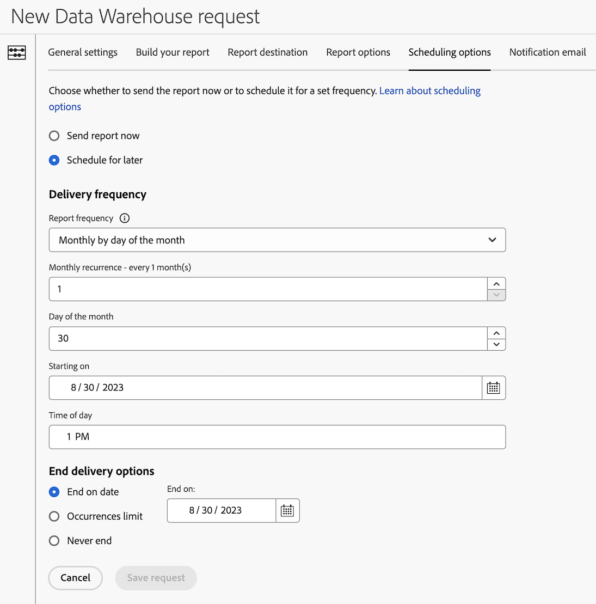

# 为Data Warehouse请求配置计划选项

>[!AVAILABILITY]
>
>本文中介绍的一些Data Warehouse功能(以及此部分中的其他Data Warehouse文章)仅在版本的有限测试阶段提供，并且在您的环境中可能尚未提供。
>
>有关尚未向所有客户提供的功能的信息，以及有关这些功能发布时间线的信息，请参阅 [发行说明](/help/release-notes/latest.md).
>
>当该功能正式发布时，将删除此说明。有关 Analytics 发布流程的信息，请参阅 [Adobe Analytics 功能发布](/help/release-notes/releases.md)。

创建Data Warehouse请求时，有多种可用的配置选项。 以下信息介绍了如何为请求配置计划选项。

有关如何开始创建请求以及指向其他重要配置选项的链接的信息，请参阅 [创建Data Warehouse请求](/help/export/data-warehouse/create-request/t-dw-create-request.md).

要为Data Warehouse请求配置计划选项，请执行以下操作：

1. 通过在Adobe Analytics中选择 **[!UICONTROL 工具]** > **[!UICONTROL Data Warehouse]** > [!UICONTROL **添加**].

   有关其他详细信息，请参阅 [创建Data Warehouse请求](/help/export/data-warehouse/create-request/t-dw-create-request.md).

1. 在“新建Data Warehouse请求”页面上，选择 [!UICONTROL **计划选项**] 选项卡。

    <!-- update screenshot -->

1. 请完成以下字段：

   | 选项 | 函数 |
   |---------|----------|
   | [!UICONTROL **立即发送报告**] | 将报表作为一次性报表发送。 选择此选项时，将隐藏所有计划选项。 |
   | [!UICONTROL **稍后计划**] | 提供用于计划报表提交的选项。 所有选项如下所述。 |
   | [!UICONTROL **报告频率**] | 提交报表的频率。 
可以使用以下选项：
<ul><li>每小时</li>
[!UICONTROL **每小时**] 仅在 [!UICONTROL **日期范围**] 上的选项 [!UICONTROL **常规设置**] 选项卡设置为 [!UICONTROL **上一小时**].
<li>每日</li><li>每周</li><li>每月</li><li>每年</li></ul>
根据您选择的频率，将显示其他选项。
 |
   | [!UICONTROL **开始日期**] | 新计划应该开始的日期。 |
   | [!UICONTROL **一天中的时间**] | 一天中应发送报告的时间。 |
   | [!UICONTROL **结束投放选项**] | 选择结束计划交货的时间。 您可以选择从不结束、在特定次发生次数后结束或在特定日期结束。 |

   {style="table-layout:auto"}

1. 继续在上配置您的Data Warehouse请求 [!UICONTROL **通知电子邮件**] 选项卡。 有关更多信息，请参阅 [为Data Warehouse请求配置通知电子邮件](/help/export/data-warehouse/create-request/dw-request-email.md).

