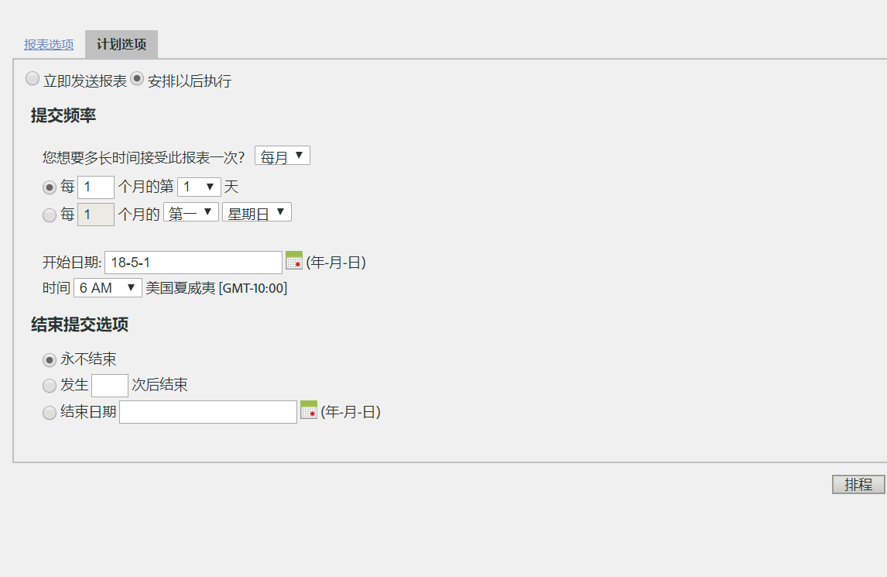

# 计划周期性请求

## 计划周期性请求 {#topic_8C3CE0CE8A584F80946D24B377CB51BE}

要计划每日/每月/每年的 Data Warehouse 请求，请确保已正确选择*预设*

1. Under [!UICONTROL Reporting Date], select **[!UICONTROL Preset]**.

1. Under [!UICONTROL Schedule Delivery], click **[!UICONTROL Advanced Delivery Options]**.

1. Go to the Scheduling Options tab and select **[!UICONTROL Schedule for later]**.
1. 为“[!UICONTROL 提交频率]”和“[!UICONTROL 结束提交选项]”选择所需的设置。

   

1. 单击&#x200B;**[!UICONTROL 计划]**。

