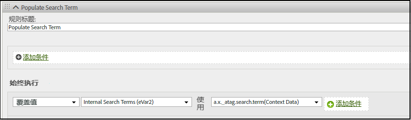

# Adobe Experience Edge中的Analytics变量映射

下表显示了Adobe Experience Platform边缘网络自动映射到Adobe Analytics的变量。 如果您使用这些XDM字段路径，则无需进行其他配置即可将数据发送到Adobe Analytics。

| XDM字段路径 | Analytics维度和描述 |
| --- | --- |
| `application.id` | 移动设备维度 [应用程序ID](https://experienceleague.adobe.com/docs/mobile-services/using/get-started-ug/mobile-metrics/metrics-reference.html#dimensions). |
| `application.isClose` | 帮助定义移动量度 [崩溃次数](https://experienceleague.adobe.com/docs/mobile-services/using/get-started-ug/mobile-metrics/metrics-reference.html#metrics). |
| `application.closeType` | 确定关闭事件是否是崩溃。 有效值包括 `close` （生命周期会话结束，并收到上一会话的暂停事件）和 `unknown` （生命周期会话在不发生暂停事件的情况下结束）。 |
| `application.isInstall` | 移动设备量度 [安装](https://experienceleague.adobe.com/docs/mobile-services/using/get-started-ug/mobile-metrics/metrics-reference.html#metrics). |
| `application.isLaunch` | 移动设备量度 [启动项](https://experienceleague.adobe.com/docs/mobile-services/using/get-started-ug/mobile-metrics/metrics-reference.html#metrics). |
| `application.name` | 帮助设置移动设备维度 [应用程序ID](https://experienceleague.adobe.com/docs/mobile-services/using/get-started-ug/mobile-metrics/metrics-reference.html#dimensions). |
| `application.launches.value` | 移动设备量度 [启动项](https://experienceleague.adobe.com/docs/mobile-services/using/get-started-ug/mobile-metrics/metrics-reference.html#metrics). |
| `application.isUpgrade` | 移动设备量度 [升级](https://experienceleague.adobe.com/docs/mobile-services/using/get-started-ug/mobile-metrics/metrics-reference.html#metrics). |
| `application.version` | 帮助设置移动设备维度 [应用程序ID](https://experienceleague.adobe.com/docs/mobile-services/using/get-started-ug/mobile-metrics/metrics-reference.html#dimensions). |
| `application.sessionLength` | 移动设备量度 [会话总时长](https://experienceleague.adobe.com/docs/mobile-services/using/get-started-ug/mobile-metrics/metrics-reference.html#metrics). |
| `commerce.checkouts.id` | 应用 [事件序列化](../vars/page-vars/events/event-serialization.md) 到 [结账](../../components/metrics/checkouts.md) 量度。 |
| `commerce.checkouts.value` | 将 [结账](../../components/metrics/checkouts.md) 量度。 |
| `commerce.order.currencyCode` | 设置 [currencyCode](../vars/config-vars/currencycode.md) 配置变量。 |
| `commerce.order.purchaseID` | 设置 [purchaseID](../vars/page-vars/purchaseid.md) 页面变量。 |
| `commerce.productListAdds.id` | 应用 [事件序列化](../vars/page-vars/events/event-serialization.md) 到 [购物车加货](../../components/metrics/cart-additions.md) 量度。 |
| `commerce.productListAdds.value` | 将 [购物车加货](../../components/metrics/cart-additions.md) 量度。 |
| `commerce.productListOpens.id` | 应用 [事件序列化](../vars/page-vars/events/event-serialization.md) 到 [购物车](../../components/metrics/carts.md) 量度。 |
| `commerce.productListOpens.value` | 将 [购物车](../../components/metrics/carts.md) 量度。 |
| `commerce.productListRemovals.id` | 应用 [事件序列化](../vars/page-vars/events/event-serialization.md) 到 [购物车减货](../../components/metrics/cart-removals.md) 量度。 |
| `commerce.productListRemovals.value` | 将 [购物车减货](../../components/metrics/cart-removals.md) 量度。 |
| `commerce.productListViews.id` | 应用 [事件序列化](../vars/page-vars/events/event-serialization.md) 到 [购物车查看](../../components/metrics/cart-views.md) 量度。 |
| `commerce.productListViews.value` | 将 [购物车查看](../../components/metrics/cart-views.md) 量度。 |
| `commerce.productViews.id` | 应用 [事件序列化](../vars/page-vars/events/event-serialization.md) 到 [产品查看](../../components/metrics/product-views.md) 量度。 |
| `commerce.productViews.value` | 将 [产品查看](../../components/metrics/product-views.md) 量度。 |
| `commerce.purchases.value` | 将 [订单数](../../components/metrics/orders.md) 量度。 |
| `device.manufacturer` | 移动设备制造商。 |
| `device.model` | 移动设备维度 [设备名称](https://experienceleague.adobe.com/docs/mobile-services/using/get-started-ug/mobile-metrics/metrics-reference.html#dimensions). |
| `device.modelNumber` | 移动设备型号。 |
| `device.colorDepth` | 帮助设置 [颜色深度](../../components/dimensions/color-depth.md) 维度。 |
| `device.screenHeight` | 帮助设置 [显示器分辨率](../../components/dimensions/monitor-resolution.md) 维度。 确保同时设置XDM字段 `device.screenWidth`. |
| `device.screenWidth` | 帮助设置 [显示器分辨率](../../components/dimensions/monitor-resolution.md) 维度。 确保同时设置XDM字段 `device.screenHeight`. |
| `device.type` | 移动设备类型。 |
| `environment.browserDetails.acceptLanguage` | 帮助设置 [语言](../../components/dimensions/language.md) 维度。 |
| `environment.browserDetails.cookiesEnabled` | 设置 [Cookie支持](../../components/dimensions/cookie-support.md) 维度。 有效值包括 `Y` （浏览器接受cookie）和 `N` （浏览器拒绝cookie）。 |
| `environment.browserDetails.javaEnabled` | 设置 [已启用Java](../../components/dimensions/java-enabled.md) 维度。 有效值包括 `Y` （已启用Java）和 `N` （Java被禁用）。 |
| `environment.browserDetails.userAgent` | 用作回退 [独特访客](../../components/metrics/unique-visitors.md) 识别方法。 通常使用 `User-Agent` HTTP请求标头。 如果要在报表中使用此字段，可将其映射到eVar。 |
| `environment.browserDetails.viewportHeight` | 设置 [浏览器高度](../../components/dimensions/browser-height.md) 维度。 |
| `environment.browserDetails.viewportWidth` | 设置 [浏览器宽度](../../components/dimensions/browser-width.md) 维度。 |
| `environment.carrier` | 移动设备维度 [运营商名称](https://experienceleague.adobe.com/docs/mobile-services/using/get-started-ug/mobile-metrics/metrics-reference.html#dimensions). |
| `environment.connectionType` | 帮助设置 [连接类型](../../components/dimensions/connection-type.md) 维度。 |
| `environment.ipV4` | 用作回退 [独特访客](../../components/metrics/unique-visitors.md) 识别方法。 通常使用 `X-Forwarded-For` HTTP标头。 |
| `environment.language` | 移动设备维度区域设置。 |
| `environment.operatingSystem` | 移动设备维度 [操作系统](https://experienceleague.adobe.com/docs/mobile-services/using/get-started-ug/mobile-metrics/metrics-reference.html#dimensions). |
| `environment.operatingSystemVersion` | 移动设备维度 [操作系统版本](https://experienceleague.adobe.com/docs/mobile-services/using/get-started-ug/mobile-metrics/metrics-reference.html#dimensions). |
| `environment.type` | 指示事件是否来自 [可穿戴](https://experienceleague.adobe.com/docs/mobile-services/android/wearables-android/c-android-wearables--additional-notes.html) 设备。 有效值包括 `Application` （事件来自应用程序）， `Extension` （事件来自可穿戴应用程序），或 `Widget` （事件来自移动设备小组件）。 |
| `identityMap.ECID[0].id` | 的 [Adobe Experience Cloud Identity Service ID](https://experienceleague.adobe.com/docs/id-service/using/home.html). |
| `marketing.trackingCode` | 设置 [跟踪代码](../../components/dimensions/tracking-code.md) 维度。 |
| `media.mediaTimed.completes.value` | Media Analytics量度 [内容结束](https://experienceleague.adobe.com/docs/media-analytics/using/metrics-and-metadata/audio-video-parameters.html#content-complete). |
| `media.mediaTimed.dropBeforeStart.value` | `c.a.media.view`、`c.a.media.timePlayed`、`c.a.media.play` |
| `media.mediaTimed.federated.value` | Media Analytics量度 [联合数据](https://experienceleague.adobe.com/docs/media-analytics/using/metrics-and-metadata/audio-video-parameters.html#federated-data). |
| `media.mediaTimed.firstQuartiles.value` | Media Analytics量度 [25%进度标记](https://experienceleague.adobe.com/docs/media-analytics/using/metrics-and-metadata/audio-video-parameters.html#twenty-five-progress-marker). |
| `media.mediaTimed.mediaSegmentView.value` | Media Analytics量度 [内容区段查看](https://experienceleague.adobe.com/docs/media-analytics/using/metrics-and-metadata/audio-video-parameters.html#content-segment-views). |
| `media.mediaTimed.midpoints.value` | Media Analytics量度 [50%进度标记](https://experienceleague.adobe.com/docs/media-analytics/using/metrics-and-metadata/audio-video-parameters.html#fifty-progress-marker). |
| `media.mediaTimed.pauseTime.value` | Media Analytics量度 [暂停总持续时间](https://experienceleague.adobe.com/docs/media-analytics/using/metrics-and-metadata/audio-video-parameters.html#total-pause-duration). |
| `media.mediaTimed.pauses.value` | Media Analytics量度 [暂停事件](https://experienceleague.adobe.com/docs/media-analytics/using/metrics-and-metadata/audio-video-parameters.html#pause-events). |
| `media.mediaTimed.primaryAssetReference.`<br/>`@id` | Media Analytics维度 [资产ID](https://experienceleague.adobe.com/docs/media-analytics/using/metrics-and-metadata/audio-video-parameters.html#asset-id). |
| `media.mediaTimed.primaryAssetReference.`<br/>`dc:title` | Media Analytics维度 [视频名称](https://experienceleague.adobe.com/docs/media-analytics/using/metrics-and-metadata/audio-video-parameters.html#video-name). |
| `media.mediaTimed.primaryAssetReference.`<br/>`iptc4xmpExt:Creator[N].iptc4xmpExt:Name` | Media Analytics维度 [创作者](https://experienceleague.adobe.com/docs/media-analytics/using/metrics-and-metadata/audio-video-parameters.html#originator). |
| `media.mediaTimed.primaryAssetReference.`<br/>`iptc4xmpExt:Episode.iptc4xmpExt:Number` | Media Analytics维度 [剧集](https://experienceleague.adobe.com/docs/media-analytics/using/metrics-and-metadata/audio-video-parameters.html#episode). |
| `media.mediaTimed.primaryAssetReference.`<br/>`iptc4xmpExt:Genre` | Media Analytics维度 [流派](https://experienceleague.adobe.com/docs/media-analytics/using/metrics-and-metadata/audio-video-parameters.html#genre). |
| `media.mediaTimed.primaryAssetReference.`<br/>`iptc4xmpExt:Rating[N].iptc4xmpExt:RatingValue` | Media Analytics维度 [内容评级](https://experienceleague.adobe.com/docs/media-analytics/using/metrics-and-metadata/audio-video-parameters.html#content-rating). |
| `media.mediaTimed.primaryAssetReference.`<br/>`iptc4xmpExt:Season.iptc4xmpExt:Number` | Media Analytics维度 [季](https://experienceleague.adobe.com/docs/media-analytics/using/metrics-and-metadata/audio-video-parameters.html#season). |
| `media.mediaTimed.primaryAssetReference.`<br/>`iptc4xmpExt:Series.iptc4xmpExt:Identifier` | Media Analytics维度 [内容ID](https://experienceleague.adobe.com/docs/media-analytics/using/metrics-and-metadata/audio-video-parameters.html#content-id). |
| `media.mediaTimed.primaryAssetReference.`<br/>`iptc4xmpExt:Series.iptc4xmpExt:Name` | Media Analytics维度 [显示](https://experienceleague.adobe.com/docs/media-analytics/using/metrics-and-metadata/audio-video-parameters.html#show). |
| `media.mediaTimed.primaryAssetReference.`<br/>`showType` | Media Analytics维度 [显示类型](https://experienceleague.adobe.com/docs/media-analytics/using/metrics-and-metadata/audio-video-parameters.html#show-type). |
| `media.mediaTimed.primaryAssetReference.`<br/>`xmpDM:duration` | Media Analytics维度 [视频长度](https://experienceleague.adobe.com/docs/media-analytics/using/metrics-and-metadata/audio-video-parameters.html#video-length). |
| `media.mediaTimed.primaryAssetViewDetails.`<br/>`@id` | Media Analytics维度 [媒体会话ID](https://experienceleague.adobe.com/docs/media-analytics/using/metrics-and-metadata/audio-video-parameters.html#media-session-id). |
| `media.mediaTimed.primaryAssetViewDetails.`<br/>`broadcastChannel` | Media Analytics维度 [内容渠道](https://experienceleague.adobe.com/docs/media-analytics/using/metrics-and-metadata/audio-video-parameters.html#content-channel). |
| `media.mediaTimed.primaryAssetViewDetails.`<br/>`broadcastContentType` | Media Analytics维度 [内容类型](https://experienceleague.adobe.com/docs/media-analytics/using/metrics-and-metadata/audio-video-parameters.html#content-type). |
| `media.mediaTimed.primaryAssetViewDetails.`<br/>`broadcastNetwork` | Media Analytics维度 [网络](https://experienceleague.adobe.com/docs/media-analytics/using/metrics-and-metadata/audio-video-parameters.html#network). |
| `media.mediaTimed.primaryAssetViewDetails.`<br/>`mediaSegmentView.value` | Media Analytics维度 [内容区段](https://experienceleague.adobe.com/docs/media-analytics/using/metrics-and-metadata/audio-video-parameters.html#content-segment). |
| `media.mediaTimed.primaryAssetViewDetails.`<br/>`playerName` | Media Analytics维度 [内容播放器名称](https://experienceleague.adobe.com/docs/media-analytics/using/metrics-and-metadata/audio-video-parameters.html#content-player-name). |
| `media.mediaTimed.primaryAssetViewDetails.`<br/>`playerSDKVersion.version` | Media Analytics维度 [SDK版本](https://experienceleague.adobe.com/docs/media-analytics/using/metrics-and-metadata/audio-video-parameters.html#sdk-version). |
| `media.mediaTimed.primaryAssetViewDetails.`<br/>`sourceFeed` | Media Analytics维度 [媒体馈送类型](https://experienceleague.adobe.com/docs/media-analytics/using/metrics-and-metadata/audio-video-parameters.html#media-feed-type). |
| `media.mediaTimed.primaryAssetViewDetails.`<br/>`streamFormat` | Media Analytics维度 [流格式](https://experienceleague.adobe.com/docs/media-analytics/using/metrics-and-metadata/audio-video-parameters.html#stream-format). |
| `media.mediaTimed.progress10.value` | Media Analytics量度 [10%进度标记](https://experienceleague.adobe.com/docs/media-analytics/using/metrics-and-metadata/audio-video-parameters.html#ten-progress-marker). |
| `media.mediaTimed.progress95.value` | Media Analytics量度 [95%进度标记](https://experienceleague.adobe.com/docs/media-analytics/using/metrics-and-metadata/audio-video-parameters.html#ninety-five-progress-marker). |
| `media.mediaTimed.resumes.value` | Media Analytics量度 [内容继续](https://experienceleague.adobe.com/docs/media-analytics/using/metrics-and-metadata/audio-video-parameters.html#content-resumes). |
| `media.mediaTimed.starts.value` | Media Analytics量度 [媒体开始](https://experienceleague.adobe.com/docs/media-analytics/using/metrics-and-metadata/audio-video-parameters.html#media-starts). |
| `media.mediaTimed.thirdQuartiles.value` | Media Analytics量度 [75%进度标记](https://experienceleague.adobe.com/docs/media-analytics/using/metrics-and-metadata/audio-video-parameters.html#seventy-five-progress-marker). |
| `media.mediaTimed.timePlayed.value` | Media Analytics量度 [内容逗留时间](https://experienceleague.adobe.com/docs/media-analytics/using/metrics-and-metadata/audio-video-parameters.html#content-time-spent). |
| `media.mediaTimed.totalTimePlayed.value` | Media Analytics量度 [媒体逗留时间](https://experienceleague.adobe.com/docs/media-analytics/using/metrics-and-metadata/audio-video-parameters.html#media-time-spent). |
| `placeContext.geo.latitude` | 移动设备维度纬度。 |
| `placeContext.geo.longitude` | 移动设备维度经度。 |
| `placeContext.geo.postalCode` | 的 [邮政编码](../../components/dimensions/zip-code.md) 维度。 |
| `placeContext.geo.stateProvince` | 的 [美国各州](../../components/dimensions/us-states.md) 维度。 |
| `productListItems[N].lineItemId` | 的 [类别](../../components/dimensions/category.md) 维度。 |
| `productlistitems[N].name` | 的 [产品](../../components/dimensions/product.md) 维度。 |
| `productlistitems[N].priceTotal` | 帮助确定 [收入](../../components/metrics/revenue.md) 量度。 |
| `productlistitems[N].quantity` | 帮助确定 [件数](../../components/metrics/units.md) 量度。 |
| `web.webInteraction.URL` | 的 [linkURL](../vars/config-vars/linkurl.md) 实施变量。 |
| `web.webInteraction.name` | 的 [自定义链接](../../components/dimensions/custom-link.md), [下载链接](../../components/dimensions/download-link.md)或 [退出链接](../../components/dimensions/exit-link.md) 维度，取决于 `web.webInteraction.type` |
| `web.webInteraction.type` | 确定点击的链接类型。 有效值包括 `lnk_o` （自定义链接）、 `lnk_d` （下载链接）和 `lnk_e` （退出链接）。 |
| `web.webPageDetails.URL` | 的 [页面URL](../../components/dimensions/page-url.md) 维度。 |
| `web.webPageDetails.errorPage` | 帮助确定“页面未找到”的标记 [维度](../../components/dimensions/pages-not-found.md) 和 [量度](../../components/metrics/pages-not-found.md). |
| `web.webPageDetails.name` | 的 [页面](../../components/dimensions/page.md) 维度。 |
| `web.webPageDetails.server` | 的 [服务器](../../components/dimensions/server.md) 维度。 |
| `web.webPageDetails.siteSection` | 的 [网站区域](../../components/dimensions/site-section.md) 维度。 |
| `web.webReferrer.URL` | 的 [反向链接](../../components/dimensions/referrer.md) 维度。 |

{style=&quot;table-layout:auto&quot;}

<!-- `environment.browserDetails.javaScriptVersion` and `web.webPageDetails.homePage` were included in the original table, but they no longer exist in Analytics. | -->

## 将其他XDM字段映射到Analytics变量

如果要添加到Adobe Analytics的任何维度或量度，可以通过 [上下文数据变量](../vars/page-vars/contextdata.md). 所有XDM字段元素都将作为前缀的“上下文数据”发送到Adobe Analytics `a.x`. 然后，您可以使用 [处理规则](../../admin/admin/c-processing-rules/processing-rules.md). 例如，如果您发送了以下事件：

```js
alloy("event",{
    "xdm":{
        "_atag":{
            "search":{
                "term":"Example search term"
            }
        }
    }
})
```

Web SDK将该数据作为上下文数据变量发送到Adobe Analytics `a.x._atag.search.term`. 然后，您可以使用处理规则将该上下文数据变量值分配给所需的Analytics变量，例如eVar:


