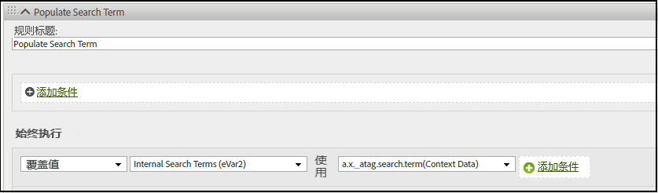
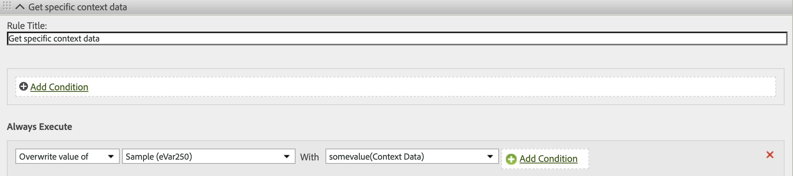

# XDM对象变量映射到Adobe Analytics

下表显示了Adobe Experience Platform Edge Network自动映射到Adobe Analytics中的XDM变量。 如果使用这些XDM字段路径，则无需额外配置即可将数据发送到Adobe Analytics。 这些字段包含在&#x200B;**[!UICONTROL Adobe Analytics ExperienceEvent Template]**&#x200B;字段组中。 如果您打算将数据同时发送到Adobe Analytics和Adobe Experience Platform，则建议使用这些字段。

如果您的组织计划迁移到Customer Journey Analytics，Adobe建议改用`data`对象在不符合架构的情况下直接将数据发送到Adobe Analytics。 此策略允许您的组织使用自己的架构，而不是使用[!UICONTROL Adobe Analytics ExperienceEvent模板]&#x200B;(不太适用于Customer Journey Analytics)。 有关类似的映射表，请参阅映射到Adobe Analytics[的](data-var-mapping.md)数据对象变量。

## 价值优先级

此表的大多数XDM对象字段与[数据对象字段](data-var-mapping.md)一致。 如果同时设置给定的XDM对象字段及其各自的数据对象字段，则数据对象字段优先。 如果同时使用XDM对象字段和数据对象字段，Adobe建议使用数据对象字段设置自定义事件。 如果字段`data.__adobe.analytics.events`存在，它将覆盖所有与商务和自定义事件相关的XDM对象字段。

## XDM对象字段映射

可以在此页面的 [GitHub 上的提交历史记录](https://github.com/AdobeDocs/analytics.en/commits/main/help/implement/aep-edge/xdm-var-mapping.md)中找到此表之前的更新内容。

| XDM 字段路径 | Analytics变量和描述 |
| --- | --- |
| `xdm.application.isClose` | 帮助定义移动生命周期量度[崩溃](https://developer.adobe.com/client-sdks/home/base/mobile-core/lifecycle/metrics/)。 |
| `xdm.application.isInstall` | 帮助确定何时增加[首次发布](https://developer.adobe.com/client-sdks/home/base/mobile-core/lifecycle/metrics/)移动生命周期量度。 |
| `xdm.application.closeType` | 确定关闭事件是否为崩溃。 有效值包括 `close`（生命周期会话结束，前一个会接话收到暂停事件）和 `unknown`（生命周期会话结束，没有暂停事件）。 帮助设置移动生命周期量度[崩溃](https://developer.adobe.com/client-sdks/home/base/mobile-core/lifecycle/metrics/)量度。 |
| `xdm.application.isInstall` | 移动生命周期量度[安装](https://developer.adobe.com/client-sdks/home/base/mobile-core/lifecycle/metrics/)。 |
| `xdm.application.isLaunch` | 移动生命周期量度[发布](https://developer.adobe.com/client-sdks/home/base/mobile-core/lifecycle/metrics/)。 |
| `xdm.application.name` | 帮助设置移动生命周期维度[应用程序 ID](https://developer.adobe.com/client-sdks/home/base/mobile-core/lifecycle/metrics/)。 |
| `xdm.application.isUpgrade` | 移动生命周期量度[升级](https://developer.adobe.com/client-sdks/home/base/mobile-core/lifecycle/metrics/)。 |
| `xdm.application.version` | 帮助设置移动生命周期维度[应用程序 ID](https://developer.adobe.com/client-sdks/home/base/mobile-core/lifecycle/metrics/)。 |
| `xdm.application.sessionLength` | 移动生命周期量度[上一个会话长度](https://developer.adobe.com/client-sdks/home/base/mobile-core/lifecycle/metrics/)。 |
| `xdm.commerce.checkouts.id` | 将[事件序列化](../vars/page-vars/events/event-serialization.md)应用于[“结账”](/help/components/metrics/checkouts.md)量度。 |
| `xdm.commerce.checkouts.value` | 按所需的量增加[“结账”](/help/components/metrics/checkouts.md) 量度。 |
| `xdm.commerce.order.currencyCode` | 设置 [currencyCode](../vars/config-vars/currencycode.md) 配置变量。 |
| `xdm.commerce.order.purchaseID` | 设置 [purchaseID](../vars/page-vars/purchaseid.md) 页面变量。 |
| `xdm.commerce.order.payments[0].transactionID` | 设置 [transactionID](../vars/page-vars/transactionid.md) 页面变量。 |
| `xdm.commerce.productListAdds.id` | 将[事件序列化](../vars/page-vars/events/event-serialization.md)应用于[添加到购物车的次数](/help/components/metrics/cart-additions.md)量度。 |
| `xdm.commerce.productListAdds.value` | 增加[购物车添加](/help/components/metrics/cart-additions.md) 量度。 |
| `xdm.commerce.productListOpens.id` | 将[事件序列化](../vars/page-vars/events/event-serialization.md)应用于[“购物车”](/help/components/metrics/carts.md)量度。 |
| `xdm.commerce.productListOpens.value` | 增加[购物车](/help/components/metrics/carts.md) 量度。 |
| `xdm.commerce.productListRemovals.id` | 将[事件序列化](../vars/page-vars/events/event-serialization.md)应用于[“购物车移除”](/help/components/metrics/cart-removals.md)量度。 |
| `xdm.commerce.productListRemovals.value` | 增加[购物车减货](/help/components/metrics/cart-removals.md) 量度。 |
| `xdm.commerce.productListViews.id` | 将[事件序列化](../vars/page-vars/events/event-serialization.md)应用于[“购物车查看”](/help/components/metrics/cart-views.md)量度。 |
| `xdm.commerce.productListViews.value` | 增加[购物车查看次数](/help/components/metrics/cart-views.md) 量度。 |
| `xdm.commerce.productViews.id` | 将[事件序列化](../vars/page-vars/events/event-serialization.md)应用于[“产品查看”](/help/components/metrics/product-views.md)量度。 |
| `xdm.commerce.productViews.value` | 增加[“产品查看次数”](/help/components/metrics/product-views.md) 量度。 |
| `xdm.commerce.purchases.value` | 增加[“订单”](/help/components/metrics/orders.md) 量度。 |
| `xdm.device.model` | 移动生命周期维度[设备名称](https://developer.adobe.com/client-sdks/home/base/mobile-core/lifecycle/metrics/)。 |
| `xdm.device.colorDepth` | 帮助设置 [“颜色深度”](/help/components/dimensions/color-depth.md) 维度。 |
| `xdm.device.screenHeight` | 帮助设置移动维度 [“监测器分辨率”](/help/components/dimensions/monitor-resolution.md) 维度。 |
| `xdm.device.screenWidth` | 帮助设置移动维度 [“监测器分辨率”](/help/components/dimensions/monitor-resolution.md) 维度。 |
| `xdm.device.type` | 移动设备类型。 |
| `xdm.environment.browserDetails.acceptLanguage` | 帮助设置 [“语言”](/help/components/dimensions/language.md) 维度。 |
| `xdm.environment.browserDetails.cookiesEnabled` | 设置 [“Cookie 支持”](/help/components/dimensions/cookie-support.md) 维度。 有效值包括 `Y`（浏览器接受 Cookie）和 `N`（浏览器拒绝 Cookie）。 |
| `xdm.environment.browserDetails.javaEnabled` | 设置 [“启用 Java”](/help/components/dimensions/java-enabled.md) 维度。 有效值包括 `Y`（Java 已启用）和 `N`（Java 已禁用）。 |
| `xdm.environment.browserDetails.userAgent` | 用作后备的[独特访客](/help/components/metrics/unique-visitors.md)识别方法。 通常使用 `User-Agent` HTTP 请求头填充。 如果要在报告中使用此字段，可以将其映射到 eVar。 |
| `xdm.environment.browserDetails.viewportHeight` | 设置 [“浏览器高度”](/help/components/dimensions/browser-height.md) 维度。 |
| `xdm.environment.browserDetails.viewportWidth` | 设置 [“浏览器宽度”](/help/components/dimensions/browser-width.md) 维度。 |
| `xdm.environment.carrier` | 移动生命周期维度[运营商名称](https://developer.adobe.com/client-sdks/home/base/mobile-core/lifecycle/metrics/)。 |
| `xdm.environment.connectionType` | 帮助设置 [“连接类型”](/help/components/dimensions/connection-type.md) 维度。 |
| `xdm.environment._dc.language` | 设置上下文数据变量`a.locale`。 仅在未设置`xdm.environment.language`时使用。 Adobe建议超过`xdm.environment.language`使用此字段。 |
| `xdm.environment.ipV4` | 用作后备的[独特访客 ](/help/components/metrics/unique-visitors.md) 识别方法。 通常使用 `X-Forwarded-For` HTTP 头填充。 |
| `xdm.environment.language` | 设置上下文数据变量`a.locale`。 Adobe建议改用`xdm.environment._dc.language`。 |
| `xdm.environment.operatingSystem` | 移动生命周期维度[操作系统](https://developer.adobe.com/client-sdks/home/base/mobile-core/lifecycle/metrics/)。 |
| `xdm.environment.operatingSystemVersion` | 帮助设置移动生命周期维度[操作系统版本](https://developer.adobe.com/client-sdks/home/base/mobile-core/lifecycle/metrics/)。 |
| `xdm._experience.analytics.customDimensions.`<br/>`eVars.eVar1`<br/>`[...]`<br/>`xdm._experience.analytics.customDimensions.`<br/>`eVars.eVar250` | 设置相应的 [eVar](/help/components/dimensions/evar.md) 维度。 |
| `xdm._experience.analytics.customDimensions.`<br/>`hierarchies.hier1`<br/>`[...]`<br/>`xdm._experience.analytics.customDimensions.`<br/>`hierarchies.hier5` | 设置相应的[层级](/help/components/dimensions/hierarchy.md)维度。 |
| `xdm._experience.analytics.customDimensions.`<br/>`listProps.prop1.delimiter`<br/>`[...]`<br/>`xdm._experience.analytics.customDimensions.`<br/>`listProps.prop75.delimiter` | 列表属性分隔符覆盖。不建议使用此字段，因为会从报告包设置下的[流量变量管理](/help/admin/tools/manage-rs/edit-settings/c-traffic-variables/traffic-var.md)中自动检索分隔符。使用此字段可能会导致使用的分隔符与 Analytics 需要的分隔符不匹配。 |
| `xdm._experience.analytics.customDimensions.`<br/>`listProps.prop1.values`<br/>`[...]`<br/>`xdm._experience.analytics.customDimensions.`<br/>`listProps.prop75.values` | 一个字符串数组，包含相应的 [List Prop](../vars/page-vars/prop.md#list-props) 值。 |
| `xdm._experience.analytics.customDimensions.`<br/>`lists.list1.list[].value`<br/>`[...]`<br/>`xdm._experience.analytics.customDimensions.`<br/>`lists.list3.list[].value` | 将每个 `list[]` 数组中的所有 `value` 字符串连接到其各自的[列表变量](../vars/page-vars/list.md)。分隔符是根据[报表包设置](/help/admin/tools/manage-rs/edit-settings/conversion-var-admin/list-var-admin.md)中的值集自动选择的。 |
| `xdm._experience.analytics.customDimensions.`<br/>`props.prop1`<br/>`[...]`<br/>`xdm._experience.analytics.customDimensions.`<br/>`props.prop75` | 设置相应的 [Prop](/help/components/dimensions/prop.md) 维度。 |
| `xdm._experience.analytics.event1to100.`<br/>`event1.id`<br/>`[...]`<br/>`xdm._experience.analytics.event901to1000.`<br/>`event1000.id` | 将[事件序列化](../vars/page-vars/events/event-serialization.md)应用于相应的[自定义事件](/help/components/metrics/custom-events.md)量度。每个事件 ID 驻留在其 100 组父项中。例如，要将序列化应用于 `event678`，请使用 `xdm._experience.analytics.event601to700.event678.id`。 |
| `xdm._experience.analytics.event1to100.`<br/>`event1.value`<br/>`[...]`<br/>`xdm._experience.analytics.event901to1000.`<br/>`event1000.value` | 按所需的量增加相应的[自定义事件](/help/components/metrics/custom-events.md)量度。每个事件驻留在其 100 组父项中。例如，`event567` 的字段为 `xdm._experience.analytics.event501to600.event567.value`。 |
| `xdm.identityMap.ECID[0].id` | [Adobe Experience Cloud 身份标识服务 ID](https://experienceleague.adobe.com/en/docs/id-service/using/home)。 |
| `xdm.marketing.trackingCode` | 设置 [“跟踪代码”](/help/components/dimensions/tracking-code.md) 维度。 |
| `xdm.media.mediaTimed.completes.value` | 流媒体服务量度[内容结束](https://experienceleague.adobe.com/en/docs/media-analytics/using/implementation/variables/audio-video-parameters#content-complete)。 |
| `xdm.media.mediaTimed.dropBeforeStart.value` | `a.media.view`, `a.media.timePlayed`, `a.media.play` |
| `xdm.media.mediaTimed.federated.value` | 流媒体服务量度[联合数据](https://experienceleague.adobe.com/en/docs/media-analytics/using/implementation/variables/audio-video-parameters#federated-data)。 |
| `xdm.media.mediaTimed.firstQuartiles.value` | 流媒体服务量度[25%进度标记](https://experienceleague.adobe.com/en/docs/media-analytics/using/implementation/variables/audio-video-parameters#twenty-five--progress-marker)。 |
| `xdm.media.mediaTimed.mediaSegmentView.value` | 流媒体服务量度[内容区段视图](https://experienceleague.adobe.com/en/docs/media-analytics/using/implementation/variables/audio-video-parameters#content-segment-views)。 |
| `xdm.media.mediaTimed.midpoints.value` | 流媒体服务量度[50%进度标记](https://experienceleague.adobe.com/en/docs/media-analytics/using/implementation/variables/audio-video-parameters#progress-marker)。 |
| `xdm.media.mediaTimed.pauseTime.value` | 流媒体服务量度[总暂停持续时间](https://experienceleague.adobe.com/en/docs/media-analytics/using/implementation/variables/audio-video-parameters#total-pause-duration)。 |
| `xdm.media.mediaTimed.pauses.value` | 流媒体服务量度[暂停事件](https://experienceleague.adobe.com/en/docs/media-analytics/using/implementation/variables/audio-video-parameters#pause-events)。 |
| `xdm.mediaCollection.sessionDetails.assetID` | 流媒体服务维度[资产ID](https://experienceleague.adobe.com/en/docs/media-analytics/using/implementation/variables/audio-video-parameters#asset-id)。 |
| `xdm.mediaCollection.sessionDetails.friendlyName` | 流媒体服务维度[视频名称](https://experienceleague.adobe.com/en/docs/media-analytics/using/implementation/variables/audio-video-parameters#video-name)。 |
| `xdm.mediaCollection.sessionDetails.originator` | 流媒体服务维度[发起人](https://experienceleague.adobe.com/en/docs/media-analytics/using/implementation/variables/audio-video-parameters#originator)。 |
| `xdm.mediaCollection.sessionDetails.episode` | 流媒体服务维度[Episode](https://experienceleague.adobe.com/en/docs/media-analytics/using/implementation/variables/audio-video-parameters#episode)。 |
| `xdm.mediaCollection.sessionDetails.genre` | 流媒体服务维度[流派](https://experienceleague.adobe.com/en/docs/media-analytics/using/implementation/variables/audio-video-parameters#genre)。 |
| `xdm.mediaCollection.sessionDetails.rating` | 流媒体服务维度[内容评级](https://experienceleague.adobe.com/en/docs/media-analytics/using/implementation/variables/audio-video-parameters#content-rating)。 |
| `xdm.mediaCollection.sessionDetails.season` | 流媒体服务维度[季](https://experienceleague.adobe.com/en/docs/media-analytics/using/implementation/variables/audio-video-parameters#season)。 |
| `xdm.mediaCollection.sessionDetails.name` | 流媒体服务维度[内容ID](https://experienceleague.adobe.com/en/docs/media-analytics/using/implementation/variables/audio-video-parameters#content-id)。 |
| `xdm.mediaCollection.sessionDetails.show` | 流媒体服务维度[节目](https://experienceleague.adobe.com/en/docs/media-analytics/using/implementation/variables/audio-video-parameters#show)。 |
| `xdm.mediaCollection.sessionDetails.showType` | 流媒体服务维度[节目类型](https://experienceleague.adobe.com/en/docs/media-analytics/using/implementation/variables/audio-video-parameters#show-type)。 |
| `xdm.mediaCollection.sessionDetails.length` | 流媒体服务维度[视频长度](https://experienceleague.adobe.com/en/docs/media-analytics/using/implementation/variables/audio-video-parameters#video-length)。 |
| `xdm.media.mediaTimed.primaryAssetViewDetails.@id` | 流媒体服务维度[媒体会话ID](https://experienceleague.adobe.com/en/docs/media-analytics/using/implementation/variables/audio-video-parameters#media-session-id)。 |
| `xdm.mediaCollection.sessionDetails.channel` | 流媒体服务维度[内容频道](https://experienceleague.adobe.com/en/docs/media-analytics/using/implementation/variables/audio-video-parameters#content-channel)。 |
| `xdm.mediaCollection.sessionDetails.contentType` | 流媒体服务维度[内容类型](https://experienceleague.adobe.com/en/docs/media-analytics/using/implementation/variables/audio-video-parameters#content-type)。 |
| `xdm.mediaCollection.sessionDetails.network` | 流媒体服务维度[网络](https://experienceleague.adobe.com/en/docs/media-analytics/using/implementation/variables/audio-video-parameters#network)。 |
| `xdm.media.mediaTimed.primaryAssetViewDetails.`<br/>`mediaSegmentView.value` | 流媒体服务维度[内容区段](https://experienceleague.adobe.com/en/docs/media-analytics/using/implementation/variables/audio-video-parameters#content-segment)。 |
| `xdm.mediaCollection.sessionDetails.playerName` | 流媒体服务维度[内容播放器名称](https://experienceleague.adobe.com/en/docs/media-analytics/using/implementation/variables/audio-video-parameters#content-player-name)。 |
| `xdm.mediaCollection.sessionDetails.appVersion` | 流媒体服务维度[SDK版本](https://experienceleague.adobe.com/en/docs/media-analytics/using/implementation/variables/audio-video-parameters#sdk-version)。 |
| `xdm.mediaCollection.sessionDetails.feed` | 流媒体服务维度[媒体馈送类型](https://experienceleague.adobe.com/en/docs/media-analytics/using/implementation/variables/audio-video-parameters#media-feed-type)。 |
| `xdm.mediaCollection.sessionDetails.streamFormat` | 流媒体服务维度[流格式](https://experienceleague.adobe.com/en/docs/media-analytics/using/implementation/variables/audio-video-parameters#stream-format)。 |
| `xdm.media.mediaTimed.progress10.value` | 流媒体服务量度[1%进度标记](https://experienceleague.adobe.com/en/docs/media-analytics/using/implementation/variables/audio-video-parameters#ten--progress-marker)。 |
| `xdm.media.mediaTimed.progress95.value` | 流媒体服务量度[95%进度标记](https://experienceleague.adobe.com/en/docs/media-analytics/using/implementation/variables/audio-video-parameters#ninety-five--progress-marker)。 |
| `xdm.mediaCollection.sessionDetails.hasResume` | 流媒体服务量度[内容继续](https://experienceleague.adobe.com/en/docs/media-analytics/using/implementation/variables/audio-video-parameters#content-resumes)。 |
| `xdm.media.mediaTimed.starts.value` | 流媒体服务量度[媒体开始](https://experienceleague.adobe.com/en/docs/media-analytics/using/implementation/variables/audio-video-parameters#media-starts)。 |
| `xdm.media.mediaTimed.thirdQuartiles.value` | 流媒体服务量度[75%进度标记](https://experienceleague.adobe.com/en/docs/media-analytics/using/implementation/variables/audio-video-parameters#seventy-five--progress-marker)。 |
| `xdm.media.mediaTimed.timePlayed.value` | 流媒体服务量度[内容逗留时间](https://experienceleague.adobe.com/en/docs/media-analytics/using/implementation/variables/audio-video-parameters#content-time-spent)。 |
| `xdm.media.mediaTimed.totalTimePlayed.value` | 流媒体服务量度[媒体逗留时间](https://experienceleague.adobe.com/en/docs/media-analytics/using/implementation/variables/audio-video-parameters#media-time-spent)。 |
| `xdm.placeContext.geo._schema.latitude` | 访客的纬度位置。 帮助设置[移动生命周期位置](/help/components/dimensions/lifecycle-dimensions.md)维度。 |
| `xdm.placeContext.geo._schema.longitude` | 访客的经度位置。 帮助设置[移动生命周期位置](/help/components/dimensions/lifecycle-dimensions.md)维度。 |
| `xdm.placeContext.geo.postalCode` | [“邮政编码”](/help/components/dimensions/zip-code.md) 维度。 |
| `xdm.placeContext.geo.stateProvince` | [“美国”](/help/components/dimensions/us-states.md) 维度。 |
| `xdm.placeContext.localTime` | 在[数据馈送](/help/export/analytics-data-feed/c-df-contents/datafeeds-reference.md)中显示为 `t_time_info`。 |
| `xdm.productListItems[]._experience.analytics.`<br/>`customDimensions.eVars.eVar1`<br/>`[...]`<br/>`xdm.productListItems[]._experience.analytics.`<br/>`customDimensions.eVars.eVar250` | 将[产品语法](../vars/page-vars/products.md)促销应用于 eVar。 |
| `xdm.productListItems[]._experience.analytics.`<br/>`event1to100.event1.value`<br/>`[...]`<br/>`xdm.productListItems[]._experience.analytics.`<br/>`event901-1000.event1000.value` | 将[产品语法](../vars/page-vars/products.md)促销应用于事件。 |
| `xdm.productListItems[].productCategories[].categoryID` | [“类别”](/help/components/dimensions/category.md) 维度。另请参阅[产品](../vars/page-vars/products.md)页面变量。 |
| `xdm.productListItems[].name` | [产品](/help/components/dimensions/product.md)维度。另请参阅[产品](../vars/page-vars/products.md)页面变量。 如果 `xdm.productListItems[].SKU` 和 `xdm.productListItems[].name` 都包含数据，则使用 `xdm.productListItems[].SKU` 中的值。 |
| `xdm.productListItems[].priceTotal` | 帮助确定[收入](/help/components/metrics/revenue.md)量度。另请参阅[产品](../vars/page-vars/products.md)页面变量。 |
| `xdm.productListItems[].quantity` | 帮助确定[单位](/help/components/metrics/units.md)量度。另请参阅[产品](../vars/page-vars/products.md)页面变量。 |
| `xdm.productListItems[].SKU` | [产品](/help/components/dimensions/product.md)维度。另请参阅[产品](../vars/page-vars/products.md)页面变量。 如果 `xdm.productListItems[].SKU` 和 `xdm.productListItems[].name` 都包含数据，则使用 `xdm.productListItems[].SKU` 中的值。 |
| `xdm.web.webInteraction.URL` | [linkURL](../vars/config-vars/linkurl.md) 实施变量。 |
| `xdm.web.webInteraction.name` | [自定义链接](/help/components/dimensions/custom-link.md)、[下载链接](/help/components/dimensions/download-link.md) 或者[退出链接](/help/components/dimensions/exit-link.md)维度取决于 `xdm.web.webInteraction.type` 中的值 |
| `xdm.web.webInteraction.type` | 确定链接点击的类型。 有效值包括 `other`（自定义链接）、`download`（下载链接）和 `exit`（退出链接）。 |
| `xdm.web.webPageDetails.URL` | [页面 URL](/help/components/dimensions/page-url.md) 维度。 |
| `xdm.web.webPageDetails.isErrorPage` | 帮助确定“找不到页面”[维度](/help/components/dimensions/pages-not-found.md)和[量度](/help/components/metrics/pages-not-found.md)。 |
| `xdm.web.webPageDetails.name` | [页面](/help/components/dimensions/page.md)维度。 |
| `xdm.web.webPageDetails.server` | [服务器](/help/components/dimensions/server.md)维度。 |
| `xdm.web.webPageDetails.siteSection` | [网站分区](/help/components/dimensions/site-section.md)维度。 |
| `xdm.web.webReferrer.URL` | [推荐人](/help/components/dimensions/referrer.md)维度。 |

{style="table-layout:auto"}

<!-- `environment.browserDetails.javaScriptVersion` and `web.webPageDetails.homePage` were included in the original table, but they no longer exist in Analytics. | -->

## 将其他 XDM 字段映射到 Analytics 变量

如果有任何维度或量度要添加到Adobe Analytics中，可以通过[上下文数据变量](../vars/page-vars/contextdata.md)进行添加。

### 隐式映射

任何未自动映射的XDM字段元素将作为前缀为`a.x.`的上下文数据发送到Adobe Analytics。 然后，可以使用[处理规则](/help/admin/tools/manage-rs/edit-settings/general/processing-rules/pr-overview.md)将此上下文数据变量映射到所需的Analytics变量。 例如，如果发送以下事件：

```js
alloy("event",{
    "xdm":{
        "_atag":{
            "search":{
                "term":"Example search term"
            }
        }
    }
})
```

Web SDK 将该数据作为上下文数据变量发送给 Adobe Analytics `a.x._atag.search.term`。 然后，您可以使用处理规则将该上下文数据变量值分配给所需的Analytics变量，如`eVar`：



## 显式映射

您还可以将XDM字段元素显式映射为上下文数据。 使用`contextData`元素显式映射的任何XDM字段元素将作为不带前缀的上下文数据发送到Adobe Analytics。 然后，可以使用[处理规则](/help/admin/tools/manage-rs/edit-settings/general/processing-rules/pr-overview.md)将此上下文数据变量映射到所需的Analytics变量。 例如，如果发送以下事件：

```js
alloy("event",{
    "xdm":{
        "_atag":{
            "analytics": {
                "contextData" : {
                    "someValue" : "1"
                }
            }
        }
    }
})
```

Web SDK将该数据作为值为`somevalue`的上下文数据变量`1`发送到Adobe Analytics。  然后，您可以使用处理规则将该上下文数据变量值分配给所需的Analytics变量，如`eVar`：


