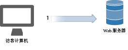
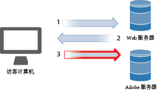
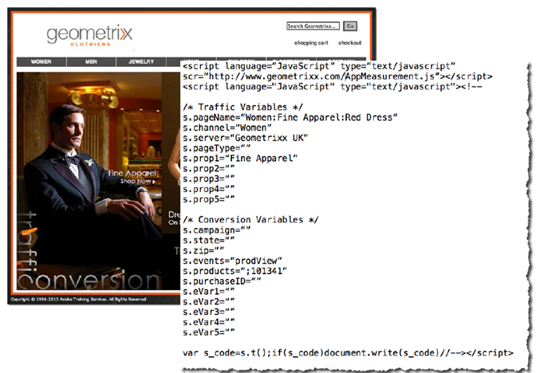
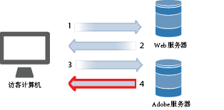
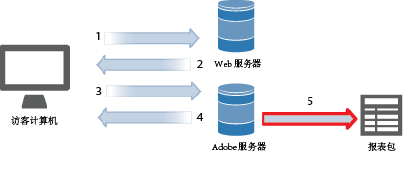
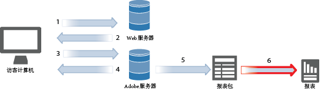
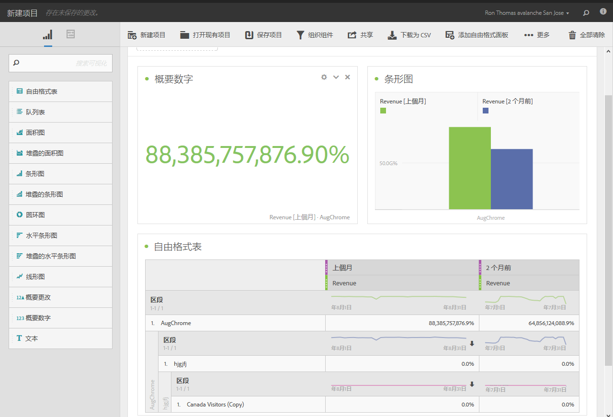

# 数据收集

了解 Adobe Analytics 如何将网站访问数据变成报告。

Analytics 数据收集是通过向 Adobe 数据收集服务器提出特殊的图像请求来完成的。在大多数实施过程中，JavaScript 代码被置于要跟踪的网页上。在访客的浏览器中加载添加了标签的网页时，该浏览器会执行我们的 JavaScript 代码，进而执行某些逻辑以捕捉访客信息并正确填充标签。JavaScript 处理网页的最后一步是向 Analytics 数据收集服务器提出图像请求，该服务器可收集正在提交的数据，并且会向访客的浏览器返回一张小型透明图像。

通常，浏览器处理网页的瓶颈在于从 Web 服务器下载页面元素（图像等）所花的时间过多，而浏览器执行 JavaScript 代码所要求的时间可忽略不计。但是，在执行访客的浏览器向 Adobe 数据收集服务器请求图像的最后一步时，增加了总的页面下载时间。页面下载时间的整体效果取决于网站访客与 Adobe 数据收集服务器之间的邻近效应（通常指的是互联网跃点，而不是地理上的距离）。

Adobe 已创建了多种方法可将数据发送到 Analytics。这些方法包括实时跟踪来自以下位置的信息：

* 可访问 Internet 的应用程序
* 促销活动
* 服务端服务器应用程序
* 电子邮件
* 移动设备
* 基于 Web 的自助服务一体机
* 网站

<!-- 

Need to reconcile with Data Collection topics in the user guide, in this guide, and in reference. 

 -->

1. 访客访问您的站点时，会向您的 Web 服务器发送一个请求。

   

1. 您站点的 Web 服务器随之会发送页面代码信息，这样相关页面就显示在浏览器中了。

   

1. 加载页面，并运行 Analytics JavaScript 代码。

   

   JavaScript 代码会将图像请求发送到 Adobe 服务器，同时传递您在实施过程中定义的变量、量度和页面数据。

   **JavaScript 代码示例：** JavaScript 代码位于网页的 body 标记中：

   

   **图像请求示例：**&#x200B;概述了页面名称的图像请求片段：

   

   >[!NOTE]
   >
   >每个图像请求都包含一个随机数字字符串，以防止浏览器缓存并确保浏览器发出后续图像请求。

1. Adobe 返回透明的像素图像。

   

   代码自动收集其他的详细信息（例如，操作系统、浏览器类型、浏览器高度和宽度、IP 地址和浏览器语言）。

1. Adobe servers store web analysis data in *`report suites`* (your data repository).

   

   [报表包](https://marketing.adobe.com/resources/help/en_US/reference/?f=report_suites_admin)可以针对选定的网站、网站集合或网页的子集，定义完整、独立的报表。

1. 报表包数据会填充您可以在 Web 浏览器中访问的报表。

   

   **示例报表：**

   

   JavaScript 代码执行非常迅速，不会显著影响页面加载时间。通过这种方法，您可以统计访客点击&#x200B;**[!UICONTROL 重新加载]**&#x200B;或&#x200B;**后退]以抵达某个页面时所显示的页面数量，因为即使页面是从缓存中获取，JavaScript 仍可以运行。[!UICONTROL **

有关更多详细信息，请参阅：

* [数据收集](../../implement/js-implementation/data-collection/query-parameters.md)
* [创建数据元素](../../implement/c-implement-with-dtm/t-data-element.md#task_962EF08CE2AE49B3B739295F6E4792C2)
* [Data Warehouse](https://marketing.adobe.com/resources/help/en_US/reference/data_warehouse.html)
* [Ad Hoc Analysis](https://marketing.adobe.com/resources/help/en_US/dsc/c_getting_started.html)
* [数据源](https://marketing.adobe.com/resources/help/en_US/whitepapers/ftp/ftp_datasources.html)
* [Data Connectors](https://marketing.adobe.com/resources/help/en_US/whitepapers/ftp/ftp_genesis.html)
* [Analytics 数据馈送](/help/export/analytics-data-feed/c-getstarted/data-feed-overview.md)的权限

>[!MORE_LIKE_THIS]
>       
>* [Experience Cloud 调试器](/help/implement/impl-testing/debugger.md)

