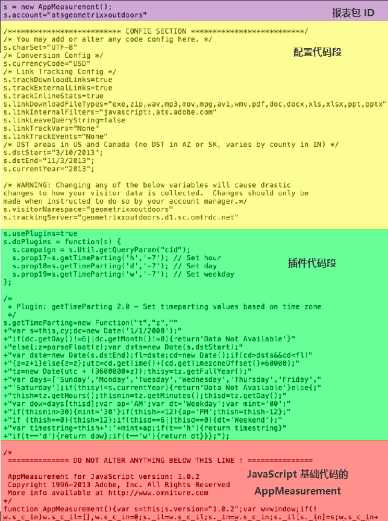

# Analytics代码

数据会被发送到报表包，以显示在报表中。将数据发送到 Analytics 的最简单也是最常用的方法是使用 DTM 实施。此外，您也可以通过 JavaScript 实施来输入 Analytics 代码。

For information about using [!UICONTROL Dynamic Tag Management] to create the header and footer code for you, see [Add Header and Footer Code](../../implement/c-implement-with-dtm/c-headers-footers/t-header-footer-code.md#task_43C8DD699A514638B0620775C06423E5).

Here is an example of [!DNL AppMeasurement] JavaScript file, showing the code parts:

