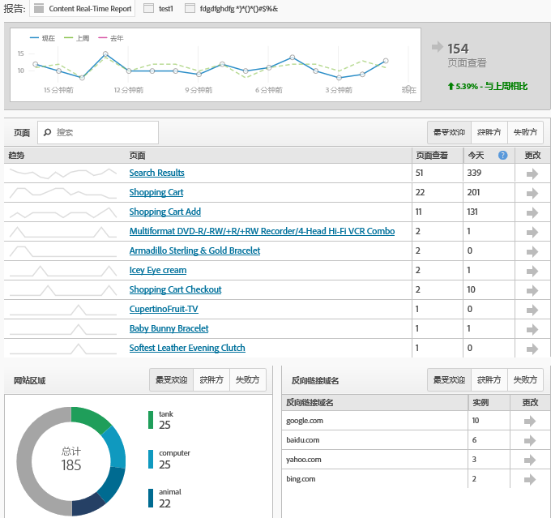

# 简化的实施模式

了解客户首次实施 Adobe Analytics 的体验。

<!-- 

https://activation.adobedtm.com/index.php?redirected=1 

 -->

New users can quickly create your first [!DNL Analytics] report suite (data repository) using this *`Getting Started with Adobe Analytics`* setup modal. Then, you can deploy [!DNL Analytics] code using [!DNL Dynamic Tag Management].

[!DNL Dynamic Tag Management] 允许您管理Adobe Analytics实施，无需每次更改网站。如果实施的是移动应用程序，则可以获取您所需的 SDK，开始从您的应用程序中收集有价值的数据。

通过此过程，您可以：

* 迅速创建首个[报表包](https://marketing.adobe.com/resources/help/en_US/analytics/getting-started/report-suites.html)。
* Deploy [!DNL Analytics] and the [Identity Service](https://marketing.adobe.com/resources/help/en_US/mcvid/).

* 针对基础的页面级数据运行报表。

>[!NOTE]
>
>Before you begin, verify that Analytics is [enabled in the Adobe Experience Cloud](https://marketing.adobe.com/resources/help/en_US/mcloud/core_services.html) (the solution provisioning process). 如果您收到电子邮件，邀请您登录企业功能板中的 Analytics，则表示您已经满足此前提条件。

**要运行简化的实施模型，请执行以下操作：**

1. Log in to the [!DNL Adobe Experience Cloud] ( [experiencecloud.adobe.com](https://experiencecloud.adobe.com)).

   当您访问 [!DNL Analytics] 时，系统会确定您是否拥有报表包。如果没有，则会显示 [!UICONTROL Adobe Analytics 快速入门]页面。

   

   Alternatively, you can run this setup in [!DNL Analytics] by clicking **[!UICONTROL Help]** &gt; **[!UICONTROL Welcome to Adobe Analytics]**.

1. 指定以下有关您的业务的基本信息：

   <table id="table_1741878A1B284CB78D297D531DC703D6"> 
     <thead> 
      <tr> 
       <th colname="col1" class="entry"> 元素 </th> 
       <th colname="col2" class="entry"> 描述 </th> 
      </tr> 
     </thead>
     <tbody> 
      <tr> 
       <td colname="col1"> 
属性类型 
 </td> 
       <td colname="col2"> 
您的实施是用于 Web、移动设备还是两者都有？ 
 </td> 
      </tr> 
      <tr> 
       <td colname="col1"> 
行业 
 </td> 
       <td colname="col2"> 
说明公司的盈利方式（产品、客户服务、销售线索、品牌知名度和广告）。 
 </td> 
      </tr> 
      <tr> 
       <td colname="col1"> 
数据层 
 </td> 
       <td colname="col2"> 
（推荐）用于存储信息的 JavaScript 数组。如果您使用动态标签管理执行自动设置，将会用到数据层。 
 
For a blog on data layers, see <a href="https://blogs.adobe.com/digitalmarketing/analytics/data-layers-buzzword-best-practice/" format="http" scope="external"> Data Layer: From Buzzword to Best Practice</a>. 
 </td> 
      </tr> 
      <tr> 
       <td colname="col1"> 
数据存储库（报表包） 
 </td> 
       <td colname="col2"> 
 <a href="https://marketing.adobe.com/resources/help/en_US/analytics/getting-started/report-suites.html" format="html" scope="external">报表包</a>是离散的数据集，通常与单个资产（站点或应用程序）或品牌相对应。每个报表包都有自己的一套报表和量度。 
 </td> 
      </tr> 
      <tr> 
       <td colname="col1"> 
时区 
 </td> 
       <td colname="col2"> 
您当地的时区。（自动检测。） 
 </td> 
      </tr> 
      <tr> 
       <td colname="col1"> 
页面查看次数的估值 
 </td> 
       <td colname="col2"> 
您的网站每天获得的大致的页面查看次数。 
 </td> 
      </tr> 
      <tr> 
       <td colname="col1"> 
基本货币 
 </td> 
       <td colname="col2"> 
您交易时使用的货币。 
 </td> 
      </tr> 
     </tbody> 
    </table>

1. Click **[!UICONTROL Next]**.

   系统会创建一个报表包。

1. To begin deployment, click **[!UICONTROL Next]**, then click one of the following options:

   <table id="table_71C7F7B9677346CD8D5130519D32464B"> 
     <thead> 
      <tr> 
       <th colname="col1" class="entry"> 元素 </th> 
       <th colname="col2" class="entry"> 描述 </th> 
      </tr> 
     </thead>
     <tbody> 
      <tr> 
       <td colname="col1"> 
部署 
 </td> 
       <td colname="col2"> 
 启动动态标签管理，您可以在这里登录和部署 Analytics。This process automatically implements the  AppMeasurement.js file and the Identity Service ( VisitorAPI.js). 
 
 
重要信息：新的浏览器标签页中会显示一个帮助页面，向您演示使用动态标签管理部署 Adobe Analytics 的全过程。 
 
 </td> 
      </tr> 
      <tr> 
       <td colname="col1"> 
下载 
 </td> 
       <td colname="col2"> 
 下载名为 INSTALL-ME &lt;报表包名称&gt;.js 的安装文件。此选项适用于了解 <a href="https://marketing.adobe.com/resources/help/en_US/sc/implement/js_implementation.html" format="html" scope="external">JavaScript 实施</a>的经验丰富的用户。 
 
 
重要：下载代码操作不属于部署 Analytics 的过程。这是手动部署，需要您在站点的网页上执行，或者通过 Adobe 咨询服务完成。 
 
 </td> 
      </tr> 
     </tbody> 
    </table>

1. 运行报表.

   部署 Analytics 工具后，您可以在“报告与分析”中运行一个报表，以确认数据能够到达您的站点。（请参阅[登录并浏览](https://marketing.adobe.com/resources/help/en_US/analytics/getting-started/analytics-navigation.html)，以熟悉 Analytics 界面。）

   For example, a **[!UICONTROL Site Metrics]** &gt; **[!UICONTROL Real-Time]** lets you see immediate data.

   >[!NOTE]
   >
   >[!UICONTROL 实时] 报告需要在运行之前进行一些配置。请参阅[配置实时报表](https://marketing.adobe.com/resources/help/en_US/reference/t_realtime_admin.html)。

**实时报表示例**

