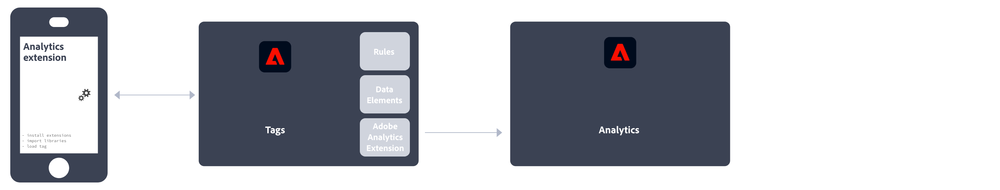

# 实施 Adobe Analytics

Adobe Analytics 需要在您的网站、移动应用程序或其他应用程序中实施相应代码，才能将数据发送到数据收集服务器。根据平台和贵组织的需求，可以通过多种方法来实施相应代码。

## 网站实施方法

对于您的&#x200B;**网站**，可以使用以下实现方法：

### 客户端

* **Web SDK 扩展**：这是一种在为新客户实施 Adobe Analytics 时推荐使用的标准化方法。 在 Adobe Experience Platform Data Collection **标记**&#x200B;中添加 **Adobe Experience Platform Web SDK 扩展**，然后在每个页面上放置一个加载器标记。该标记将数据发送到 Adobe Experience Platform **Edge Network**，而后者将这些数据转发到 Adobe Analytics。
  
请参阅[如何使用 Adobe Experience Platform Web SDK 扩展实施 Adobe Analytics。](./aep-edge/overview.md)以了解详情。

* **Web SDK**：如果您不想使用 Adobe Experience Platform 数据收集，可以在您的站点上手动加载 Web SDK 库。 在每个页面上引用 Web SDK 库 (`alloy.js`)，并将所需的跟踪调用以您组织方便的格式发送到 Adobe Experience Platform **Edge Network**。 Edge Network 将这些数据转发到 Adobe Analytics。
  
有关详细信息，请参阅[如何使用 Adobe Experience Platform Web SDK 实施 Adobe Analytics](./aep-edge/overview.md) 以了解详情。

* **Analytics 扩展**：在 Adobe Experience Platform 数据收集&#x200B;**标签**&#x200B;中添加 **Adobe Analytics 扩展**，然后在每个页面上放置一个加载器标记。该标记将数据直接发送到 Adobe Analytics。如果要利用标记的便利，但不想使用 Edge Network 基础设施，请使用此实施。
  
请参阅[如何使用 Analytics 扩展实施 Adobe Analytics](launch/overview.md) 以了解详情。

* **旧版 JavaScript**：历史上用于实施 Adobe Analytics 的手动方法。在每个页面上引用 AppMeasurement 库 (`AppMeasurement.js`)，然后在 JavaScript 中设置变量和各种设置。
  
此实施方法可能对使用自定义代码的实施很有用，并且非常适合在别处不提供的实施类型，如非常适合 [AMP 页面](other/amp.md)。

以下决策流程可帮助您选择客户端实施方法：

>[!TIP]
>
>有关根据您的当前状况要选择何种实施的建议和最佳实践，请联系您的 Adobe 客户团队。

### 服务器端

要实施 Adobe Analytics 服务器端，您有以下选项：

* **Edge Network API**：在使用Adobe Experience Platform Edge Network API通过数据流与Adobe Analytics通信的服务器上实施代码。
  
有关详细信息，请参阅[使用Adobe Experience Platform Edge Network API实施Adobe Analytics](/help/implement/aep-edge/api/overview.md)。

* **（批量）数据插入 API**：您可以使用 Adobe Analytics（批量）数据插入 API 将服务器端数据直接收集到 Adobe Analytics 中。
  
请参阅[数据插入 API](../import/c-data-insertion-api/c-data-insertion-api.md)，了解更多信息。

## 移动应用程序实施方法

对于您的&#x200B;**移动应用程序**，可以使用以下实现方法：

* **Mobile SDK 扩展**：这是一种在您的移动设备应用程序中实施 Adobe Analytics 时推荐使用的标准化方法。 使用专用库，可轻松将数据从您的移动应用程序中发送到 Adobe。 在 Adobe Experience Platform 数据收集&#x200B;**标记**&#x200B;中添加 **Adobe Experience Platform Mobile SDK 扩展**，然后在您的应用程序中实施 Mobile SDK 库。可使用该 SDK 导入库、注册扩展和加载标记配置。将数据发送到 Adobe Experience Platform **Edge Network**，然后 Edge 将这些数据转发到 Adobe Analytics。
  

  有关详细信息，请参阅[使用 Adobe Experience Platform Mobile SDK 实施 Adobe Analytics](../implement/aep-edge/mobile-sdk/overview.md)。

* **Analytics 扩展**：在 Adobe Experience Platform 数据收集&#x200B;**标记**&#x200B;中添加 **Adobe Analytics 扩展**，并在您的应用程序中实施 Mobile SDK 库。可使用该 SDK 导入库、注册扩展和加载标记配置。此实施方法直接将数据发送到 Adobe Analytics。如果要利用 Adobe Experience Platform 数据收集的便利，但不想使用 Adobe 的 Experience Platform Edge 网络基础设施，则建议使用此实施。
  

  有关详细信息，请参阅[使用 Analytics 扩展实施 Adobe Analytics](../implement/aep-edge/mobile-sdk/overview.md)。

>[!CAUTION]
>
>有关对 Adobe 移动 SDK 旧版本的支持，请参阅 [SDK 终止支持公告](https://developer.adobe.com/client-sdks/resources/sdks-end-of-support/)。

## 重要 Analytics 实施文章

* [负责现有的 Adobe Analytics 实施](/help/implement/prepare/existing-implementation.md)
* [Adobe Debugger](validate/debugger.md)
* [在 Experience Platform 中创建标记属性](launch/create-analytics-property.md)
* [AppMeasurement 更新](appmeasurement-updates.md)
* [使用 Platform Web SDK 设置 Adobe Analytics 教程](https://experienceleague.adobe.com/docs/platform-learn/implement-web-sdk/applications-setup/setup-analytics.html?lang=zh-Hans)
* [“在移动应用程序中实施 Adobe Experience Cloud”教程](https://experienceleague.adobe.com/docs/platform-learn/implement-mobile-sdk/overview.html?lang=zh-Hans)

## 重要 Analytics 资源

* [联系客户关怀团队](https://experienceleague.adobe.com/zh-hans?support-solution=Analytics#support)
* [Experience League 上的 Adobe Analytics 社区](https://experienceleaguecommunities.adobe.com/t5/adobe-analytics/ct-p/adobe-analytics-community)
* [Adobe Analytics 资源](https://experienceleaguecommunities.adobe.com/t5/adobe-analytics-discussions/adobe-analytics-resources/m-p/276666)
* [最新发行说明](../release-notes/latest.md)
