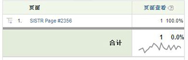

# 使用变量值中的空格

在 HTML 中，有多个字符会产生空格。

这些字符包括空格、Tab 和回车（或换行）。请仔细研究下面的示例：

```js
<head> 
 <title> 
   Home Page 
 </title> 
</head> 
<body> 
<script language="javascript"> 
 s.pageName=document.title 
</script> 
```

在本例中，document.title 填充了 [!UICONTROL s.pageName]，它应当收到值“Home Page”。请注意“Home Page”之前的空格。并非所有的浏览器都会以同样的方式解释此空格。结果可能会如以下两个示例之一所示：

```js
s.pageName="Home Page"
```

```js
s.pageName="        Home Page"
```

第一个值显示正确，但是第二个值会在文本之前显示空格。[!DNL Analytics] 将它们视为 [!UICONTROL s.pageName] 变量的不同值。[!DNL Analytics] 界面会去除第二个值中开头的空格。结果会得到一个如下显示的报表。



此实施错误导致您的变量值被分割为多个行项目。[!DNL SAINT] 不允许键值开头有空格。这意味着当此问题影响到您的网站时，不可将它用于分组多个行项目，并以此作为问题的解决方法。修复该问题的唯一方法是重新处理所需的变量值（在本例中，即是 document.title 属性），从而删除任何开头的（或尾部）空格。

以上示例使用了 [!UICONTROL s.pageName] 变量及 document.title 属性。Adobe 不建议把 document.title 用作页面名称，此问题也不会只影响 [!UICONTROL s.pageName] 变量。任何包含开头/尾部空格的变量值都可受到影响。
