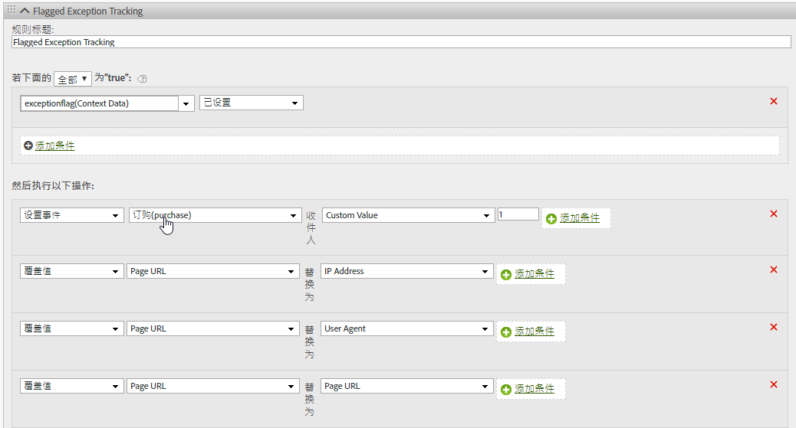

# hitGovernor

s.hitGovernor 插件可跟踪在预定义的连续时间范围内发送的 Analytics 图像请求的总数量，如果总数超过了某个阈值，则此插件还可以根据需要执行其他逻辑。

## hitGovernor {#topic_56B636A42A624B38A0A446C607ACD700}

s.hitGovernor 插件可跟踪在预定义的连续时间范围内发送的 Analytics 图像请求的总数量，如果总数超过了某个阈值，则此插件还可以根据需要执行其他逻辑。

虽然来自机器人、蜘蛛程序、特定用户代理或特定 IP 地址列表的流量都可以被识别为机器人流量（否则将不被计入报表），但是您的报告包中仍有可能会捕获不应计算的流量。例如，在不合理的一段时间（如大约每秒一个请求）内的大量点击或页面查看次数可能是重复的流量。

使用此插件可以在访客生命周期的剩余时间内自动阻止此类流量，并且还可以在报表中动态识别此类流量。

## hitGovernor 插件原理 {#section_541BC639E31442D09B1C85A2FFCDC02C}

每次将图像请求发送到跟踪服务器时，此插件即会增加 Cookie 值，并在连续时间范围内跟踪该值。默认时间范围为 1 分钟，但该时间范围可以被覆盖。（请参阅下面的[实施](../../../implement/js-implementation/plugins/hitgovernor.md#task_D4BDB524AA294C139AFCAE2B61FEA3F2)）。If the total number of hits during that time frame exceeds the default hit threshold (60), a final custom link image request is sent to set the *`exceptionFlag`* context data variable. 默认的点击量阈值也可以被覆盖。

如有需要，从此刻起，可以在默认期限（60 天）内阻止系统收集该特定访客的流量。如果要阻止流量，需要在 doPlugins 函数中额外添加一行代码，如下所述。同样地，此时间期限也可以调整。The logic allows time to either include that visitor's IP address, User Agent, or [!DNL Experience Cloud] Visitor ID in the proper permanent exception logic, or to reset the timeout period after the sixty days have elapsed. 如此一来，如果此流量在 60 天后被插件识别为欺诈，则该流量会再次被标记为异常，那么在接下来的 60 天内系统同样不会收集该流量。

## 报表 {#section_E742F19B528041808454744DB2C7007C}

无需设置任何默认变量或事件。但是，我们强烈建议您设置处理规则逻辑以相应地设置变量和事件。这些自定义变量和事件可能包括：

* [!DNL Experience Cloud] 访客 ID
* IP 地址
* 用户代理
* 已标记的异常事件

然后通过为这些变量创建区段，可以创建区段和虚拟报表包，以查看这些不明确的点击对站点所造成的整体影响。

我们建议您使用在报表中捕获到的值来更新机器人规则、DB VISTA 规则，或公司 IP 排除规则。

## 实施 {#task_D4BDB524AA294C139AFCAE2B61FEA3F2}

要实施 hitGovernor 插件，请执行以下操作：

1. 修改 AppMeasurement 库。

   要初始化此插件，请在 AppMeasurement 库代码的 `registerPostTrackCallback` 函数中插入此行代码（粗体部分）。

   >[!NOTE]
   >
   >Although the `registerPostTrackCallback` functionality is included in AppMeasurement libraries 1.8.0+, it is not included in any custom code configuration by default. 将此函数插入在 doPlugins 函数的后面。**

   ```
    s.registerPostTrackCallback(function(){ 
   
<b> s. presser()；</b>})；
```
Below the doPlugins section of your AppMeasurement file, include the plugin code contained in [Plugin Source Code](../../../implement/js-implementation/plugins/hitgovernor.md#reference_76423C81A7A342B2AC4BE41490B27DE0), below.

The hit limit threshold, hit timing threshold, and traffic exclusion time frames can all be overridden by setting these variables, outside of the plugin itself and preferably with your other configuration variables:

<table id="table_9959A40F5F0B40B39DB86E21D03E25FD"> 
<thead> 
<tr> 
<th colname="col1" class="entry"> Variable </th> 
<th colname="col2" class="entry"> Syntax </th> 
<th colname="col3" class="entry"> Description </th> 
</tr> 
</thead>
<tbody> 
<tr> 
<td colname="col1"> <p>Hit Limit Threshold </p> </td> 
<td colname="col2"> <p> <code> s.hl = 60; </code> </p> </td> 
<td colname="col3"> <p>The total number of hits that should not be exceeded during a given timeframe. </p> </td> 
</tr> 
<tr> 
<td colname="col1"> <p>Hit Time Threshold </p> </td> 
<td colname="col2"> <p> <code> s.ht = 10; </code> </p> </td> 
<td colname="col3"> <p>The window, in seconds, for when hits are recorded. This number is divided by six to determine the rolling timing windows. </p> </td> 
</tr> 
<tr> 
<td colname="col1"> <p>Exclusion Threshold </p> </td> 
<td colname="col2"> <p> <code> s.he = 60; </code> </p> </td> 
<td colname="col3"> <p>Number of days that the exclusion cookie is set for that visitor. </p> </td> 
</tr> 
</tbody> 
</table>

>[!NOTE]
>
>Your implementation might use a different object name than the default analytics "s" object. If so, please update the object name accordingly.

1. Configure processing rules.

This plugin records flagged exceptions as context data in a link tracking image request. As such, processing rules must be configured to assign track those flagged exceptions into appropriate variables like those below.



1. (Optional) Include the traffic-blocking code in doPlugins.

After traffic has been identified as an exception, any subsequent hits from that visitor can be blocked entirely by including this code within the `doPlugins` function:
```
如果(s. Util. cookieRead('s_ gh')==9) s. abunt= true，则//Check为preset presser标志；
```
If this code is not included, traffic from that visitor will be flagged but not blocked. 

## Plugin Source Code {#reference_76423C81A7A342B2AC4BE41490B27DE0}

This code should be added below the doPlugins section of your AppMeasurement library.
```
Publish总督(版本0.1测试版，11-13-17)
s. header= new Function(”，+”var s= this；if(s. hl=='undefined'){s. hl=60；}(typeof s=='u'=60){s.
ht=60；}如果(typeof s whe=='undefined'){s. ht=60；}(typeof“+”.
cookieRead. cookieRead('s_ gh')==8){var i= new Date()，y= i. getFullYear()，m= i. getM“+”onth()，d= i. getDate()，i= new Date(y，m，d+ s. he)；s. Util. cookieWrite('s_ h“+”g'、9、i)；返回；} var f= s. Util. cookieRead('s_ hc')，g= Number(s. Util. coo“+”kieRead('s_ ht'))，h= Math. floor(((new Date()))，ha= f！=''?f.sp"
+"lit('|').map(Number):[0,0,0,0,0],i=ha.reduce(function(ha,b){return "
+"ha+b;},0),j=g==0?0:Math.floor(((h-g)/(s.ht/6))/1000);if(g==0)s.Util"
+".cookieWrite('s_ht',h);if(i&lt;s.hl){if(j&gt;=1){if(j&gt;=6){ha=[0,0,0,0,0];"
+"}else{for(var k=0;k&lt;j;k++){ha.unshift(0);ha.pop();}}s.Util.cookieWr"
+"ite('s_ht',h);}}else{s.Util.cookieWrite('s_hg',8);s.linkTrackVars+="
+"',contextData.exceptionFlag';s.contextData['exceptionFlag']='true';"
+"s.tl(this,'o','exceptionFlag');}ha[0]++;s.Util.cookieWrite('s_hc',h"
+"a.join('|'));");

```


