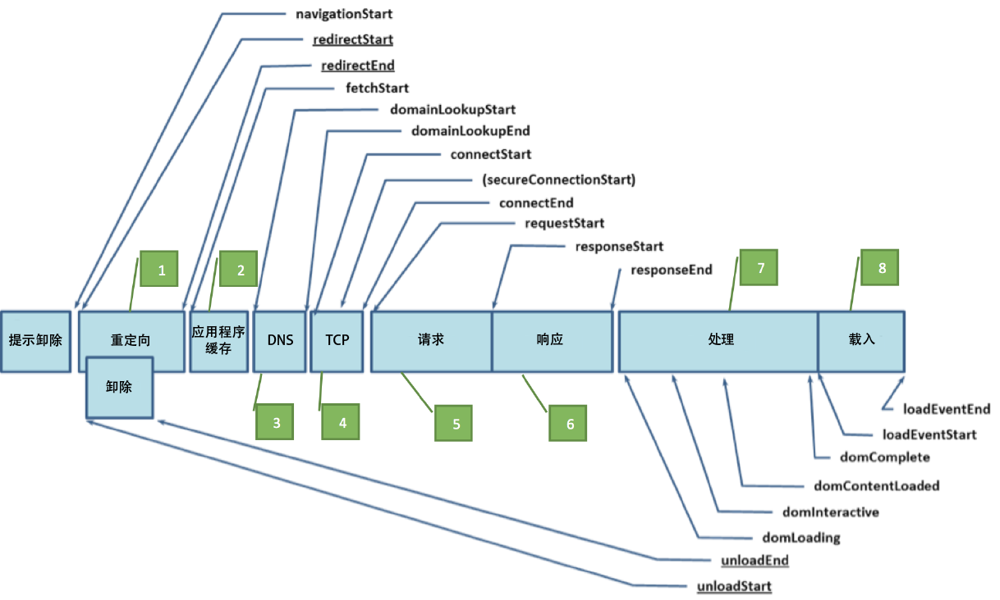

# performanceTiming

这个插件通过使用 Navigation Timing JavaScript API 来运行，用于准确测量 Web 的性能。该插件能够提供一种本地方法，可针对页面加载事件和资产加载时间，获取准确而详细的时间数据。以前进行此类测量时，要么利用时间量度的 JavaScript Date 对象，要么利用 Navigation Timing 量度的基础推断法。尽管这两种方法都能够针对页面加载时间提供一些趋势数据，但并不可靠。

## 这个插件的作用 {#section_4E0771B959FD4F86B4B91BD18CA01DF1}

>[!IMPORTANT]
>
>这是插件的测试版，可能会即将更新其他更新。

这个插件可利用下列详细的事件，来跟踪页面加载的各个时间组件：

| 事件 | 名称 | 计算依据 |
|---|---|---|
| 1 | 重定向时间 | fetchStart - navigationStart |
| 2 | 应用程序缓存时间 | domainLookupStart - fetchStart |
| 3 | DNS 时间 | domainLookupEnd - domainLookupStart |
| 4 | TCP 时间 | connectEnd - connectStart |
| 5 | 请求时间 | responseStart - connectEnd |
| 6 | 响应时间 | responseEnd - responseStart |
| 7 | 处理时间 | loadEventStart - domLoading |
| 8 | 载入时间 | loadEventEnd - loadEventStart |
| 9 | 页面加载总时间 | loadEventEnd - navigationStart |
| 10 | 性能实例 | 计数器 |

下面的图表说明了由 PerformanceTiming 接口和 PerformanceNavigation 接口定义的时间属性，依次为包含或不包含重定向的情况。



有关 Navigation Timing 对象的完整详细信息，请参阅此处：

[https://www.w3.org/TR/navigation-timing/#sec-navigation-timing-interface](https://www.w3.org/TR/navigation-timing/#sec-navigation-timing-interface)

此外，插件可以有选择地使用 performanceEntries 对象，为特定页面上加载的各个资产记录资产名称、资产加载开始时间和资产加载持续时间等详细信息。这个插件能够记录大量信息，为此它要求启用 DOM 存储对象，以便在查看页面的间隙存储页面加载信息。请在启用此项功能之前，确保贵公司的隐私政策允许使用 DOM 存储对象。另外，它还要求使用 listVar 来跟踪所有资源。

## 所需的支持插件 {#section_B6447EB6548942EFBC219AEFDC245639}

* appendList
* getPreviousValue

## 插件代码和实施 {#section_564D77E1CF0E445586D95AD9769CE57D}

>[!NOTE]
>
>以下说明要求您更改站点上的数据收集代码。此操作会影响您网站上的数据收集，且只应由具备使用和实施 Adobe Analytics 经验的开发人员完成。This plugin is compatible only with [!DNL AppMeasurement] tracking libraries.

**配置区段（在 doPlugins 之前）：**

`s.pte`：逗号分隔的事件列表，其中包含您要使用且按照特定顺序排列的 10 个事件 - 各个时间事件组件（事件 1 - 8）、页面加载总时间（事件 9）和总性能实例（事件 10）。

`s.ptc`：设置以确定是否执行 doPlugins 中的插件。始终设置为 false。

*示例调用*

```
s.pte = 'event10,event11,event12,event13,event14,event15,event16,event17,event18,event19' 
//[--------------------------- 1 to 8 ---------------------------][-- 9 --][- 10 -] 
s.ptc = false; 
```

**doPlugins 区域:**

要初始化此插件，需要在 s_code 的 `doPlugins` 区域中加入一行代码，最好是在已指定 `s.pageName`   变量之后加入。如果您要利用插件中的资产加载时间功能，则必须传入要使用的列表变量的名称。否则，将只跟踪您之前在 `s.pte` 变量中指定的事件内的性能时间条目。

>[!NOTE]
>
>In order to correlate performance timing entries with pages on your site, you must also initialize the `getPreviousValue` plug-in. 我们建议您将这些性能条目与之前的页面名称或之前的页面 URL 值进行对比。

*示例调用*

```
/* Performance Timing */ 
s.eVar9 = s.getPreviousValue(s.pageName,'gpv_v9','');  //Record the previous page name in the designated eVar of your choice 
s.performanceTiming('list2')  
```

**插件区域：**

最后，将插件本身添加到您的 JavaScript 实施中。

```
/* Plugin: Performance Timing Tracking - 0.11 BETA */ 
s.performanceTiming=new Function("v","" 
+"var s=this;if(v)s.ptv=v;if(typeof performance!='undefined'){if(perf" 
+"ormance.timing.loadEventEnd==0){s.pi=setInterval(function(){s.perfo" 
+"rmanceWrite()},250);}if(!s.ptc||s.linkType=='e'){s.performanceRead(" 
+");}else{s.rfe();s[s.ptv]='';}}"); 
s.performanceWrite=new Function("","" 
+"var s=this;if(performance.timing.loadEventEnd>0)clearInterval(s.pi)" 
+";try{if(s.c_r('s_ptc')==''&&performance.timing.loadEventEnd>0){try{" 
+"var pt=performance.timing;var pta='';pta=s.performanceCheck(pt.fetc" 
+"hStart,pt.navigationStart);pta+='^^'+s.performanceCheck(pt.domainLo" 
+"okupStart,pt.fetchStart);pta+='^^'+s.performanceCheck(pt.domainLook" 
+"upEnd,pt.domainLookupStart);pta+='^^'+s.performanceCheck(pt.connect" 
+"End,pt.connectStart);pta+='^^'+s.performanceCheck(pt.responseStart," 
+"pt.connectEnd);pta+='^^'+s.performanceCheck(pt.responseEnd,pt.respo" 
+"nseStart);pta+='^^'+s.performanceCheck(pt.loadEventStart,pt.domLoad" 
+"ing);pta+='^^'+s.performanceCheck(pt.loadEventEnd,pt.loadEventStart" 
+");pta+='^^'+s.performanceCheck(pt.loadEventEnd,pt.navigationStart);" 
+"s.c_w('s_ptc',pta);if(sessionStorage&&navigator.cookieEnabled&&s.pt" 
+"v!='undefined'){var pe=performance.getEntries();var tempPe='';for(v" 
+"ar i=0;i<pe.length;i++){tempPe+='!';tempPe+=pe[i].name.indexOf('?')" 
+">-1?pe[i].name.split('?')[0]:pe[i].name;tempPe+='|'+(Math.round(pe[" 
+"i].startTime)/1000).toFixed(1)+'|'+(Math.round(pe[i].duration)/1000" 
+").toFixed(1)+'|'+pe[i].initiatorType;}sessionStorage.setItem('s_pec" 
+"',tempPe);}}catch(err){return;}}}catch(err){return;}"); 
s.performanceCheck=new Function("a","b","" 
+"if(a>=0&&b>=0){if((a-b)<60000&&((a-b)>=0)){return((a-b)/1000).toFix" 
+"ed(2);}else{return 600;}}"); 
s.performanceRead=new Function("","" 
+"var s=this;if(performance.timing.loadEventEnd>0)clearInterval(s.pi)" 
+";var cv=s.c_r('s_ptc');if(s.pte){var ela=s.pte.split(',');}if(cv!='" 
+"'){var cva=s.split(cv,'^^');if(cva[1]!=''){for(var x=0;x<(ela.lengt" 
+"h-1);x++){s.events=s.apl(s.events,ela[x]+'='+cva[x],',',2);}}s.even" 
+"ts=s.apl(s.events,ela[ela.length-1],',',2);}s.linkTrackEvents=s.apl" 
+"(s.linkTrackEvents,s.pte,',',2);s.c_w('s_ptc','',0);if(sessionStora" 
+"ge&&navigator.cookieEnabled&&s.ptv!='undefined'){s[s.ptv]=sessionSt" 
+"orage.getItem('s_pec');sessionStorage.setItem('s_pec','',0);}else{s" 
+"[s.ptv]='sessionStorage Unavailable';}s.ptc=true;"); 
/* Remove from Events 0.1 - Performance Specific,  
removes all performance events from s.events once being tracked. */ 
s.rfe=new Function("","" 
+"var s=this;var ea=s.split(s.events,',');var pta=s.split(s.pte,',');" 
+"try{for(x in pta){s.events=s.rfl(s.events,pta[x]);s.contextData['ev" 
+"ents']=s.events;}}catch(e){return;}"); 
/* Plugin Utility - RFL (remove from list) 1.0*/ 
s.rfl=new Function("l","v","d1","d2","ku","" 
+"var s=this,R=new Array(),C='',d1=!d1?',':d1,d2=!d2?',':d2,ku=!ku?0:" 
+"1;if(!l)return'';L=l.split(d1);for(i=0;i<L.length;i++){if(L[i].inde" 
+"xOf(':')>-1){C=L[i].split(':');C[1]=C[0]+':'+C[1];L[i]=C[0];}if(L[i" 
+"].indexOf('=')>-1){C=L[i].split('=');C[1]=C[0]+'='+C[1];L[i]=C[0];}" 
+"if(L[i]!=v&&C)R.push(C[1]);else if(L[i]!=v)R.push(L[i]);else if(L[i" 
+"]==v&&ku){ku=0;if(C)R.push(C[1]);else R.push(L[i]);}C='';}return s." 
+"join(R,{delim:d2})"); 
```

## 注释 {#section_131C5D97A0094880AFC3A2BBE0BC9DE4}

* 在生产环境中进行部署之前，请务必对插件安装进行测试，以确保可按预期进行数据收集。
* 由于传递性能数据的插件与上一页面关联，因而不会为访问的最终页面查看而收集数据。
* 如果您要跟踪资产时间，该插件会依据能力大小，在用户的 Web 浏览器中设置 DOM 存储值。如果用户不接受 Cookie，并且已经启用了 DOM 存储，该插件将不会把数据传入 Analytics。
* 由于浏览器限制，很小百分比的用户不会传递导航定时数据，逻辑包含在插件中以确保数据不会歪斜-尤其是在移动浏览器的小部分中。不过，此插件已在 IE、Firefox、Chrome 和 Safari 中测试成功。
* [!UICONTROL 应创建计算指标] 以帮助汇总和了解与这些指标相关的访客行为：

   * 重定向平均时间（重定向时间/性能时间实例）
   * 应用程序缓存平均时间（应用程序缓存时间/性能时间实例）
   * DNS 平均时间（DNS 时间/性能时间实例）
   * TCP 平均时间（TCP 时间/性能时间实例）
   * 请求平均时间（请求时间/性能时间实例）
   * 响应平均时间（响应时间/性能时间实例）
   * 处理平均时间（处理时间/性能时间实例）
   * 载入平均时间（载入时间/性能时间实例）
   * 页面载入平均时间（页面载入总时间/性能时间实例）

