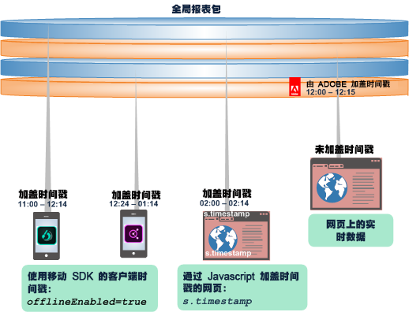
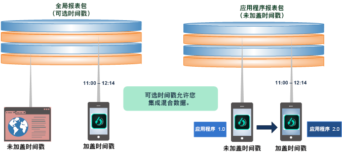
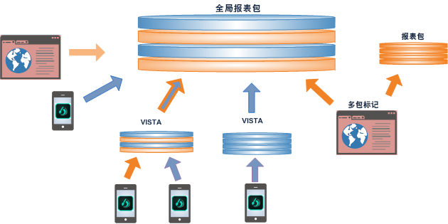
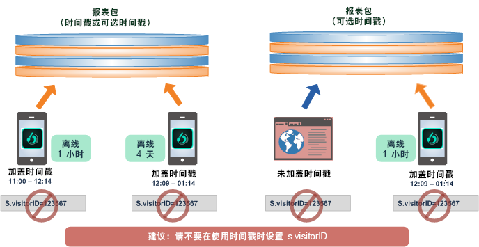
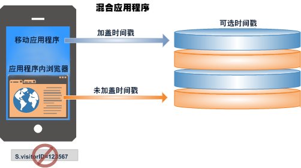

# 使用可选时间戳

了解有关使用可选时间戳设置的好处和限制。

可选时间戳是所有新报表包的默认设置。

* 在同一全局报表包中混合加盖时间戳和未加盖时间戳的数据。
* 将加盖时间戳的数据从移动设备应用程序发送至全局报表包。
* 升级应用程序以应用时间戳，而不必创建新的报表包。

>[!NOTE]
>
>“可选时间戳”是从模板生成的所有新报表包的默认设置。从现有报表包复制而来的新报表包将继承原始报表包的设置。

请参阅[可选时间戳](https://marketing.adobe.com/resources/help/en_US/reference/timestamp-optional.html)，以了解更多设置信息。

## 可选时间戳：集成加盖时间戳和未加盖时间戳的数据 {#section_BF17CB593044462B993FD0D28EA56518}

使用可选时间戳功能，您可以整合未加盖时间戳的数据和加盖时间戳的数据，且不会造成数据丢失。生成自移动设备的具有时间戳的离线数据可以与网页上未加盖时间戳的实时数据相整合，或是使用客户端时间戳调用与来自任何平台的数据集成。

* **加盖时间戳的数据**。Client-side timestamp data is captured and sent directly with the device data using client-side timestamp variables: Javascript on a web page, or using a Mobile SDK call ( [!DNL offlineEnabled=true]) in a mobile app.
* **未加盖时间戳的数据**。当数据抵达收集服务器时，Adobe 会在报表包中针对未加盖时间戳的数据设置时间戳。

报表包可具有以下时间戳设置之一：

* 不允许时间戳（支持设置 visitorID）
* 要求时间戳（不支持设置 visitorID）
* 可选时间戳（支持设置 visitorID，但不支持加盖时间戳的点击量）

## 关于可选时间戳功能 {#section_63B2FA9A2AB24B3993E84D2C2B4BF2CE}

可选时间戳允许您跨越多个报表包集成和报告，而无论这些报表包中是否包含客户端时间戳。通过可选时间戳，您可以更新您的应用程序以应用时间戳，同时仍可使用之前应用程序中未加盖时间戳的数据。

| 在之前的版本中... | 此外... |
|--- |--- |
| 无法将加盖时间戳的数据发送至未加盖时间戳的全局报表包。因此，发送自离线设备的点击数据将在添加到未加盖时间戳的报表包时被丢弃。  因此，发送自离线数据的点击数据将在添加到未加盖时间戳的报表包时被丢弃。 | 在更新应用程序以收集和使用时间戳时，要求您应用新的报表包。 您在更新应用程序以使用时间戳时，无法保存到现有的报表包或集成现有的数据。 |

**使用可选时间戳**，您可以将来自实时网站的未加盖时间戳的数据与来自移动设备的脱机数据集成，或将未加盖时间戳的应用程序更新为加盖时间戳的应用程序。 

## 将数据整合到全局报表包中 {#section_5BE3BDF56007402BB1F5C3144D5FE1E0}

将数据整合到全局报表包中可通过多种方式完成，包括多包标记、VISTA 规则，以及从离线来源导入批量文件。

>[!IMPORTANT]
>
>Carefully plan the design for each component data set so the combination makes sense in a global report suite.

## 应用时间戳时的最佳实践 {#section_9436394E5D7E4F8A8B369B6D11BB2B2B}

以下是集成加盖时间戳和未加盖时间戳数据的最佳实践，以及应当注意的一些要求和限制。

* 通常，对应给定访客或访问的时间戳必须按正确的时间顺序抵达 Adobe。

   无序数据可能包含从离线数据收集延迟抵达的数据和延迟抵达的点击量，或离线移动设备上不同步的时钟。无序数据可能对时间计算（如逗留时间值）、属性（eVar 持续性）、访问量/访问计数和路径报表造成负面影响。

   

* 不建议在设置 [s.visitorID](https://marketing.adobe.com/resources/help/en_US/sc/implement/visid_custom.html) 时使用时间戳。这可能会导致数据顺序混乱。

* 混合应用程序若包含可打开 Web 浏览器（未加盖时间戳的实时数据）的应用程序（加盖时间戳的离线数据），则不应使用时间戳。它会导致会话报告不准确。

   

   此外，混合应用程序不应设置访客 ID。
