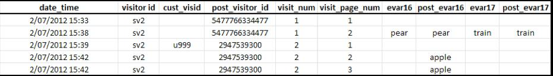

# 归因和持久性

>[!IMPORTANT]
>
>不再建议跨设备识别访客的方法。Please refer to the [Adobe Experience Cloud Device Co-op Documentation](https://marketing.adobe.com/resources/help/en_US/mcdc/).

在访客资料与同一访客 ID 变量关联后进行合并时，历史数据集中的属性不会发生更改。

* 如果设置了变量 `s.visitorID` 并在点击时发送该变量，则系统会检查是否存在具有匹配访客 ID 的任何其他访客资料。
* 如果存在，则从此时开始使用系统中存在的该访客资料，而不再使用之前的访客资料。
* 如果找不到匹配的访客 ID，则会创建一个新资料。

当未验证的客户首次到达您的网站时，Adobe Analytics 会为该客户分配一个访客资料。如[独特访客和访问计数](../../../implement/js-implementation/xdevice-visid/xdevice-connecting.md#section_70330AB6724C4E419A4BD0BDD54641AC)中所示，进行验证时会创建新资料。创建新资料后，一次访问结束，另一次访问开始。

**在首次数据连接时**

以下示例显示了当客户在第一个设备上首次进行验证时，如何将数据发送到 Adobe Analytics：

* `eVar16` 有效期为天，访问 `evar17` 期满。

* `post_visitor_id` 列代表由Adobe Analytics维护的配置文件。
* The `post_evar16` and `post_evar17` columns show shows the persistence of eVars.

* `cust_visid` 表示设置的值 `s.visitorID`。

* 每一行就是一次“点击”，即发送到 Adobe Analytics 数据收集服务器的一个请求。

如果在首次数据连接时包含之前未识别的 `s.visitorID` 值（上述 `u999`），则会创建新资料。之前资料中的永久性值将会转移到新资料中。

* 设置为访问时过期的 eVar 不会复制到经验证的资料中。请注意，不会保留上述值 `car`。
* 设置为通过其他措施过期的 eVar 将会复制到经验证的资料中。请注意，将会保留值 `apple`。
* 对于保留的 eVar，不会记录实例量度。这意味着在使用跨设备访客识别时，可能会看到 eVar 值的“独特访问”量度大于“实例”量度的报表。

**后续数据连接时**

以下示例显示了客户之前在其他设备上经过验证后，在新设备上进行验证时如何将数据发送到 Adobe Analytics：

在客户进行验证时，其 ID 与之前“经验证”的资料 `2947539300` 相匹配。将不再使用此次访问开始时所用的资料 (`5477766334477`)，而且不会保留该文件中的任何数据。

* 地域划分数据根据访问的首次点击进行记录，并且无论使用的是什么设备，单次访问的地域划分数据都不会更改。这意味着在新设备上进行后续数据连接时，通常不包括地域划分数据。
* 浏览器、操作系统和颜色深度等技术列将根据访问的首次点击进行记录。和地域划分值一样，这些值不会复制到拼接的资料中。
* “直接”或“内部”等通常设置为不覆盖其他渠道的营销渠道，将会在包含该设备首次验证（如[独特访客和访问计数](../../../implement/js-implementation/xdevice-visid/xdevice-connecting.md#section_70330AB6724C4E419A4BD0BDD54641AC)中所示的首次验证）的后续数据连接时覆盖其他渠道。

**特殊情况**

在某些其他情况下，经验证的资料中不会保留未验证资料中的数据。

* 如果用户是您网站的新访客（以前从未在此设备上访问过该网站），并且该用户在到达网站大约 3 分钟内进行了验证，则经验证的资料中将不会保留任何值。

