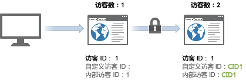
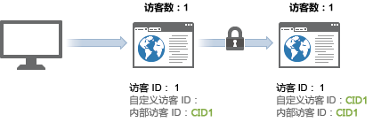

# 访客

>[!IMPORTANT]
>
>不再建议跨设备识别访客的方法。Please refer to the [Adobe Experience Cloud Device Co-op Documentation](https://marketing.adobe.com/resources/help/en_US/mcdc/).

Analytics 将每个有效的独特访客 ID 算作一个独特访客。

If you look at the [previous table](../../../implement/js-implementation/xdevice-visid/visit-example.md#concept_E3B32B8E539F4FDC8E3FA872328B87BA), this occurred 3 times: at hits 1, 9, and 10. 这是因为这两个服务器调用的有效[!UICONTROL 访客 ID] 相同，而且即使两次访问相隔几个小时并且发生在不同的设备上，也会这样处理。

在启用跨设备访客识别时，这可能会增加您所看到的独特访客数。同一次访问中访客可能会被计算两次：首次访问被计算一次，用户通过验证后又被计算一次。

当新访客查看您的网站时，将填充并存储 `s_vi` Cookie。在数据收集服务器上，将为此访客 ID 创建新访客资料，并将资料中的有效[!UICONTROL 访客 ID] 设置为与 Cookie 匹配。

在启用跨设备访客识别时，如果随后的点击（如验证后）中提供了[!UICONTROL 访客 ID] 变量，则会更新有效[!UICONTROL 访客 ID] 以与自定义值匹配。这可能会致使有效[!UICONTROL 访客 ID] 在验证后直接发生更改，从而产生多个访客计数。

首次关联之后，访问次数恢复正常，因为访客通过[!UICONTROL 访客 ID] Cookie 进行关联。如果访客稍后查看您的网站，接着进行验证，访客计数不会虚增，因为有效的[!UICONTROL 访客 ID] 在验证后不会发生更改。

