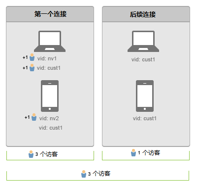

# 跨设备连接用户

>[!IMPORTANT]
>
>不再建议跨设备识别访客的方法。Please refer to the [Adobe Experience Cloud Device Co-op Documentation](https://marketing.adobe.com/resources/help/en_US/mcdc/).

跨设备访客识别可帮助您连接跨多个设备的访客。跨设备访客识别使用访客 ID 变量 s.visitorID 来关联跨设备的用户。

如果您为某次点击提供了一个[!UICONTROL 访客 ID] 变量，系统将检查所有其他访客资料是否具有相匹配的[!UICONTROL 访客 ID]。如果有，则从此时开始使用系统中存在的该访客资料，并且不再使用之前的访客资料。

[!UICONTROL 访客 ID] 通常在出现以下情况以后进行设置：执行身份验证；或在访客执行了某些其他操作，使您能够脱离他们所使用的设备进行唯一识别。我们建议创建一个用户名或内部 ID 的散列，并且不包含任何个人识别信息。

在[之前的示例中](../../../implement/js-implementation/xdevice-visid/xdevice-connecting.md)，当客户从每个设备登录后，他们都将与相同的用户配置文件关联。如果访客稍后注销设备，拼接仍将继续工作，因为每个设备的 Cookie 中所存储的[!UICONTROL 访客 ID] 已经与相同的访客资料关联。我们建议尽可能地填充 [!UICONTROL s.visitorID] 变量，以备在[!UICONTROL 访客 ID] Cookie 被删除时使用。

## 独特访客和访问计数 {#section_70330AB6724C4E419A4BD0BDD54641AC}

请考虑两个设备的如下连接顺序：

**在首次数据连接时**

* 删除重复访客不是可回溯性过程。

在笔记本电脑上进行验证后，Adobe Analytics 会将具有任一访客 ID（`nv1` 或 `cust1`）的点击视为同一个人。但是，由于删除重复访客不是可回溯性过程，因此将计作 2 个独特访客。

在移动设备上进行首次数据连接时，无法识别客户，因此计作新独特访客。用户在移动设备上进行验证 (`cust1`) 之后，Adobe Analytics 会将 `cust1` 映射回主网站上提供的访客 ID，从而不会再增加独特访客数。

每个经验证的新设备或浏览器都将增加 1 个独特访客。

**后续数据连接时**

与经验证的设备进行后续数据连接时，不会增加独特访客数。
