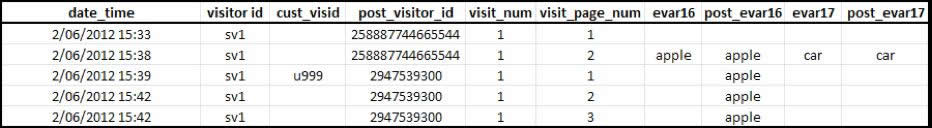
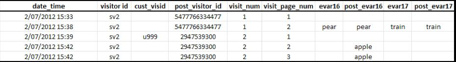

# 属性和永久性

>[!IMPORTANT]
>
>不再建议使用这种方法来识别跨设备访客。 相关信息，请参阅组件用户指南中的[跨设备分析](/help/components/cda/overview.md)。

在访客轮廓与同一访客 ID 变量关联后进行合并时，历史数据集中的属性不会发生更改。

* 如果设置了`visitorID`变量并在点击时发送该变量，则Adobe会检查是否存在具有匹配访客ID的任何其他访客资料。
* 如果存在某个配置文件，则会从该时间点开始使用系统中已存在的访客配置文件，并且不再使用之前的访客配置文件。
* 如果找不到匹配的访客ID，则会创建新资料。

当未经身份验证的客户首次访问您的网站时，Adobe Analytics会为该客户分配一个访客资料。 创建新资料后，一次访问结束，另一次访问开始。

## 示例 1

以下示例显示了当客户在第一个设备上首次进行验证时，如何将数据发送到 Adobe Analytics：

* `eVar16` 的有效期限为 1 天，而 `evar17` 在访问时过期。
* `post_visitor_id` 列表示由 Adobe Analytics 维护的资料。 Post 列通常显示在数据馈送中。 相关信息，请参阅导出用户指南中的[数据馈送](/help/export/analytics-data-feed/data-feed-overview.md)。
* `post_evar16` 和 `post_evar17` 列显示 eVar 的永久性。
* `cust_visid` 表示 `visitorID` 中设置的值。
* 每一行就是一次“点击”，即发送到 Adobe Analytics 数据收集服务器的一个请求。

如果在首次数据连接时包含之前未识别的 `visitorID` 值（上述 `u999`），则会创建新资料。 上一个配置文件的持续值将被传输到新配置文件中。

* 设置为访问时过期的eVar将不会复制到已验证的资料中。 请注意，不会保留上述值 `car`。
* 设置为通过其他措施过期的 eVar 将会复制到经验证的轮廓中。 请注意，将会保留值 `apple`。
* 对于保留的eVar，不会记录任何实例量度。 这意味着在使用跨设备访客识别时，可能会看到eVar值的独特访问量度大于实例量度的报表。

>[!NOTE]
>
>如果用户是您网站的新访客（以前从未在此设备上访问过该网站），并且该用户在到达网站大约 3 分钟内进行了验证，则经验证的资料中将不会保留任何值。

## 示例 2

以下示例显示了客户之前在其他设备上经过验证后，在新设备上进行验证时如何将数据发送到 Adobe Analytics。

当客户进行验证时，会将他们与之前“已验证”的资料 (`2947539300`) 进行匹配。 将不再使用此次访问开始时所用的轮廓 (`5477766334477`)，而且不会保留该文件中的任何数据。

* 地域划分数据根据访问的首次点击进行记录，并且无论使用的是什么设备，单次访问的地域划分数据都不会更改。 这意味着，在新设备上的后续数据连接中，通常不包括地域划分数据。
* 浏览器、操作系统和颜色深度等技术列会在访问的第一次点击时记录。 和地域划分值一样，这些值也不会复制到拼接的资料中。
* 如果在后续数包据连接时含针对相应设备的首次身份验证，则营销渠道会覆盖其他渠道。
