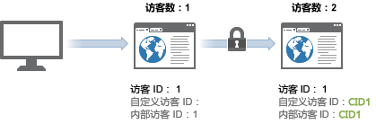
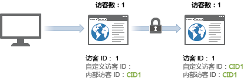

# 跨设备访客识别示例

>[!IMPORTANT]
>
>不再建议使用这种方法来识别跨设备访客。相关信息，请参阅组件用户指南中的[跨设备分析](/help/components/cda/overview.md)。

以下示例通过使用在常见客户交互中发送的服务器调用范例来展示跨设备访客识别的工作原理。

| 服务器调用 | 操作 | 访客 ID Cookie | 访客 ID 变量 | 有效访客 ID | 访问页数 | 访问量 |
|--- |--- |--- |--- |--- |--- |--- |
| 1 | 访客点击营销电子邮件中的链接，并从家庭计算机中访问您的网站。此访客过去还曾 7 次访问您的网站。 | 1 | - | 1 | 1 | 8 |
| 2-8 | 在您的网站上访问了另外的 7 个页面。 | 1 | - | 1 | 2-8 | 8 |
| 9 | 在家庭计算机上验证。 | 1 | CID1 | CID1 | 9  （这是 CID1 的首次点击，因此会接管访客 ID 1 并继续访问其访客轮廓。） | 8 |
| 10 | 访问另外一个页面。 | 1 | CID1 | CID1 | 10 | 8 |
| 11 | 使用办公室的笔记本电脑打开网站。此访客之前没有用这台设备访问过您的网站。 | 2 | - | 2 | 1 | 1 |
| 12 | 在笔记本电脑上验证。 | 2 | CID1 | CID1 | 1 | 9 |
| 13 | 查看另外一个页面。 | 2 | CID1 | CID1 | 2 | 9 |

## 访问计数

每当发生点击并且访问页码等于 1 时，Analytics 即会计为一次访问。

按照上表，有一次新访问被计数 4 次：即分别在第 1、9、11 及 12 次点击时被计数。

## 访客计数

Analytics 将每个有效的独特访客 ID 算作一个独特访客。

按照上表，有一位新访客被计数 3 次：即分别在第 1、9 及 10 次点击时被计数。

当您使用跨设备访客识别功能时，您看到的独特访客数可能会增加。同一次访问中访客可能会被计算两次：首次访问被计算一次，用户通过验证后又被计算一次。

首次关联之后，访问次数恢复正常，因为访客通过其浏览器 Cookie 进行关联。如果访客稍后查看您的网站，接着进行验证，访客计数不会虚增，因为有效的访客 ID 在验证后不会发生更改。

确保在独特访客识别上尽可能保持一致。例如，在用户通过身份验证后始终使用 `visitorID` 变量。
