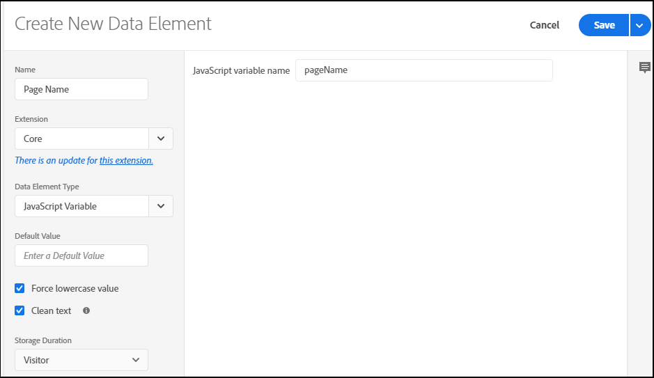

# 将数据层对象映射到数据元素

在为 [实施创建数据层后](https://docs.adobe.com/content/help/en/analytics/implementation/prepare/data-layer.html) ，您可以将其中的对象映射到Launch中 [的数据元素](https://docs.adobe.com/content/help/en/launch/using/reference/manage-resources/data-elements.html#create-a-data-element)。 数据元素是数据图的构件块，可通过多种方式加以利用。 您可以使用数据元素跨Adobe Platform解决方案（包括Analytics报告）收集、组织和交付数据。

要将数据层对象映射到启动数据元素，请执行以下操作：

1. 在启动项中，单击要向其添加数据元素的属性名称。 如果尚未设置属性，请参阅创建启动项属 [性的说明](https://docs.adobe.com/content/help/en/core-services-learn/implementing-in-websites-with-launch/configure-launch/launch.html)。

2. Click **Data Elements** and then click **Create New Data Element**.

   

3. 为数据元素输入名称。 此名称应该是一个简单标签，与要跟踪的数据层中的JavaScript变量相对应。

4. 对于“扩展”，选择“ **核心”。** 此扩展包含您需要的所有变量。

5. For **Data Element Type**, select **JavaScript Variable**. 在适用 **的字段中输入** Javascript变量名称。 这应与JavaScript数据层中对象的确切名称匹配。

6. 在“ **默认值**”中，输入您希望在默认情况下建立的任何值，或在适当时将其留空。

7. 根据您的实践，您可以选择强制使用小写值的选项并强制使用干净文本（Launch将应用常规间距）。

8. 指定要为新数据元素设置启动存储值的持续时间。

9. 单击&#x200B;**保存**。

以下示例显示了在启动项中为数据层中的JavaScript变量创建的页 ``pageName`` 面名称数据元素：

将数据层对象映射到数据元素后，您可以利用它们填充Analytics变量。 有关详细信息，请参 [阅将数据元素映射到分析变量](https://docs.adobe.com/content/help/en/analytics/implementation/prepare/data-layer.html)。
