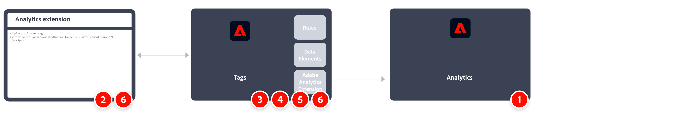

# 使用 Adobe Analytics 扩展实施 Analytics

在 Adobe Analytics 的整个生命周期中，Adobe 提供了多种不同方法来帮助您在网站上实施用于收集数据的代码。 Adobe当前推荐的方法是通过Adobe Experience Platform中的[标记](https://experienceleague.adobe.com/docs/experience-platform/tags/home.html)。

Adobe Experience Platform 中的标记是一款标记管理解决方案，可让您在满足其他标记要求的同时部署 Analytics 代码。 Adobe 提供了与其他解决方案和产品的集成，并允许您部署自定义代码。 无需依赖组织中的开发团队，也可以完成以下所有任务，进而更新网站上的代码。

凡是已签署有效Adobe CX企业版合同的客户都可以使用标记。 如果不确定您是否具有访问权限，请联系贵组织的某个CX企业系统管理员。

实施任务的高级概述：

<table style="width:100%">

<tr>
<th style="width:5%"></th><th style="width:60%"><b>任务</b></th><th style="width:35%"><b>更多信息</b></th>
</tr>

<tr>
<td> 1</td>
<td>确保您已<b>定义报告包</b>。</td>
<td><a href="../../admin/tools/manage-rs/report-suites-admin.md">报告包管理器</a></td>
</tr>

<tr>
<td>2</td>
<td><b>创建数据层</b>来管理您网站上的数据跟踪。</td>
<td>
<a href="../prepare/data-layer.md">创建数据层</a>
</td>
</tr>

<tr>
<td>3</td>
<td><b><b>创建标记属性</b>。 属性是用于引用标记管理数据的总容器。</td>
<td><a href="../launch/create-analytics-property.md">创建 Adobe Analytics 标记属性</a></td>
</tr>

<tr>
<td>4</td><td>在标记属性中<b>安装 Analytics 扩展</b>。 配置 Analytics 扩展以将数据发送到 Adobe Analytics。</td>
<td><a href="https://experienceleague.adobe.com/docs/experience-platform/tags/extensions/client/analytics/overview.html">Adobe Analytics 扩展概述</a></td>
</tr>

<tr>
<td>5</td>
<td><b>部署到开发环境</b>。 有一个可在其中进行标签迭代开发的环境。</td>
<td><a href="./deploy-dev.md">将 Analytics 实施部署到开发环境</td>
</tr>

<tr>
<td>6</td> 
<td><b>验证并发布到生产环境</b>. 嵌入代码以将标记资产包含到网站页面。 然后使用数据元素、规则等来定制您的实施。</td>
<td><a href="https://experienceleague.adobe.com/docs/experience-platform/tags/publish/environments/environments.html#embed-code">嵌入代码</a> <a href="./validate-publish-prod.md">验证开发实施并发布到生产环境</a></td>
</tr>

</table>

## 其他资源

标记可高度定制。 详细了解如何通过在实施中包含正确的数据来充分利用 Adobe Analytics。

- [标记文档](https://experienceleague.adobe.com/docs/experience-platform/tags/home.html#?lang=zh-Hans)：了解界面的使用方式和可用的扩展。

- [实施变量](../vars/overview.md)：确定要发送到数据收集服务器的变量。
