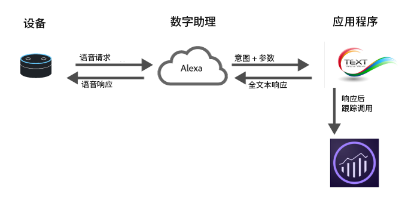

# 为数字助理实施 Analytics

随着云计算、机器学习和自然语言处理等技术取得最新进展，数字助理日益成为日常生活的一部分。使用者开始与设备交谈，希望设备能像人一样理解他们所讲的内容并做出响应。随着这些平台变得日益成熟，各种企业品牌可以使用同样逼真且自然的方式来向使用者展现其服务。例如，使用者可以提出以下问题：

* “Alexa，问一下我的车何时需要加油。”
* ”小娜，我的支票帐户还有多少余额？”
* “Siri，从我的银行应用中向 John 支付昨晚的晚餐费 20 美元。”

本页概要介绍了如何充分利用 Adobe Analytics 来测量并优化这些类型的体验。

## 数字体验架构概述



现如今的数字助理大多采用了类似的高层架构：

1. **设备**：带麦克风并允许用户提问的设备（如 Amazon Echo 或手机）。
1. **数字助理**：该设备可以与支持数字助理的服务进行交互。此服务可将语音转换为机器可理解的意图，并解析请求详情。理解用户的意图后，数字助理会将意图和请求详情传送至负责处理请求的应用程序。
1. **“应用程序”**：可以是手机应用程序，也可以是语音应用程序。应用程序负责对请求做出响应。应用程序对数字助理做出响应，然后数字助理再对用户做出响应。

## 在何处实施 Analytics

实施 Analytics 的一个最佳位置是在应用程序内。应用程序从数字助理处接收意图和详细信息，然后确定如何做出响应。

在请求期间，有两次机会可向 Adobe Analytics 发送数据。

1. 在将请求发送至应用程序时。
1. 在应用程序返回响应后。

如果您只想记录客户发生的事情，以便日后进行优化，则可以在应用程序返回响应后向 Adobe Analytics 发送请求。这样，您就可以了解到请求以及系统响应的全部相关信息。

## 新安装

对于某些数字助理，当有人安装相应技能（特别是涉及身份验证）时，您会收到通知。Adobe 建议通过设置上下文数据变量 `a.InstallEvent=1` 来发送安装事件。此功能并非在所有数字助理上都可用，但当此功能可用于查看客户维系情况时将很有用。以下代码示例会将安装事件、安装日期及应用程序 ID 值发送到上下文数据变量。

```text
GET
/b/ss/examplersid1,examplersid2/1?vid=[UserID]&c.a.InstallEvent=1&c.a.InstallDate=2017-04-24&c.a.AppID=Spoofify1.0&c.OSType=Alexa&pageName=install
HTTP/1.1
Host:
<xref href="https://example.data.adobedc.net">
  example.data.adobedc.net
 Cache-Control: no-cache
</xref href="https:>
```

## 多个助理或多个应用程序

贵组织可能希望使用适用于多个平台的应用程序。最佳实践是在每个请求中各包含一个应用程序 ID。此变量可以在 `a.AppID` 上下文数据变量中进行设置。格式应遵循 `[AppName] [BundleVersion]`，例如 BigMac for Alexa 1.2：

```text
GET /b/ss/examplersid1,examplersid2/1?vid=[UserID]&c.a.AppID=Spoofify1.0&c.a.Launches=1&c.Product=AmazonEcho&c.OSType=Alexa&pageName=install  HTTP/1.1
Host: example.data.adobedc.net
Cache-Control: no-cache
```

```text
GET /b/ss/examplersid1,examplersid2/1?vid=[UserID]&c.a.AppID=Spoofify2.0&c.a.Launches=1&c.Product=GoogleHome&c.OSType=Android&pageName=install  HTTP/1.1
Host: example.data.adobedc.net
Cache-Control: no-cache
```

## 用户/访客识别

Adobe Analytics 可使用 [Adobe Experience Cloud 身份标识服务](https://experienceleague.adobe.com/docs/id-service/using/home.html?lang=zh-Hans) 将不同时间的互动与同一人关联起来。大多数的数字助理将返回 `userID`，可使用该值保留不同用户的活动。在大多数情况下，可以将该值作为唯一标识符进行传递。有些平台返回的标识符长于允许的 100 个字符。在这些情况下，Adobe 建议使用标准哈希算法（如 MD5 或 Sha1）对唯一标识符进行哈希处理，使其变为固定长度值。

当您跨不同设备（例如从 Web 到数字助理）映射 ECID 时，使用 ID 服务能发挥最大作用。如果您的应用程序是移动设备应用程序，请按原样使用 Experience Platform SDK，然后使用 `setCustomerID` 方法发送用户 ID。但是，如果您的应用程序是一项服务，请使用该服务提供的用户 ID 作为 ECID，并在 `setCustomerID` 中对其进行设置。

```text
GET /b/ss/examplersid1,examplersid2/1?vid=[UserID]&pageName=[intent]  HTTP/1.1
Host: example.data.adobedc.net
Cache-Control: no-cache
```

## Sessions

由于数字助理采用对话方式，因此它们通常使用会话的概念。例如：

**使用者：**“Ok Google，帮我叫一辆出租车”

**Google：**“没问题，你什么时间要用车？”

**消费者：**“8:30pm”

**Google：** “不错，驱动程序将在8:30pm前到达”

会话对于保持语境非常重要，并有助于收集更多详细信息，从而使数字助理更加自然。如果对会话实施 Analytics，则会在启动新会话时执行以下两个操作：

1. **访问 Audience Manager**：获取用户所属的相应区段，以便能够对响应进行自定义。（例如，该用户当前符合多渠道折扣的条件。）
2. **发送新会话或启动事件**：将首个响应发送至 Analytics 时，包括启动事件。通常，可以通过设置 `a.LaunchEvent=1` 上下文数据来发送此响应。

```text
GET /b/ss/examplersid1,examplersid2/1?vid=[UserID]&c.a.LaunchEvent=1&c.Intent=[intent]&pageName=[intent]  HTTP/1.1
Host: example.data.adobedc.net
Cache-Control: no-cache
```

## 意图

每个数字助理都使用自己的算法来检测意图，然后将意图传递至“应用程序”，以便应用程序了解要采取什么行动。这些意图是对请求的简洁表达。

例如，如果用户说“Siri，从我的银行应用中向John支付昨晚的晚餐费20美元”，则其意图可能类似于&#x200B;*sendMoney*。

通过将其中每个请求作为 eVar 发送，您将能够对会话应用程序的每个意图运行路径报告。此外，请确保您的应用程序可以处理无意图的请求。 Adobe 建议将“未指定意图”传入给意图上下文数据变量，而不是忽略变量。

```text
GET /b/ss/examplersid1,examplersid2/1?vid=[UserID]&c.a.AppID=Penmo1.0&c.a.LaunchEvent=1&c.Intent=SendPayment&pageName=[intent]  HTTP/1.1
Host: example.sc.adobedc.net
Cache-Control: no-cache
```

或

```text
GET /b/ss/examplersid1,examplersid2/1?vid=[UserID]&c.a.AppID=Penmo1.0&c.a.LaunchEvent=1&c.Intent=No_Intent_Specified&pageName=[intent]  HTTP/1.1
Host: example.data.adobedc.net
Cache-Control: no-cache
```

## 参数/槽/实体

除了意图之外，数字助理通常还会使用一系列键值对来提供意图详情。这些键值对被称作槽、实体或参数。例如，“Siri，从我的银行应用中向 John 支付昨晚的晚餐费 20 美元”这一请求将具有以下参数：

* 对象 = John
* 金额 = 20
* 原因 = 晚餐

通常情况下，应用程序中的这些值的数量有限。要在 Analytics 中跟踪这些值，可将这些值发送到上下文数据变量，然后将每个参数分别映射到一个 eVar。

```text
GET /b/ss/examplersid1,examplersid2/1?vid=[UserID]&c.a.AppID=Penmo1.0=1&c.a.LaunchEvent=1&c.Intent=SendPayment&c.Amount=20.00&c.Reason=Dinner&c.ReceivingPerson=John&c.Intent=SendPayment&pageName=[intent]  HTTP/1.1
Host: example.data.adobedc.net
Cache-Control: no-cache
```

## 错误状态

有时，数字助理会向应用程序提供它不知道要如何处理的输入内容。例如，“Siri，从我的银行应用中向 John 支付昨晚的晚餐费 20 袋煤”。

若出现这种情况，请让应用程序请求数字助理做出澄清说明。此外，还要向 Adobe 发送相应数据以指示应用程序出现错误状态，并同时发送用于指定所发生错误类型的 eVar。请务必包括输入内容不正确和应用程序遇到问题等错误。

```text
GET /b/ss/examplersid1,examplersid2/1?vid=[UserID]&c.a.AppID=Penmo1.0&c.Error=1&c.ErrorName=InvalidCurrency&pageName=[intent]  HTTP/1.1
Host: example.data.adobedc.net
Cache-Control: no-cache
```

## 设备功能

虽然大多数平台不会公开与用户对话的设备，但却会公开所用设备的功能。例如，音频、屏幕、视频等。这一信息非常有用，因为它指明了与用户进行交互时可使用的内容类型。在测量设备功能时，最好按字母顺序将它们串联起来。

示例：`":Audio:Camera:Screen:Video:"`

创建区段时，可使用前导冒号和尾随冒号。例如，显示所有使用 `:Audio:` 功能的点击。

* [Amazon 功能](https://developer.amazon.com/public/solutions/alexa/alexa-skills-kit/docs/alexa-skills-kit-interface-reference)（使用 Amazon Alexa）
* [Google 功能](https://developers.google.com/actions/assistant/surface-capabilities)（使用 Actions on Google）

## 示例

| 人员 | 设备响应 | 操作/意图 | GET 请求 |
|---|---|---|---|
| 安装 Spoofify | 无响应 | 安装 | `GET /b/ss/examplersid1,examplersid2/1?vid=[UserID]&c.a.InstallEvent=1&c.a.InstallDate=[currentDate]&c.a.AppID=Spoofify1.0&c.OSType=Alexa&c.Intent=Install&pageName=Install  HTTP/1.1`<br>`Host: example.data.adobedc.net`<br>`Cache-Control: no-cache` |
| 播放 Spoofify | “好的，正在播放 Spoofify” | 播放 | `GET /b/ss/examplersid1,examplersid2/1?vid=[UserID]&c.a.AppID=Spoofify1.0&c.a.LaunchEvent=1&c.Intent=Play&pageName=PlayApp  HTTP/1.1`<br>`Host: example.data.adobedc.net`<br>`Cache-Control: no-cache` |
| 更改歌曲 | “好的，您想要听哪首歌曲？” | 更改歌曲 | `GET /b/ss/examplersid1,examplersid2/1?vid=[UserID]&c.a.AppID=Spoofify1.0&c.Intent=ChangeSong&pageName= Ask%20For%20Song  HTTP/1.1`<br>`Host: example.data.adobedc.net`<br>`Cache-Control: no-cache` |
| 请播放“Baby Shark” | “好的，正在播放 PinkFong 的‘Baby Shark’” | 更改歌曲 | `GET /b/ss/examplersid1,examplersid2/1?vid=[UserID]&c.a.AppID=Spoofify1.0&c.Intent=ChangeSong&pageName=Action%20Play%20Song&c.SongID=[012345]  HTTP/1.1`<br>`Host: example.data.adobedc.net`<br>`Cache-Control: no-cache` |
| 更改播放列表 | “好的，您想要使用哪个播放列表？” | 更改播放列表 | `GET /b/ss/examplersid1,examplersid2/1?vid=[UserID]&c.a.AppID=Spoofify1.0&c.Intent=ChangePlaylist&pageName=Ask%20For%20Playlist  HTTP/1.1`<br>`Host: example.data.adobedc.net`<br>`Cache-Control: no-cache` |
| 请播放我最喜爱的歌曲播放列表 | “好的，正在播放您最喜爱的歌曲播放列表” | 更改播放列表 | `GET /b/ss/examplersid1,examplersid2/1?vid=[UserID]&c.a.AppID=Spoofify1.0&c.Intent=ChangePlaylist&pageName=Action%20Play%20Playlist&c.Playlist=My%20Favorite%20Songs  HTTP/1.1`<br>`Host: example.data.adobedc.net`<br>`Cache-Control: no-cache` |
| 关闭音乐 | 无响应，音乐关闭 | 关 | `GET /b/ss/examplersid1,examplersid2/1?vid=[UserID]&c.a.AppID=Spoofify1.0&c.Intent=Off&pageName=Music%20Off  HTTP/1.1`<br>`Host: example.data.adobedc.net`<br>`Cache-Control: no-cache` |
