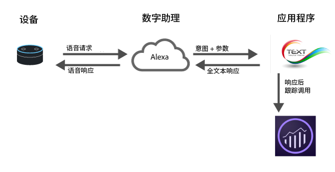

# 为数字助理实施 Analytics

随着云计算、机器学习和自然语言处理技术的进步，数字助理已成为日常生活的一部分。 消费者会与设备交谈，期待得到类似人的回应，而品牌可以通过这些相同的体验来展示他们的服务。 例如，消费者可能会问：

* “Alexa，当我的车需要换油的时候，问问他。”
* “嗨，Google，我的支票账户余额多少？”
* “Siri，从我的银行应用中向John支付昨晚的晚餐费20美元。”

本页概述了如何使用Adobe Analytics来衡量和优化这些类型的体验。

## 数字体验架构概述



大多数数字助理都遵循类似的高层架构：

1. **设备**：带有麦克风并允许用户提问的设备（如智能扬声器或手机）。
1. **数字助理**：为该助理提供支持的服务。 它将语音转换为机器可理解的意图并解析请求的详细信息。 了解意图后，助手会将意图和详细信息传递到处理请求的应用程序。
1. **“应用程序”**：手机上的应用程序或响应请求的语音应用程序。 它响应数字助理，然后数字助理响应用户。

## 数据如何发送到Adobe Analytics

数字助理应用程序通常在没有Adobe客户端库（AppMeasurement或Web SDK）的服务器或平台上运行。 使用[数据插入API](https://developer.adobe.com/analytics-collection-apis/methods/data-insertion/)**在服务器端发送点击**。 您要测量的每次交互都会成为数据插入API请求，其查询字符串（或XML正文）包含此页面上描述的变量，通常是[上下文数据变量](/help/implement/vars/page-vars/contextdata.md)，您通过[处理规则](/help/admin/tools/manage-rs/edit-settings/general/processing-rules/pr-overview.md)将这些变量映射到eVars、props和事件。

本页重点介绍&#x200B;*要度量的*&#x200B;以及如何在Analytics中对其进行建模。 有关端点、查询字符串和XML编码、所需组件和响应类型，请参阅[数据插入API文档](https://developer.adobe.com/analytics-collection-apis/methods/data-insertion/)。 以下命名的每个变量都映射到[变量引用](https://developer.adobe.com/analytics-collection-apis/methods/data-insertion/variable-reference)中的查询字符串参数和XML标记。

## 在何处实施Analytics

实施Analytics的最佳位置之一是应用程序中，该应用程序从数字助理接收意图和详细信息，并确定如何响应。 请求过程中有两个时刻有助于将数据发送到Adobe Analytics：

1. 在将请求发送至应用程序时。
1. 在应用程序返回响应后。

如果您有兴趣记录未来优化所发生的情况，请在返回响应后发送点击，这样您就拥有了请求的完整上下文以及系统如何响应。

## 衡量标准

### 新安装

对于在有人安装技能时通知您的助理（特别是涉及身份验证的助理），通过设置上下文数据变量`a.InstallEvent=1`以及`a.InstallDate`和应用程序ID (`a.AppID`)发送安装事件。 这并非在每个平台上都可用，但如果存在，则可用于保留分析。

### 多个助理或应用程序

组织通常会为多个平台构建应用程序。 在`a.AppID`上下文数据变量中的每个请求上包含应用程序ID，格式为`[AppName] [BundleVersion]`（例如`Spoofify 1.0`）。 添加一个平台或操作系统上下文数据变量（如`OSType`），以便您可以在报表中区分Alexa、Google Assistant和其他平台。

### 访客识别

Adobe Analytics使用[Adobe访客ID服务](https://experienceleague.adobe.com/cn/docs/id-service/using/home)将一段时间的交互绑定到同一个人。 大多数数字助理会返回可用作唯一标识符的`userID` — 将其作为访客ID覆盖(`vid`)传递。 某些平台返回的标识符长于允许的100个字符；在这些情况下，使用标准算法（如MD5或SHA-1）将其散列为固定长度的值。

使用访客ID服务可在您跨设备（例如，从Web到数字助理）映射ECID时实现最大价值。 如果您的应用程序是移动设备应用程序，请使用Experience Platform Mobile SDK并通过`setCustomerID`方法发送用户ID。 如果您的应用程序是某个服务，请使用该服务提供的用户ID作为访客ID，并使用`setCustomerID`进行设置。 有关如何设置服务器端请求上的标识符，请参阅[使用数据插入API的访客标识](../id/data-insertion.md)。

### 会话

由于数字助理具有对话性，因此他们通常具有会话（多轮交流）的概念。 当新会话开始时，Adobe会推荐以下两项内容：

1. **联系Audience Manager**&#x200B;以获取用户所属的区段，以便自定义响应。
1. 通过设置上下文数据变量`a.LaunchEvent=1`，使用第一个响应发送启动事件&#x200B;**。**

### 意图

每个助理都会检测意图并将其传递到应用程序。 意图是请求的简洁呈现 — 例如，“Siri，从我的银行应用中向John支付昨晚的晚餐费20美元”可能会归结为意图&#x200B;*sendMoney*。 将每个意图发送到映射到eVar的上下文数据变量，以便您可以跨意图运行路径报表。 此外，请确保您的应用程序处理无意图的请求；Adobe建议发送`No Intent Specified`而不是忽略变量。

### 参数、槽和实体

除了意图之外，助理通常会提供请求的键/值详细信息（称为版块、实体或参数）。 对于“Siri，给小明20美元，付昨天的晚餐钱”，参数可能是：

* 谁=约翰
* 金额= 20
* 为什么=晚餐

每个应用程序通常具有一组有限的此类变量。 将它们发送到上下文数据变量，并将每个变量映射到eVar。

### 错误状态

有时，助手传递您的应用程序无法处理的输入（例如，“Siri，从我的银行应用程序向John发送20袋煤”）。 发生这种情况时，请让应用程序请求说明并发送指示错误状态的数据 — 将`a.Error=1`与指定错误类型的eVar一起设置。 包括输入无效的错误和应用程序本身遇到问题的错误。

### 设备功能

虽然大多数平台不会公开确切的设备，但却会公开其功能（如音频、屏幕或视频），这些功能定义了您可以使用的内容类型。 在测量设备功能时，按字母顺序使用前导冒号和尾随冒号将它们连接起来，例如`":Audio:Camera:Screen:Video:"`，以便您可以构建区段，例如“具有`:Audio:`功能的所有点击”。

* [Amazon Alexa界面参考](https://developer.amazon.com/public/solutions/alexa/alexa-skills-kit/docs/alexa-skills-kit-interface-reference)
* [Google Assistant表面功能](https://developers.google.com/actions/assistant/surface-capabilities)

## 示例请求

以下数据插入API GET请求记录银行应用程序的&#x200B;*SendPayment*&#x200B;意图，将应用程序ID、启动事件、意图和插槽值设置为上下文数据：

```text
GET /b/ss/examplersid1,examplersid2/1?vid=[UserID]&c.a.AppID=Penmo%201.0&c.a.LaunchEvent=1&c.Intent=SendPayment&c.Amount=20.00&c.Reason=Dinner&c.ReceivingPerson=John&pageName=SendPayment HTTP/1.1
Host: example.data.adobedc.net
```

有关完整的请求格式、端点和响应类型，请参阅[数据插入API文档](https://developer.adobe.com/analytics-collection-apis/methods/data-insertion/request)。

## 测量模型示例

下表显示了音乐应用程序中常见的操作如何映射到Analytics变量。 在每个数据插入API请求中将它们设置为上下文数据变量，然后使用处理规则将它们映射到eVar和事件。

| 人员操作 | 意图/事件 | 要设置的上下文数据 |
| --- | --- | --- |
| 安装应用程序 | 安装 | `a.InstallEvent=1`, `a.InstallDate`, `a.AppID`, `OSType` |
| 启动应用程序 | Launch | `a.LaunchEvent=1`, `a.AppID`, `Intent=Play` |
| 要求更改歌曲 | 更改歌曲 | `a.AppID`, `Intent=ChangeSong` |
| 播放特定歌曲 | 更改歌曲 | `a.AppID`, `Intent=ChangeSong`, `SongID` |
| 更改播放列表 | 更改播放列表 | `a.AppID`, `Intent=ChangePlaylist`, `Playlist` |
| 遇到无效的输入 | （错误） | `a.Error=1`, `ErrorName` |
