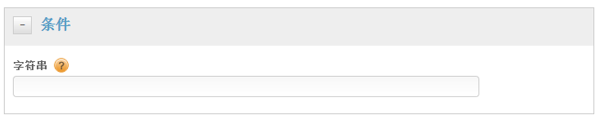

# 为直接调用规则创建条件

为直接调用规则创建条件。

1. 在&#x200B;**[!UICONTROL 条件]**对话框中，指定将在直接调用中传递到`_satellite.track()`的字符串（不带引号）。

   

   >[!NOTE]
   >
   >如果您按照上文中的描述，使用 UI 指定将在直接调用中传递到 `_satellite.track()` 的字符串，则不要使用引号。如果您使用编辑器插入[自定义页面代码](/help/implement/other/dtm/c-aa-tool/customize-page-code.md)，则必须使用引号。

