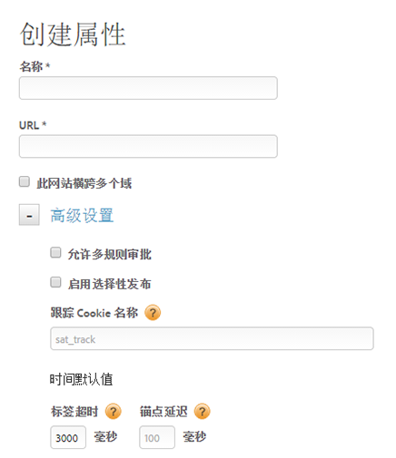

# 创建 Web 属性

Web 属性可以是包含在一个嵌入代码中且具有规则库的一个或多个域和子域的任意组合。

>[!NOTE]只有具有管理员权限的用户才能创建属性。有关角色的详细信息，请参阅 Dynamic Tag Management 产品文档中的[在 DTM 中创建和管理组](https://marketing.adobe.com/resources/help/zh_CN/dtm/groups.html)。

您可以使用DTM管理和跟踪这些资产。 例如，假定您基于一个模板拥有多个网站，并且希望跟踪所有这些网站上的相同资产。 可以将一个Web属性应用到多个域。

有关Web属性和最佳实践的一般信息，请参 [阅动态标签管理产品文档中的](https://marketing.adobe.com/resources/help/zh_CN/dtm/web_property.html) Web属性。

1. Navigate to your company page, then click **[!UICONTROL Add Property]**.

   

1. 填写以下字段：

   <table id="table_376D72251C4D4C4CA878D10C18D2532C"> 
    <thead> 
    <tr> 
    <th colname="col1" class="entry"> 元素 </th> 
    <th colname="col2" class="entry"> 描述 </th> 
    </tr> 
    </thead>
    <tbody> 
    <tr> 
    <td colname="col1"> 名称 </td> 
    <td colname="col2"> 
属性的名称。 
 </td> 
    </tr> 
    <tr> 
    <td colname="col1"> URL </td> 
    <td colname="col2"> 
属性的基本 URL。 
 </td> 
    </tr> 
    <tr> 
    <td colname="col1">  此网站跨多个域  </td> 
    <td colname="col2"> 
如果希望访客数据在域之间保留，则可以添加和删除域。 如果选择此选项，则访问数据会跨子域保留。 
 
通过此设置，您可以指定如何跟踪关联子域或域之间的流量。 指向子域的链接被视为出站链接。 单独跟踪对子域的访问。 
 </td> 
    </tr> 
    </tbody> 
    </table>

1. （可选）配置 [!UICONTROL Advanced Settings]。

   <table id="table_6E687FBE6ACC4301BCCD837F4DCBB9C9"> 
    <thead> 
    <tr> 
    <th colname="col1" class="entry"> 元素 </th> 
    <th colname="col2" class="entry"> 描述 </th> 
    </tr> 
    </thead>
    <tbody> 
    <tr> 
    <td colname="col1">  允许多规则批准 </td> 
    <td colname="col2"> 
允许一次批准此属性的多个规则。默认批准仅允许单规则批准。 
 </td> 
    </tr> 
    <tr> 
    <td colname="col1">  启用选择性发布 </td> 
    <td colname="col2"> 
指定是否允许用户选择要发布的已批准规则。 这是默认选项。 
 </td> 
    </tr> 
    <tr> 
    <td colname="col1">  跟踪 Cookie 名称 </td> 
    <td colname="col2"> 
覆盖默认跟踪 Cookie 名称。您可以自定义动态标签管理用来跟踪您的退出状态以接收其他cookies的名称。 
 </td> 
    </tr> 
    <tr> 
    <td colname="col1">  标记超时 </td> 
    <td colname="col2"> 
指定动态标签管理在超时和取消标签请求之前等待标签触发的时间。 
 
 由于动态标签管理的工作方式，因此不必担心这个数字太高。 DTM有有效的方法可确保缓慢的标记不会影响用户体验。 
 </td> 
    </tr> 
    <tr> 
    <td colname="col1">  锚记延迟 </td> 
    <td colname="col2"> 
指定动态标签管理在移至下一页之前等待标记触发单击的链接的时间。 默认值为 100 毫秒。 
 
较长的延迟可提高跟踪准确性。Adobe 建议将延迟设置为等于或少于 500 毫秒，用户将不会察觉到这段延迟。 
 
动态标签管理将等待指定的时间，但如果信标更早触发，则延迟会缩短。 （也就是说，用户并不会总是等待延迟的全部时长。） 
 </td> 
    </tr> 
    </tbody> 
    </table>

1. 单击 **[!UICONTROL Create Property]**.
