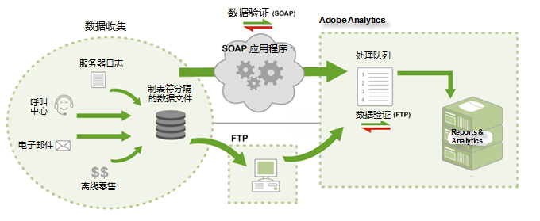

# 数据源的工作原理

有关 Adobe 如何提供数据源访问权限的信息。

>[!NOTE]
>
>通过数据源提交后，导入的数据与使用其他方法收集的数据无区别(JavaScript信标、ActionSource、数据插入API等)。数据一经导入便无法删除。

可使用以下两种方法来提交数据：

* [FTP](../../import/c-data-sources/datasrc-how-data-sources-works.md#section_0E70022648F94061AF5B4AD6C7145243)
* [API](../../import/c-data-sources/datasrc-how-data-sources-works.md#section_65DACC9CE00C437BBFDD02D19C25A4BD)

## FTP {#section_0E70022648F94061AF5B4AD6C7145243}

您可以通过市场营销报表创建和管理基于 FTP 的数据源，它可使用 FTP 文件传输将数据文件导入数据源。在创建数据源之后，Adobe 会为您提供一个 FTP 位置，可供您上载数据源文件。上载完成之后，数据源可自动查找并处理这些数据源文件。处理完成之后，相关数据即可用于市场营销报表。

## API {#section_65DACC9CE00C437BBFDD02D19C25A4BD}

Adobe 提供的数据源 API，可让您以编程方式将自己的应用程序链接到数据源。这种方式不再需要中间 FTP 服务器，也不需要经由 HTTP、SOAP 和 REST 传输数据。

请参阅[数据源 API 文档](https://marketing.adobe.com/developer/documentation/data-sources/c-data-sources-api)。
