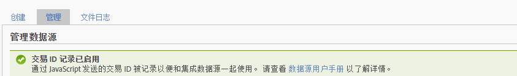

# 事务与客户集成

Data Sources提供另外两种将离线事件集成到在线数据的方法。

* [启用交易 ID 记录](../../import/c-data-sources/datasrc-integrating-offline-data.md#section_30D6D47AEC0F4A36B87EBFE4C858F20C)
* [交易集成](../../import/c-data-sources/datasrc-integrating-offline-data.md#section_B3F281CEFF9B47E9A07F9851D61D415D)
* [客户集成](../../import/c-data-sources/datasrc-integrating-offline-data.md#section_9F4AAD710D2543BDA834090A98115FBF)

这些集成将离线数据与特定的在线交易或在线访客关联。

## 启用交易 ID 记录 {#section_30D6D47AEC0F4A36B87EBFE4C858F20C}

交易 ID 可以从 UI 启用/禁用，而无需 ClientCare 的参与：

Go to **[!UICONTROL Admin]** &gt; **[!UICONTROL Report Suites]** &gt; **[!UICONTROL[Select Report Suite]]** &gt; **[!UICONTROL Edit Settings]** &gt; **[!UICONTROL General]** &gt; **[!UICONTROL General Account Settings]**.

<!-- 

When contacting Customer Care, be prepared to provide the following information: 
 
<ul id="ul_C425C7A074484650AFCCF0425E8E3F47"> 
 <li id="li_7640C0C4DF0C49749A3C37E5461DC22F">Report Suite ID of the data source for which you need transaction ID recording enabled. 
In Data Sources, the report suite ID is the first part of the login appended by a random number that identifies the specific data source that was set up. For example, <code> RSID-drmossdev5 Login-drmossdev5_0001343430</code>. 
 </li> 
 <li id="li_4FB0E3EC7BE94A2DBEE9063365A71C9C">The Transaction ID expiration window (described in <a href="../../import/c-data-sources/datasrc-tid-visitor-profile.md#concept_0AF92491E8274BF69E66DB36E5F54A0F" format="dita" scope="local"> Transaction ID and Visitor Profiles</a>). By default this is 90 days, but it can be extended to up to 2 years. </li> 
</ul>

 -->

To see if Transaction ID Recording is enabled, navigate to **[!UICONTROL Analytics]** &gt; **[!UICONTROL Admin]** &gt; **[!UICONTROL Data Sources]**.

[!UICONTROL “管理”]选项卡将显示“交易 ID 记录”的状态。

## 客户集成 {#section_9F4AAD710D2543BDA834090A98115FBF}

客户 ID 用于指定客户的离线活动，并将其与在线活动关联。它们应当在以下情况下使用：

* 在&#x200B;*`visitorID`* 变量。
* 客户活动转为离线（例如商机提供或购买）没有指定的时间点。

若要配置此类型的数据源，请参阅 [Visitor ID](../../import/c-data-sources/c-datasrc-types/datasrc-visitorid.md#concept_1CFAA61D57A84B22A41F7A8E0DFCAAB5)

## 交易集成 {#section_B3F281CEFF9B47E9A07F9851D61D415D}

交易 ID 用于记录某一时间点的访客状态。使用它们的时间点通常应在客户体验从在线转为离线时，例如：

* 为销售人员提供一个联系客户的商机。
* 进行在线购买，并且以后可以在商店退货。
* 购买以后可能会寻求支持的产品。

客户从在线转为离线时通常是匿名的。

交易 ID 事件未包含在访问参与率量度中（这些量度显示在市场营销报表中），而是包含在访客参与率量度中（仅在临时分析中可用）。

这是因为交易 ID 数据不与访问关联（因为离线事件通常不是在线事件的一部分），而是与访客关联。

请参阅 [交易 ID](../../import/c-data-sources/c-datasrc-types/datasrc-transactionid.md#concept_A97302E9EC45468A8F30285FACE8C776).
