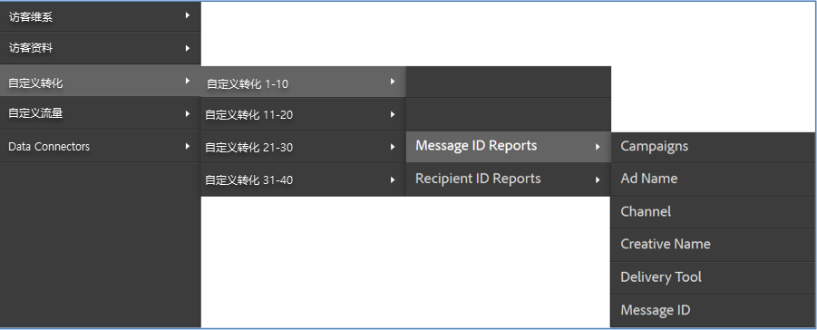

# 部署集成{#deploying-the-integration}

部署此集成是一个简单的过程，它需要执行以下操作：

## 完成Adobe集成向导{#completing-the-adobe-integration-wizard}

完成数据连接器界面中集成向导的步骤。

1. 导航到Adobe Experience cloud中的数据连接器（以前称为Genesis）区域。
1. 启动ContactLab集成向导。
1. 选择所需的报表包并提供集成的名称。
1. 配置以下项目：

   | 项目 | 描述 |
   |---|---|
   | 电子邮件地址 | 主要联系人的电子邮件地址 |
   | 描述 | （可选）此集成设置的说明 |

1. 配置以下 **[!UICONTROL 变量映射]** :

   | 项目 | 描述 |
   |---|---|
   | 链接 ID | 选择一个eVar以实时收集链接ID。 |
   | 消息ID | 选择一个eVar以实时收集消息ID。 |
   | Recipient ID | 选择一个eVar以实时收集收件人ID。 |
   | 跳出次数 | 选择一个数字事件以从ContactLab接收每日弹回。 |
   | 已发送 | 选择一个数字事件，以接收从ContactLab发送的每日发送。 |
   | 已单击 | 选择一个数字事件，以从ContactLab接收每日总点击量。 |
   | 已打开 | 从ContactLab中选择一个数字事件，以接收每日打开的总数。 |
   | 取消订阅 | 选择一个数字事件，以便从ContactLab接收每日取消订阅。 |

1. 启用数据访问和配置数据收集。
   1. 根据需要重命名分类。
   1. **[!UICONTROL 合作伙伴细分]** ，是包含在您的集成中的标准再营销细分。
   1. 在“ **[!UICONTROL 您的区段]**”下，选择要包含在此集成中的任何自定义区段。 您可以在管理面板下创建其他自定义区段。
   1. 在“ **[!UICONTROL 访问请求]**”下，选中该框可允许将产品信息导出到每日再营销区段的ContactLab。
   1. 根据需要重命名计算量度。
   1. 配置您是通过手动更新Analytics收集代码还是使用自动化解决方案来收集ID。 如果选择“ **[!UICONTROL 自动解决方案]**”，则必须包含电子邮件链接中使用的参数才能传递ID。
1. 查看所有配置项，然后单击“ **[!UICONTROL 立即激活]**”。

## 验证集成{#verifying-the-integration}

查看Adobe Experience cloud中的ContactLab集成设置

1. 查看集成活动日志。

   1. 在Adobe Experience cloud中，导航至“支持” **[!UICONTROL &gt;“集]** 成活动日志” ****。

      

   1. 查找成功导 **[!UICONTROL 入的分类数据]**、 **[!UICONTROL 成功导入的量度数据]**、成功导 **[!UICONTROL 出的量度数据等条目]**。 这些条目应在成功部署后的1天内显示。
1. 在Adobe Analytics中查看报告数据。

   1. 导航到“自 **[!UICONTROL 定义转化]** ”&gt;“自定 **[!UICONTROL 义转化1-10]** ” **[!UICONTROL &gt;“消息]** ID报告”。

      

   1. 查找ContactLab报告。 此数据应在成功部署后的24-48小时内显示。