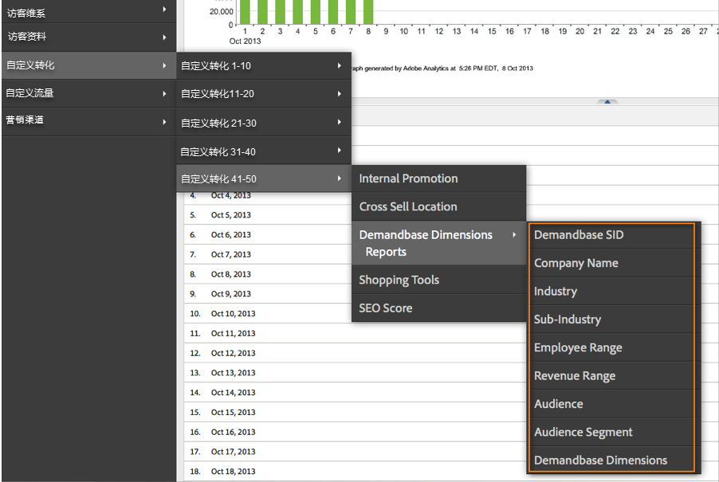
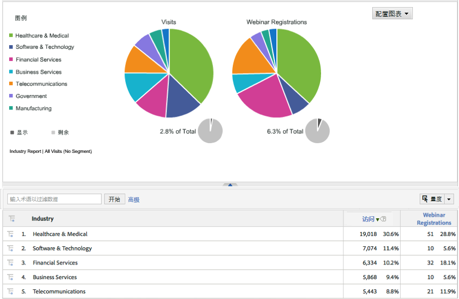

# 部署集成{#deploying-the-integration}

部署此集成是一个简单的过程，需要执行以下操作。

## 完成Adobe集成向导{#completing-the-adobe-integration-wizard}

要激活集成，必须在数据连接器界面中完成配置向导。

1. 导航到Adobe Experience cloud中的数据连接器（以前称为Genesis）区域。
1. 启动Demandbase 2.0集成向导。
1. 选择所需的报表包并提供集成的名称。
1. 配置以下项目：

<table id="table_8D60DC7C48C144DC9934749E7F9F65FF"> 
 <thead> 
  <tr> 
   <th colname="col1" class="entry"> 项目 </th> 
   <th colname="col2" class="entry"> 描述 </th> 
  </tr>
 </thead>
 <tbody> 
  <tr> 
   <td colname="col1"> 电子邮件地址 </td> 
   <td colname="col2"> 主要联系人的电子邮件地址。 </td> 
  </tr> 
  <tr> 
   <td colname="col1"> 描述 </td> 
   <td colname="col2"> （可选）此集成设置的说明。 </td> 
  </tr> 
  <tr> 
   <td colname="col1"> Demandbase API密钥 </td> 
   <td colname="col2"> 您可以从Demandbase代表处获取此信息。 </td> 
  </tr> 
  <tr> 
   <td colname="col1"> 自定义Demandbase维度#N </td> 
   <td colname="col2"> 这些是8个可选维的ID。 有关详细信息，请参阅Demandbase自定义维。 </td> 
  </tr> 
  <tr> 
   <td colname="col1"> 发送到Adobe Target </td> 
   <td colname="col2">如果为“true”，则Demandbase维度也将使用隐藏的mbox发送到Adobe Target。 <p>注意： 必须在网页上实现已配置的mbox.js文件，才能收集维度。 </p> </td> 
  </tr> 
 </tbody> 
</table>

1. 配置以下变量映射项：

   | 项目 | 描述 |
   |---|---|
   | Demandbase维度 | 从报表包中选择一个可用的eVar变量。 |
   | Demandbase自定义维度（可选） | 从报表包中选择一个可用的eVar变量。 |

1. 配置自定义维的名称（如果适用）。

   1. 如果您选择在步骤4中包括自定义维，并在步骤5中映射可选eVar，则必须为这些维提供友好名称。 例如，如果选择输入“stock_ticker”作为“自定义维1”，则应将包含“维1”的框更改为“股票报价机”。
   1. 不 **要修改** 标准8维的名称（即Demandbase SID、公司名称、行业等）。

1. 选中此框，自动为您创建Demandbase Integration控制面板（建议）。
1. 查看所有配置项，然后单击“ **[!UICONTROL 立即激活]**”。

## 部署集成代码{#deploying-the-integration-code}

完成集成向导后，您必须将集成代码部署到Adobe Analytics部署代码(s_code)。

> [!NOTE] 如果您使用Adobe TagManager或动态标签管理来部署Adobe Analytics，则可以使用其中一种工具轻松添加集成代码。

1. 转到“支 **[!UICONTROL 持]** ”选项卡，从集成的“资 `integration code v2_0_1` 源”区域下载并保存资源。

1. 如果适用，请对代码进行任何必要的修改。 有关详细信息，请参阅修改集成代码（在此页上）。
1. 如果Adobe Analytics部署代码中尚未包含集成模块，请包含该模块。
1. 使用下列方法之一部署代码：

   * 使用Adobe TagManager或动态标签管理添加代码。
   * 或者，将代码交付到负责更新Adobe Analytics部署代码的组织资源。

>[!IMPORTANT]
>
>在将此集成部署到生产环境之前，请确保在开发／暂存环境中测试该集成的部署。

## 修改集成代码{#modifying-the-integration-code}

在大多数情况下，您无需对数据连接器向导生成的集成代码进行任何修改。

但是，如果您确实需要进行调整，下面将介绍一些代码设置。

<table id="table_5405A73CEFD44466B3C39559F4A037C9"> 
 <thead> 
  <tr> 
   <th colname="col1" class="entry"> 代码设置 </th> 
   <th colname="col2" class="entry"> 描述 </th> 
  </tr>
 </thead>
 <tbody> 
  <tr> 
   <td colname="col1"> s.maxDelay </td> 
   <td colname="col2">Adobe Analytics图像请求在触发至Analytics收集服务器之前等待Demandbase数据的最大毫秒数。 <p>注意： 此设置适用于可能通过集成模块运行的所有集成。 </p> </td> 
  </tr> 
  <tr> 
   <td colname="col1"> _db。_key </td> 
   <td colname="col2"> 您的Demandbase API密钥。 </td> 
  </tr> 
  <tr> 
   <td colname="col1"> _db。_apiURL </td> 
   <td colname="col2"> Demandbase API的URL模板。 </td> 
  </tr> 
  <tr> 
   <td colname="col1"> _db。_delim </td> 
   <td colname="col2"> 用于在将Demandbase维值发送到Adobe Analytics时分隔这些值的分隔符。 更改此设置可能导致默认分类规则无法正确运行。 </td> 
  </tr> 
  <tr> 
   <td colname="col1"> _db。_setTnt </td> 
   <td colname="col2">如果为true，则集成代码将尝试使用隐藏的mbox将Demandbase维作为配置文件参数发送到Adobe Target。 <p>注意： 这要求mbox.js代码存在于页面上。 </p> </td> 
  </tr> 
  <tr> 
   <td colname="col1"> _db。_tntVarPrefix </td> 
   <td colname="col2"> 在发送到Adobe Target之前，此字符串会附加到每个Demandbase维名称的前面。 例如，如果此设置的值为“db_”，则维度“industry”将作为“db_industry”发送到Adobe Target。 </td> 
  </tr> 
  <tr> 
   <td colname="col1"> _db。_dimensionsArray </td> 
   <td colname="col2"> 发送到Adobe Analytics的标准Demandbase维度。 建议不要修改此设置。 “max_size”属性是发生截断之前维的允许字符数。 </td> 
  </tr> 
  <tr> 
   <td colname="col1"> _db。_dimensionsArrayCustom </td> 
   <td colname="col2"> 发送到Adobe Analytics的自定义Demandbase维度。 “max_size”属性是发生截断之前维的允许字符数。 </td> 
  </tr> 
  <tr> 
   <td colname="col1"> _db。_cName </td> 
   <td colname="col2"> 用于保持Demandbase API通信状态的会话Cookie的名称。 </td> 
  </tr> 
  <tr> 
   <td colname="col1"> _db。_contextName </td> 
   <td colname="col2"> 用于将标准维发送到Adobe Analytics的contextData变量的名称。 建议不要修改此设置。 </td> 
  </tr> 
  <tr> 
   <td colname="col1"> _db。_contextNameCustom </td> 
   <td colname="col2"> 用于将自定义维发送到Adobe Analytics的contextData变量的名称。 建议不要修改此设置。 </td> 
  </tr> 
 </tbody> 
</table>

## 包括集成模块{#including-the-integrate-module}

集成代码要求集成模块存在于Adobe Analytics部署中。

如果您的部署中尚未安装集成模块，请根据您的实施类型完成以下步骤。

### 对于AppMeasurement v1.0+ {#section-f28d090bf2404cabaae34cd9c66fc575}

1. 解压缩您从“ **[!UICONTROL Analytics]** ”&gt;“Admin **[!UICONTROL ”]** &gt;“CodeManager”下载的AppMeasurement zip **[!UICONTROL 文件]**。

1. 打开名为的文件 [!DNL AppMeasurement_Module_Integrate.js]。
1. 将此文件的内容复制并粘贴到主文 [!DNL AppMeasurement.js] 件中。

   >[!NOTE]
   >
   >将其粘贴到文件中此行注释下的“不更改任何内容”之前。

### 对于旧版代码(H-code) {#section-bba8ad8c715e4f97883e7de3269f681a}

1. 从Data Connectors UI中的“资源”区域（在“支持”选项卡下）下载集成模块。

   

1. 将该文件的内容复制并粘贴到您的文 [!DNL s_code] 件中。

   >[!NOTE]
   >
   >将其粘贴到文件中此行注释下的“不更改任何内容”之前。

## 验证集成{#verifying-the-integration}

通过检查实时跟踪和报告，验证集成是否成功捕获数据。

### 实时跟踪 {#section-9c20e8ff6b404ae09387ee07d675c9e2}

使用DigitalPulse调试器工具验证Demandbase维度数据是否正通过发送到Adobe Analytics。 删除Cookie后，在已部署集成代码的网站上重新加载一个页面。 假定您的当前IP映射到Demandbase识别的组织，您应当看到类似于以下内容的结果。

**Reports &amp; Analytics（以前称为SiteCatalyst）包括两个Demandbase上下文数据变量：**


**** Target Mbox包括Demandbase配置文件参数：只有在页面上实施了Target并且您为Adobe Target配置了此集成，您才会看到这一点——请参阅Adobe集成向导中的步骤4。


### 报表 {#section-1792fe75dc3249d0ad063dfd87a89162}

使用控制面板查看Adobe Analytics中的Demandbase报告，该控制面板是使用Adobe集成向导自动为您创建的（步骤7）。

或者，您也可以导航到Adobe Analytics菜单结构中的Demandbase报表——请参阅下面的截屏。

> [!NOTE] 此数据应在成功部署后的24-48小时内显示。





### 常见问题解答 {#section-d926b160a2ef4f07b43ea1bc67ac2a0a}

**“n/[a]”是什么意思？**

Demandbase Data Connector通过设置此默认值来指示属性何时为“不可用”。 有两种常见情况设置了默认值：

* Demandbase检测到访客来自不属于公司的IP地址。
* 使用“帐户监视”属性（以“watch_list”开头），但该公司不在“帐户监视”列表中。

**为什么“`[n/a]`”对于某些属性显示得更频繁？**

Demandbase对所有IP地址进行分类，并提供audience和audience_segment属性，即使访客不来自公司IP。 当受众返回“Residential”、“Wireless”和“Hospitality”等值时，其他属性可能不可用。

有时，访客的受众是“SMB”，但其他属性将显示“`[n/a]`”。 这意味着Demandbase能够将访客归为小型企业，但完整的公司档案不可用。 这种情况通常发生在最小的公司，即多个小型企业使用相同的服务提供商或IP地址块时。

### 开发人员注意事项 {#section-d33fff55bc4b4db99f82dee418ef1bc2}

如果需要调整实施中的默认值，请更新以下代码行：

```
_db._nonOrgMatchLabel = "[n/a]";
```
