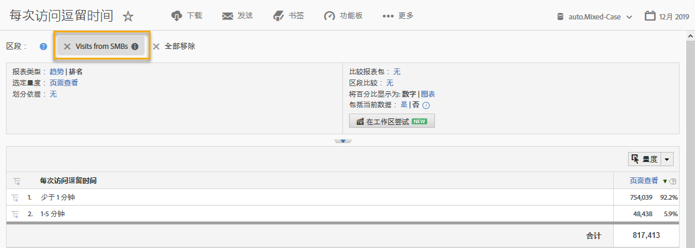

# 使用集成{#using-the-integration}

部署集成后，您可以开始使用它提供的其他功能。

> [!NOTE] 在Adobe Analytics报告中，可能需要24-48小时才能开始查看某些Demandbase数据。

以下是您可以从Adobe Analytics中通过此集成获取价值的一些操作：

## 按Demandbase维度查看流量和转化量度{#viewing-traffic-and-conversion-metrics-by-demandbase-dimension}

此集成提供了新维度，这些维度可作为Adobe Analytics报告使用。

以下报告是分析访问和转化量度（网络研讨会注册）的示例，这些量度按受众类型和行业分类。

## 按Demandbase维度细分{#segmenting-by-demandbase-dimensions}

此集成的主要功能是能够根据Demandbase维度创建Adobe Analytics细分。

例如，您可以构建一个只包括SMB组织访问的细分。 您可以将此称为“中小企业访问”。 其定义是：

受众等于中小型企业。

有关如何构建细分的更多信息，请参阅《 [Analytics细分指南》](https://marketing.adobe.com/resources/help/en_US/analytics/segment/)。

此区段随后可应用于几乎任何报表——例如，此处所示的“每次访问所花费的时间”报表： 
