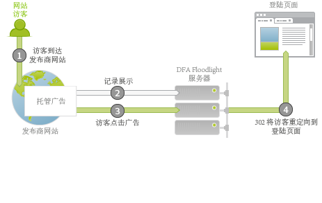
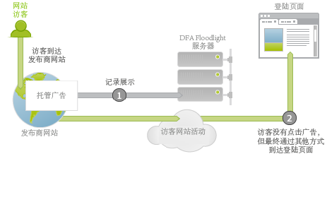

# 广告服务集成概述{#ad-serving-integration-overview}

此集成可通过多种方式捕获有关广告驱动型访客的数据。第一种方式是通过点击某广告进并到达一个标记的登陆页面，该方式称为点进：

访客到达托管该广告的发布商网站。此广告具有一个唯一标识符，称为广告 ID。广告由版面和创作两部分构成，它们分别描述了广告在发布商网站上的位置以及向访客显示的具体内容。当访客从 DFA 内容服务器获取此广告、版面或创作时，它会跟踪 DFA Floodlight 服务器对该访客 (1) 的展示。

如果该访客点击广告 (2)，将会查询 Floodlight 服务器（这计为一次点击），然后 302 将访客重定向 (3) 至登陆页面。当访客到达登陆页面后，即可称其为一次点进。此页面包含 Adobe 跟踪代码，用于从 DFA Floodlight 服务器中查询数据。

如果访客在 Floodlight 服务器跟踪到一次点击后没有真正到达登陆页面，则不能称为一次点进。某些广告和实施实际上可能没有让访客的浏览器遵守 302 重定向。有关此主题的进一步讨论，请参阅[协调量度差异](../dfa-data-connector-analytics/dfa-reconciling-metric-discrepancies/dfa-reconciling-metric-discrepancies.md#concept-8c31ebe761ca4b3fab1e3a18ef5d098f)。

如果访客在收到广告展示后没有点击它，但仍在不久之后通过其他方式到达登陆页面，此集成会捕获下一个量度。

此种情况即称为一次显示到达。此情况与点进的不同之处在于，访客没有点击广告，而是继续其他活动，然后来到登陆页面 (2)。最简单的例子是，访客在浏览器中键入登陆页面的 URL。其他示例包括：访客继续浏览但稍后使用搜索引擎，引擎将访客引导至登陆页面。无论如何，用户均到达登陆页面。
