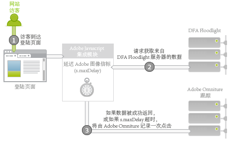

# Adobe 集成：实时数据收集{#adobe-integration-real-time-data-collection}

下图显示数据收集的工作原理。

Adobe 集成的数据收集部分从访客到达登陆页面 (1) 开始进行。在登陆页面上运行的 Adobe 数据收集代码没有该访客与服务广告之间的历史记录。Google DFA 团队协助提供一种在 DFA Floodlight 服务器上运行的服务，以允许 Adobe 代码查询有关网站 (2) 上当前访客的广告信息。为获取此数据，它会暂时延迟 Adobe 图像信标，并请求获取来自 Floodlight 服务器的数据。

在数据抵达或经过较长时间后，它会向 Adobe 跟踪服务器 (3) 触发点击。

集成模块是一种特殊的核心 Adobe JavaScript 模块，它可导致 Adobe 图像信标延迟，从而等待第三方请求一段指定的时间量 ( *`s.maxDelay`*). *`s.maxDelay`*&#x200B;定义集成模块在触发到访客浏览器的图像标记之前，将等待来自 DFA Floodlight 服务器的数据多长时间。此行为非常重要，因此仍将收集基本访客数据，甚至在 DFA Floodlight 服务器发生故障或负载过重时也是如此。如果 Floodlight 数据在&#x200B;*`s.maxDelay`*&#x200B;过期之前到达，Adobe 跟踪数据将被立即触发，并将包含额外的 DFA 数据。

如果发生超时，页面代码可指定一个 Adobe 报告与分析事件以用作超时事件。此事件可用于诊断集成问题，或调整 *`s.maxDelay`*。如果存在过多的超时，请增加 *`s.maxDelay`*. *`s.maxDelay`* 可以设置得太高，但是在这种情况下，访客可能有可能在 *`s.maxDelay`* 计时器过期之前离开站点。For more discussion on this topic, see [Tuning s.maxDelay](../dfa-data-connector-analytics/dfa-integration/dfa-tuning-s-maxlelay.md#concept-6deb28eee18e414db220d6009d449f0d).

有时候，Floodlight 服务器在响应时会出现与访客相关的错误。这通常发生于 Floodlight 服务器不了解访客的任何相关信息时，因为访客还没有查看任何广告，或没有 DFA 访客 Cookie。页面代码可指定自定义转化变量 (eVar)，该变量将收集这些错误，并可协助排解实施问题，或指出 Google 交易存在的问题。最常见的错误包括：无历史记录，无 Cookie、查询错误和退出，如下表中所述：

| 错误 | 名称 | 描述 |
|---|---|---|
| nh | 无历史记录 | 访客尚未查看或点击任何广告。 |
| nc | 无 Cookie | 访客没有 DFA 访客 Cookie。 |
| qe | 查询错误 | 在查询 Floodlight 服务器的数据时发生错误。 |
| oo | 退出 | 访客退出 Google 展示/点击跟踪。 |

