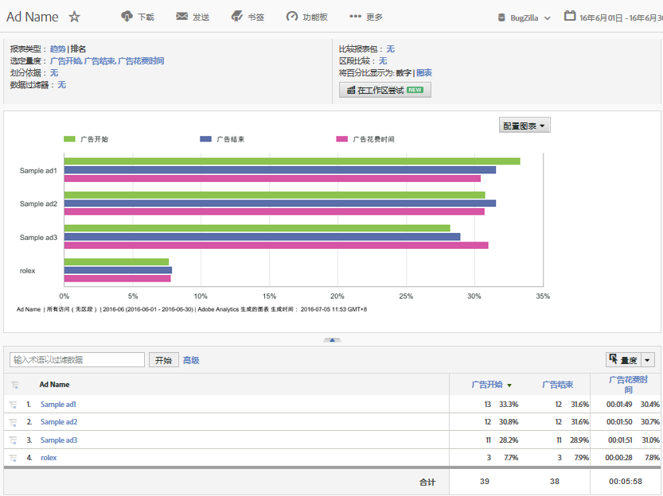

# 使用 DFA 数据的 Analytics 报告{#analytics-reports-using-dfa-data}

一旦 DFA 和 Adobe® 收集服务器可互相通信，您即可在报告与分析中生成包含 DFA 数据的报表。

预封装的 DFA 报表包括：

**渠道**：显示横幅广告与其他在线广告选项之间的比较数据，例如付费搜索和电子邮件。

**交付工具**：显示 DoubleClick for Advertisers 与其他在线广告服务之间的比较数据。

**网站名称**：显示展示有 DFA 横幅广告的网站之间的比较数据。

**页面名称**：显示展示有 DFA 横幅广告的单独网页之间的比较数据。

**广告名称**：显示特定 DFA 横幅广告之间的比较数据。

**促销活动**：显示不同 DFA 广告促销活动之间的比较数据。

要生成 DFA 报表，请执行以下操作：

1. 登录到 Adobe Marketing Cloud。
1. Go to **[!UICONTROL Analytics]** &gt; **[!UICONTROL Reports &amp; Analytics]**. 请确保您已选择安装有 DFA 集成的报表包。

1. 在左侧导航中，选择用于捕获 DFA 点进数据的转化变量，然后选择所需的 DFA 报表。
1. Click **[!UICONTROL Add Metrics]**. 此操作将打开“量度选择器”对话框。
1. Check the Impressions and Clicks metrics in the **[!UICONTROL Available Metrics]** list and click **[!UICONTROL Apply]**.

   所生成的报表会显示展示次数、点击量和收入数据，这样您就能了解 DFA 服务转化为利润收入的情况。例如，DFA 广告名称报表可显示直接归因于当前 DFA 广告促销活动中特定横幅广告的展示次数、点击量和收入数据。

   

此报表具有以下重要功能：

* 报表标题（标有 DFA_广告名称报表）显示报表时段（2009 年 2 月），并使用水平条格式指示这是一个排名报表。
* 此图表本身显示了报表中每个 DFA 广告的三个量度（展示次数、点击量和收入）。
* 此图表将每个量度的数据显示为一个总量度百分比，而不是对每个量度使用实际数字。您可以在&#x200B;**[!UICONTROL 配置报表]对话框中更改它。**
* 在图表下方，DFA_广告名称报表列出了每个 DFA 广告的报表详细信息，并同时显示广告效果的数字和百分比数据。
* 选择一个特定的 DFA 广告名称来打开一个选项菜单，以便获取有关此特定 DFA 广告的更多信息。
* 每个量度列均包含一个与图表中量度所分配颜色对应的颜色键。
* 报表按收入量度排序，具有最高收入的广告列在最顶部。您可以通过单击不同的列（量度）标签来更改报表排序。

