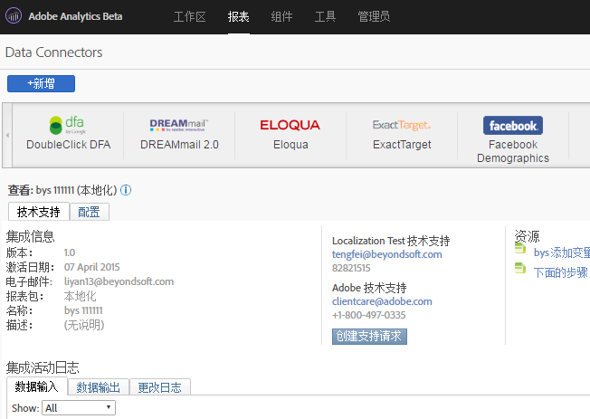

# Adobe Analytics 的 DFA Data Connectors{#dfa-data-connector-for-adobe-analytics}

在当今日益复杂且竞争加剧的在线市场中，在线广告商和代理机构必须不断提升他们对于在线市场营销环境及广告投入回报的理解。尽管广告商、代理机构和发布商都具有单独的工具来帮助实现这些目标，然而从千差万别的数据系统和流程手动汇总数据可能会严重削弱在线市场营销促销活动的效果，最终只能得到不太理想的促销活动效果、并造成数据差异和混乱。

DoubleClick for Advertisers (DFA) 集成使用 Adobe® Data connectors™ 以允许 DoubleClick DFA 将数据自动传递到报告与分析，从而解决了此问题。

**[!UICONTROL “分析]** ”&gt;“ **[!UICONTROL 管理员]** ”&gt; **[!UICONTROL “数据连接器”]**

