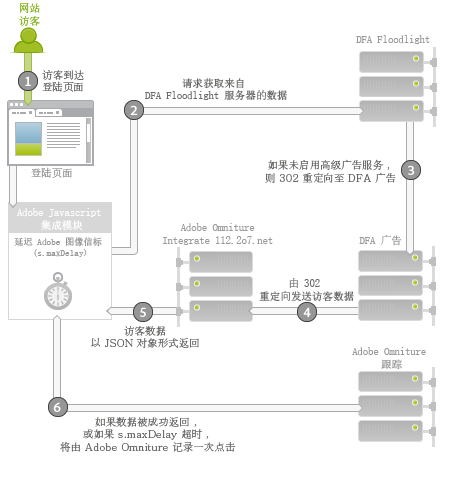

# Adobe Analytics 的 DFA Data Connectors{#dfa-data-connector-for-adobe-analytics}

在当今日益复杂且竞争加剧的在线市场中，在线广告商和代理机构必须不断提升他们对于在线市场营销环境及广告投入回报的理解。尽管广告商、代理机构和发布商都具有单独的工具来帮助实现这些目标，然而从千差万别的数据系统和流程手动汇总数据可能会严重削弱在线市场营销促销活动的效果，最终只能得到不太理想的促销活动效果、并造成数据差异和混乱。

DoubleClick for Advertisers (DFA) 集成使用 Adobe® Data connectors™ 以允许 DoubleClick DFA 将数据自动传递到报告与分析，从而解决了此问题。

**[!UICONTROL Analytics]** &gt;管 **[!UICONTROL 理员]** &gt;数 **[!UICONTROL 据连接器]**

## 主要优点{#key-benefits}

Data Connectors - DFA 集成的主要优点包括：

* **提高转化**：获取指导性分析，以基于点击后的访客行为和喜好来优化广告促销活动版面和现场转化。
* **共享的数据位置**：将 DoubleClick DFA 点进和查看数据与报告与分析合并，以提高跨组织的合作及做出客观决策的能力。
* **增值分析**：DFA 和 Adobe 报告与分析之间的自动化集成允许广告商和代理机构花更少的时间处理数据，并将更多的时间用来分析报表和采取适当的措施。
* **更深入的客户分析**：对访客来自何处以及他们在您网站上的活动进行更深入的分析。
* **存留期成功量度**：测算您的客户赢取促销活动在整个访客生命周期内的效果。
* **集成的报告**：自动同步 DFA 和报告与分析之间的数据，以简化商业流程和报告。
* **存留期访客分析**：通过多个由用户定义的成功事件和存留期值来测算促销活动的效果。
* **成本量度**：通过在一个系统中比较 DFA 成本数据和这些成本所产生的收入，优化投资回报率。

## 广告服务集成概述{#ad-serving-integration-overview}

此集成可通过多种方式捕获有关广告驱动型访客的数据。第一种方式是通过点击某广告进并到达一个标记的登陆页面，该方式称为点进：

访客到达托管该广告的发布商网站。此广告具有一个唯一标识符，称为广告 ID。广告由版面和创作两部分构成，它们分别描述了广告在发布商网站上的位置以及向访客显示的具体内容。当访客从 DFA 内容服务器获取此广告、版面或创作时，它会跟踪 DFA Floodlight 服务器对该访客 (1) 的展示。

如果该访客点击广告 (2)，将会查询 Floodlight 服务器（这计为一次点击），然后 302 将访客重定向 (3) 至登陆页面。当访客到达登陆页面后，即可称其为一次点进。此页面包含 Adobe 跟踪代码，用于从 DFA Floodlight 服务器中查询数据。

如果访客在 Floodlight 服务器跟踪到一次点击后没有真正到达登陆页面，则不能称为一次点进。某些广告和实施实际上可能没有让访客的浏览器遵守 302 重定向。有关此主题的进一步讨论，请参阅[协调量度差异](../dfa-data-connector-analytics/dfa-reconciling-metric-discrepancies.md)。

如果访客在收到广告展示后没有点击它，但仍在不久之后通过其他方式到达登陆页面，此集成会捕获下一个量度。

此种情况即称为一次显示到达。此情况与点进的不同之处在于，访客没有点击广告，而是继续其他活动，然后来到登陆页面 (2)。最简单的例子是，访客在浏览器中键入登陆页面的 URL。其他示例包括：访客继续浏览但稍后使用搜索引擎，引擎将访客引导至登陆页面。无论如何，用户均到达登陆页面。

## Adobe 集成：实时数据收集{#adobe-integration-real-time-data-collection}

下图显示数据收集的工作原理。

Adobe 集成的数据收集部分从访客到达登陆页面 (1) 开始进行。在登陆页面上运行的 Adobe 数据收集代码没有该访客与服务广告之间的历史记录。Google DFA 团队协助提供一种在 DFA Floodlight 服务器上运行的服务，以允许 Adobe 代码查询有关网站 (2) 上当前访客的广告信息。为获取此数据，它会暂时延迟 Adobe 图像信标，并请求获取来自 Floodlight 服务器的数据。

在数据抵达或经过较长时间后，它会向 Adobe 跟踪服务器 (3) 触发点击。

集成模块是一种特殊的核心 Adobe JavaScript 模块，它可导致 Adobe 图像信标延迟，从而等待第三方请求一段指定的时间量 (`s.maxDelay`）。`s.maxDelay`定义集成模块在触发到访客浏览器的图像标记之前，将等待来自 DFA Floodlight 服务器的数据多长时间。此行为非常重要，因此仍将收集基本访客数据，甚至在 DFA Floodlight 服务器发生故障或负载过重时也是如此。如果 Floodlight 数据在`s.maxDelay`过期之前到达，Adobe 跟踪数据将被立即触发，并将包含额外的 DFA 数据。

如果发生超时，页面代码可指定一个 Adobe 报告与分析事件以用作超时事件。此事件可用于诊断集成问题，或调整 `s.maxDelay`. 如果存在过多的超时，请增加 `s.maxDelay`. `s.maxDelay` 但是，设置得过高时，访客可能会在计时器过期之前离开 `s.maxDelay` 网站。.

有时候，Floodlight 服务器在响应时会出现与访客相关的错误。这通常发生于 Floodlight 服务器不了解访客的任何相关信息时，因为访客还没有查看任何广告，或没有 DFA 访客 Cookie。页面代码可指定自定义转化变量 (eVar)，该变量将收集这些错误，并可协助排解实施问题，或指出 Google 交易存在的问题。最常见的错误包括：无历史记录，无 Cookie、查询错误和退出，如下表中所述：

| 错误 | 名称 | 描述 |
|---|---|---|
| nh | 无历史记录 | 访客尚未查看或点击任何广告。 |
| nc | 无 Cookie | 访客没有 DFA 访客 Cookie。 |
| qe | 查询错误 | 在查询 Floodlight 服务器的数据时发生错误。 |
| oo | 退出 | 访客退出 Google 展示/点击跟踪。 |

## Adobe 集成：夜间数据导入{#adobe-integration-nightly-data-import}

集成的数据收集部分可收集有关网站访客的点进和显示到达数据。为获取 DFA 点击、展示和成本量度，Google 与 Adobe 协同提供一种夜间流程，用于将这些额外数据导入集成的报表包。这些量度是通过数据源导入的，这意味着它们仅在汇总中可用，而不是在访问级别。

## 版本区别{#version-differences}

当前有三个版本的 DFA 集成：版本 1.0、1.5 和 2.0。

下表概述了每个集成版本中的功能。

| 功能 | 版本 1.0 | 版本 1.5 | 版本 2.0 |
|---|---|---|---|
| DFA 点击和展示夜间量度 | 是 | 是 | 是 |
| 点进和显示到达跟踪 | 是 | 是 | 是 |
| 集成在广告商级别接收数据 | 否 | 是 | 是 |
| 集成在 Floodlight 配置级别接收数据 | 否 | 否 | 是 |
| 成本量度 | 否 | 否 | 是 |
| 创作量度 | 否 | 否 | 是 |
| 查询字符串超出 2k 字节 | 否 | 是 | 是 |
| 使用集成模块进行最佳的第三方数据收集 | 否 | 是 | 是 |
| 超时和错误跟踪 | 否 | 是 | 是 |
| 无需使用协商的客户端 ID | 否 | 否 | 是 |

### 关于版本 1.5 {#section-b5a3e967cfa141ea8f740612336181be}

版本 1.5 的集成为登陆页面 JavaScript 引入了集成模块。集成模块允许对 DFA 广告服务器 (ad.doubleclick.net) 发出固定大小的请求，它克服了之前集成的 2K 请求限制。它还引入了可配置的超时 *`s.maxDelay`*, to continue collecting Adobe visitor data when network outages occur. 还可将错误和超时捕获到 Analytics 变量中。

以下插图显示了在版本 1.5 中登陆页面上的网络交互。

在版本 1.5 中，集成模块 (2) 请求来自 Floodlight 服务器 (3) 的数据。Floodlight 服务器将重定向至 DFA 广告服务器，这将采用与版本 1.0 相同的方式返回有关访客的数据。它将 302 重定向 (4) 到 integrate.112.2o7.net 上的一项特殊转换服务，该服务可将响应结构转换为 JSON 对象。集成模块消耗此 JSON 对象，并将信息一直传递到 Adobe 跟踪 (5)。

将集成从版本 1.0 转到 1.5 涉及到一项 JavaScript 更改。要获取此 JavaScript，请登录到您的 Adobe Online Marketing Suite 帐户，选择 Genesis 产品，单击 DFA 集成中的“编辑”，并继续完成向导。鉴于之前已分配了客户端站点 ID，因此在您保存了集成之后，将立即通过电子邮件收到新的 JavaScript 代码。在拥有此代码后，您还将需要包含集成模块的新版核心 s_code。您可从客户经理或实施顾问处请求获取此代码。

新增 JavaScript 代码的一项重要功能是在版本 1.5 和版本 2.0 之间不需要任何实施更改。

### 关于版本 2.0 {#section-afd56de0c56c4489bb5ddc5798d6709a}

最新版本的 DFA 集成将整个 Floodlight 配置的数据引入集成。在版本 2.0 之前，单独的集成会关联到单个的 DFA 广告商。通过此更改，整个 Floodlight 配置的点击量、展示次数和成本量度都将包含在集成的报表包中。如果这两个网站位于同一 Floodlight 配置中，还可以跟踪跨站点显示到达次数。

媒体成本量度也将从版本 2.0 的集成起可用。要启用集成的媒体成本量度，您必须在 Genesis 向导中为媒体成本选择一个报告与分析事件，并在 DFA 界面中指定该量度数据使用的货币。

超时次数预计会在 2.0 集成中减少，因为 302 重定向已消除。消除这些跃点应当会减少超时次数，并增加可集成的 DFA 数据量。

如果 Floodlight 配置是 DFA 中的一个共享配置，则从版本 1.5升级到 2.0 会导致 Floodlight 配置内的所有共享广告商都包含在报表包中。

### 升级到版本 2.0 {#section-f0bf90b9a7a1434ab1540b6c0999f4c7}

下表简要介绍了迁移至较新版本集成的所有者。

| 迁移 | 所有者 | 任务 |
|---|---|---|
| 版本 1.0 到 1.5 | 客户 | 通过集成模块实施版本 1.5 JavaScript |
| 版本 1.5 到 2.0 | 客户 | 客户开始与 Google 讨论有关升级的时间范围。在批准后，Google 将启用高级广告服务。 |
