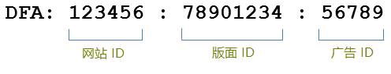
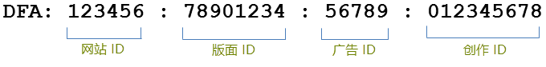

# 集成功能{#integration-features}

激活后，Data connectors DFA 集成为您的 Adobe Analytics 报表提供以下量度：

* 显示到达次数
* DFA 点击量
* 展示次数
* （可选）DFA 成本数据
* （可选）DFA 查询错误，超时

>[!NOTE]
>
>此集成不支持单击跟踪器(以前单击“单击命令”)。点击跟踪器可用于记录文本链接、电子邮件所含链接、或网站上其他硬编码元素的点击次数。

Data connectors DFA 集成可通过 DFA 返回的数据自动构建 DFA 跟踪代码。这些构建的跟踪代码可用于唯一标识广告及其关联的版面和创作。以下内容简要介绍了跟踪代码的结构，具体取决于集成的版本。版本 1.5 类似于以下：

版本 2.0 类似于以下：

这些 ID 可用作 Genesis 和 DFA 之间的共享关键值，以关联正确的分类和量度。

| 网站 ID | 托管广告的第三方网站。网站名称分类提供此网站 ID 的描述性名称。 |
|---|---|
| 广告 ID | 提交给用户的商业消息的 ID。广告名称分类包含您的组织在 DFA 系统中定义的广告名称。For example: `Hybrid Coup Textlink - Build`. |
| 版面 ID | 表示您的 DFA 帐户购买了其中的广告空间的网站、网站的一部分、或一组网站。 |
| 创作 ID | 打算向访客显示的图像、Flash SWF 或其他资源。创作名称分类包含您在 DFA 界面中向该创作提供的名称。 |

对于任何 DFA 促销活动而言，其他两个分类，即交付工具 (DoubleClick for Advertisers) 和渠道（横幅广告），都具有相同的值，并可帮助区分 DFA 导入数据。

## SearchCenter 重复数据删除 {#section-f809b3bb5e5142aa8ff89bcd5f0d0e49}

DFA 集成现在支持 Adobe SearchCenter 感知。如果通过 Data connectors 向导启用 SearchCenter 重复数据删除，搜索驱动型访客将不会导致从 DFA 的 Floodlight 服务器提取数据，并且&#x200B;*`s.campaign`*&#x200B;将不会由 DFA 填充，这样便允许 SearchCenter 填充它。此外，DFA 和 SearchCenter 现在会将删除了重复数据的值填入每个产品的变量。

以下列表简要介绍在启用 SearchCenter 重复数据删除时启用的逻辑。

If **[!UICONTROL DFA]** &gt; **[!UICONTROL SearchCenter deduplication]** is selected in the wizard:

* 对于 DFA 点进，集成会将字符串“DFA Clickthrough”填入配置的 SCM eVar。
* 对于 DFA 显示到达，集成会将字符串“DFA Viewthrough”填入 SCM eVar。

If **[!UICONTROL SearchCenter]** &gt; **[!UICONTROL DFA deduplication]** is selected in the wizard:

* 对于 DFA 显示到达，集成会将字符串“DFA Viewthrough”填入 SCM eVar。

>[!NOTE]
>
>如果启用了SearchCenter&gt; DFA de-delease并设置了SearchCenter查询字符串参数，则不会考虑访问DFA处理。这意味着 SearchCenter 查询字符串参数应当不同于 DFA 点进参数，并且没有任何显示广告应设置 SearchCenter 查询字符串参数。

